# Public vs Private Services

* Public/Private services is from a networking perspective and there are three types
    * Public Internet Zone
    * AWS Public Internet Zone
    * AWS Private Internet Zone

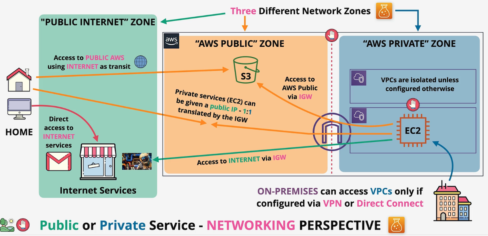

# AWS Global Network

* Visit [AWS Infrastructure](https://aws.amazon.com/about-aws/global-infrastructure/regions_az/) to have a visualize picture of the different AWS Regions and Edge Locations
* `AWS Region`
    * Geographic Separation
        * Isolated fault domain
    * Geopolitical Separation
        * Different governance
    * Location Control
        * Performance
* `Regions` are identified by region code or region name
    * Region Code: *ap-southeast-2*
    * Region Name: *Asia Pacific (Sydney)*

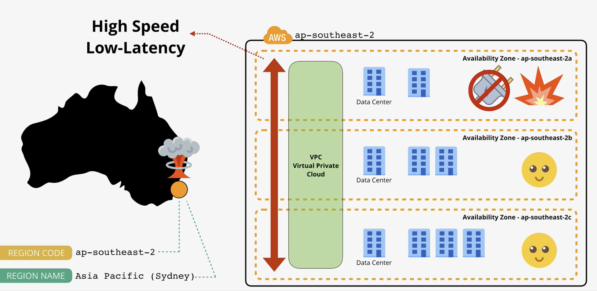

## Service Resilience
* *Globally Resilient*
    * A region can fail and service is still running in other regions
    * Example: IAM or Route53
* *Region Resilient*
    * A service operates in a single region
    * Generally replicate data in multiple *Availability Zones*
* *Availability Zone (AZ) Resilient*
    * A service operates in a single *AZ*
    * If *AZ* fails the service will too

# AWS Default Virtual Private Cloud
* A `VPC` is a virtual network inside of AWS
* **Exists within 1 account and 1 region**
* Private and isolated by default unless configured otherwise
* Created **once per region** when an AWS account is first created
* **Regionally Resilient**
    * Operates across multiple *Availability Zones* in a specific AWS Region
* Services deployed into the same `VPC` can communicate with each other
* A `VPC` is isolated from
    * Other `VPCs`
    * The *Public AWS Zone*
    * The *Public Internet*
* Types of VPC
    * `Default VPC`
        * Max of **1 per region**
        * Pre-configured by AWS
    * `Custom VPC`
        * **100% private by default**
        * Two `Custom VPCs` in the same region **do not communicate** with each other unless explicitly configured
    * `VPC CIDR`
        * Defines the start and end range of IP addresses within the `VPC`
        * Default `VPC CIDR: 172.31.0.0/26`

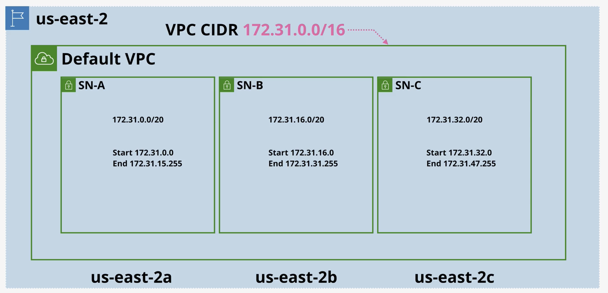
A `VPC` is divided into *subnets*, each located in a single `AZ`, set at creation and cannot be changed. The `Default VPC` is pre-configured with **one subnet per AZ**

* `Default VPC` Facts
    * One per region
        * Can be removed and created
    * Come pre-configured by AWS
    * Default VPC CIDR is always `172.31.0.0/16`
    * `/20` subnet in each AZ in the region
    * `Internet Gateway (IGW)`, `Sercurity Group (SG)`, and `NACL` are provided with Default VPCs
    * Subnets assign pubic IPv4 addresses
        * If you deploy any services to a `Default VPC`, by default they do have public IPv4 addressing

# Elastic Cloud Compute (EC2)
* AWS's implementation of *IaaS (Infrastructure as a Service)*
* Provisions virtual machines (*instances*) with your chosen resources and OS
* Use `EC2` when you need to deploy compute that requires an OS, runtime environment, database dependencies, or application interfaces and need to manage them yourself

## Key Facts and Features
* *IaaS*
    * Provides virtual machine instances
* **Private by default**
    * Uses `VPC` networking
    * `VPC` and `EC2` must both be configured to allow public access
* **AZ Resilient**
    * Instance fails if `AZ` fails
* Different instance sizes and capabilities available
* **AWS Manages:**
    * Virtualization
    * Physical Hardware
    * Networking
    * Storage
    * Facilities
* **Customer Manages:**
    * OS and everything above it

## Instance Lifecycle

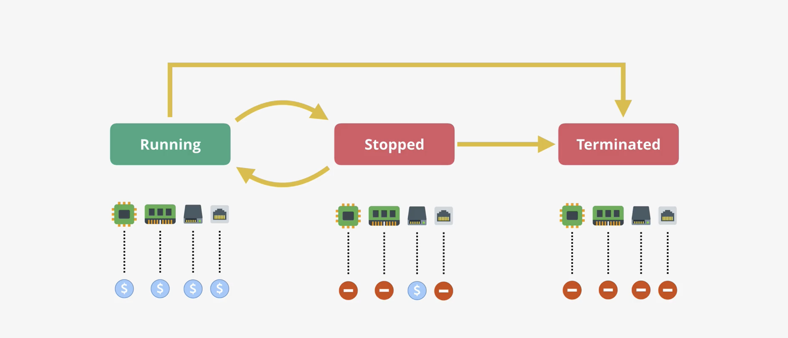
(CPU-Memory-Disk-Networking)

## Amazon Machine Image (AMI)

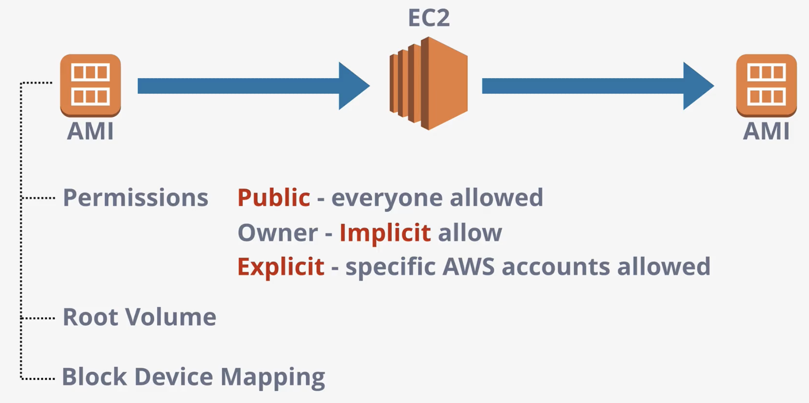

* **Permissions**
    * **Public**
        * Everyone is allowed to launch instances from the `AMI`
    * **Owner**
        * The owner is implicitly allowed to create `EC2` instances from the `AMI`
    * **Explicit**
        * Owner explicitly grants access to the `AMI` for specific AWS accounts
* **Block Device Mapping**
    * Configuration that links the `AMI's` volumes and how they are presented to the OS
    * Determines which volume is the boot volume and which is a data volume

## Connecting to an EC2

* Windows OS
    * Uses *Remote Desktop Protocol (RDP)* and runs on *port 3389*
* Linux OS
    * Uses *ssh* on and runs on *port 22*

```bash
# Below is how you would authenticate
ssh -i PrivateKey.pem ec2-user@aws.com
```

# Simple Storage Service (S3)

* `S3` is *object storage*
    * Not file or block storage
* Best used when accessing a whole object at once (image or audio file)
* **Not suitable** for Windows server needing a network file system
    * That requires file based storage
* `S3` is flat
    * There is no file system
* **Cannot mount an S3 bucket**
    * That is block storage

## S3 101

* Global Storage Platform meaning its regional based/resilient.
	* *Regionally Resilient*
        * Data is replicated across Azs within that region
* Public service, unlimited data and multi-user
	* Runs in AWS Public Zones
* Used with movies, audio, photos, text, and large datasets.
* Economical and accessed in UI, CLI, API, HTTP.
* Delivers *Objects* and *Buckets*. *Objects* are the data that S3 stores (cat pics, game of thrones episodes). 
	* *Buckets* are containers for objects. 
	* Think of *objects* like files..
* *Value* sizes can range from 0 - 5TB

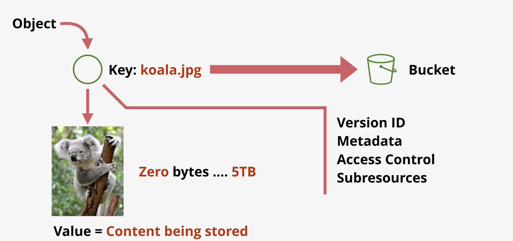

## S3 Buckets

* `S3` have stable and controlled data sovereignty
* The blast radius of an `S3 bucket` will be contained within the region
* Bucket name has to be globally unique
* Everything is stored at the root level
	* Flat Structure
* Folders are prefixes to object names

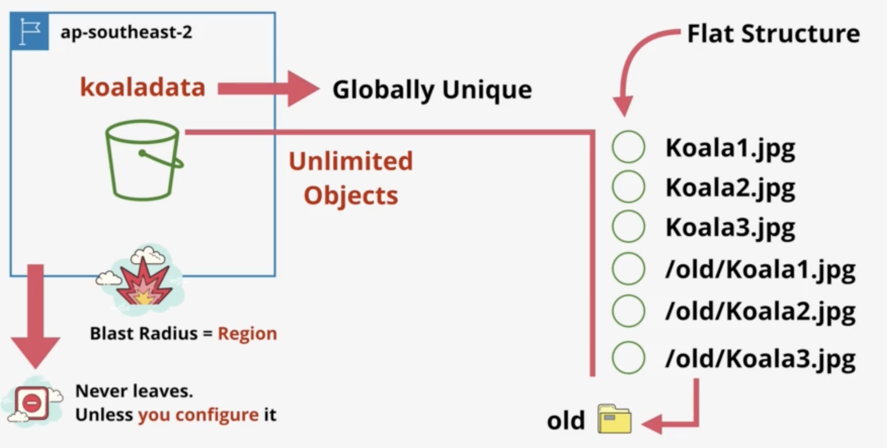

## S3 Use Cases

* Large scale data storage, distribution, and upload
* **Offloading**
    * Store assets like blog photos in `S3` instead of `EC2`
* **Input/Output** for many AWS services
    * It is the default storage service inside AWS


# S3 Amazon Resource Name (ARN)

* Standard *ARN Format*
    * `abbreviated:partition:service:region:account-number:name`
* `S3` is a global service
    * Region and account number are not needed
* `S3` bucket arn example:
    * `arn:aws:s3:::mys2bucketname`

## S3 Summary

* **Buckets names are globally unique**
* 3-63 characters, all lowercase, no underscores
* Start with a lowercase letter or number
* Can't be *ip formatted* (1.1.1.1)
* Buckets
    * 100 soft limit in an AWS Account
    * 1000 hard limit per account
* Unlimited objects in buckets (0 bytes - 5TB)
* `Key = Name` and `Value = Data`
* **5000 users** per AWS Account

# AWS CloudFormation

* `CloudFormation`
    * Is an *Infrastructure as Code (IaC)* product in AWS that allows automation of infrastructure creation, update, and deletion
* Templates are created in `YAML/JSON` can be used to interact with resources in an AWS Account


## CloudFormation Basics

### Resources


A `Resource` section of a template is the only mandatory part of `CloudFormation` template. `CloudFormation` creats a stack, which helps keep *Template* and *Physical* resources in sync.

### Description

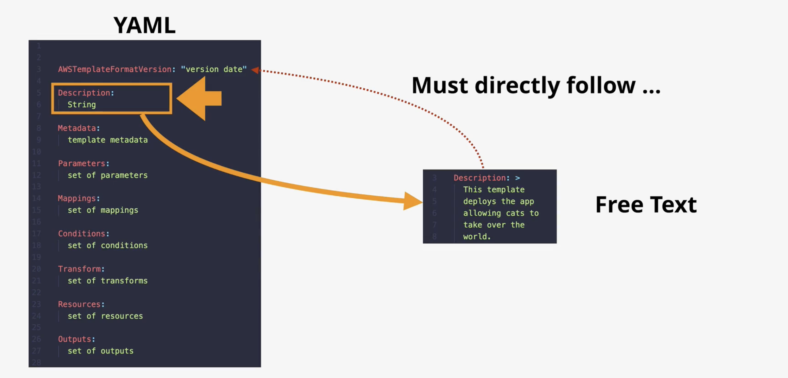

If using `AwsTemplateFormatVersion` and `Description` in the same *yml* file at the same time then the `Description` must come right after the *AwsTemplateFormatVersion*. If the *AwsTemplateFormatVersion* is not defined it is then assumed.

### Metadata

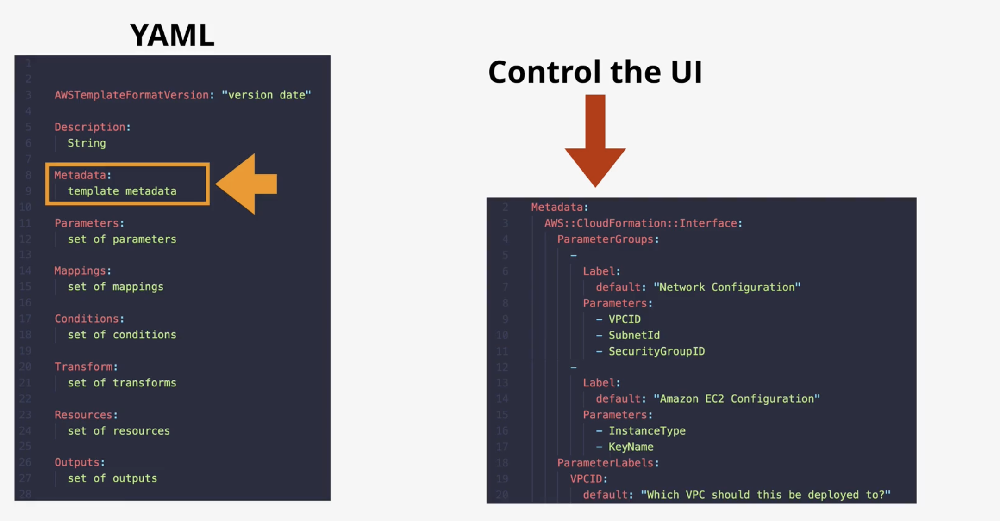

`Metadata` controls how the UI presents the templates.

### Conditions

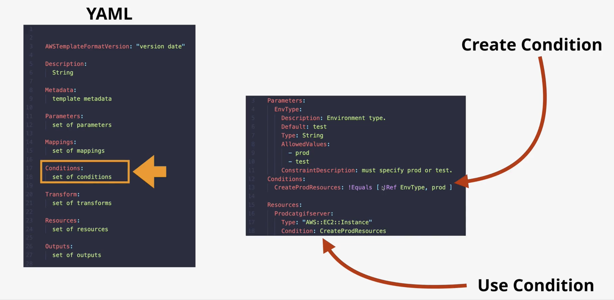

### Logical Resource

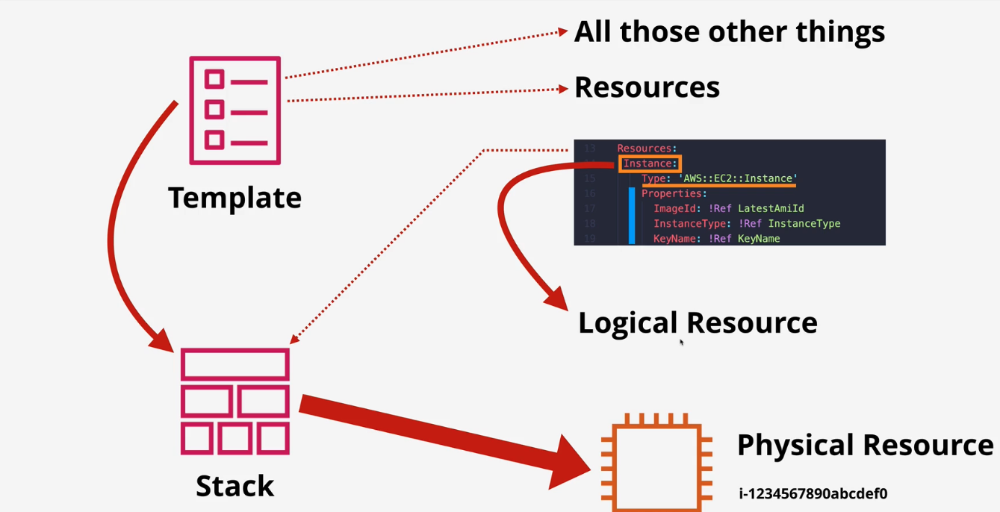

### Example


```yaml

Parameters:
	LatestAmiId:
		# We want the latest AMI for a given distribution
		# We are asking for the latest ami for amazon linux 2023 in whichever region youre in
		Type: 'AWS::SSM::Parameter::Value<AWS::EC2::Image::Id>'
		Default: '/aws/service/ami-amazon-linux-latest/al2023-ami-kernel-default-x86_64'
	SSHandWebLocation:
		Description: The IP address range that can be used to SSH to the EC2 instances
		Type: String
		MinLength: '9'
		MaxLength: '18'
		Default: 0.0.0.0/0
		AllowedPattern: '(\d{1,3})\.(\d{1,3})\.(\d{1,3})\.(\d{1,3})/(\d{1,2})'
		ConstraintDescription: must be a valid IP CIDR range of the form x.x.x.x/x. Default is 0.0.0.0/0 and is less           safe.

Resources:
	EC2Instance:
		Type: AWS::EC2::Instance
		Properties:
		InstanceType: "t2.micro"
		ImageId: !Ref LatestAmiId
		IamInstanceProfile: !Ref SessionManagerInstanceProfile
		SecurityGroups:
		- !Ref InstanceSecurityGroup
	InstanceSecurityGroup:
		Type: 'AWS::EC2::SecurityGroup'
		Properties:
		GroupDescription: Enable SSH access via port 22 and 80
		SecurityGroupIngress:
			# allowing two different types of traffic into whatever sg is attached to
			- IpProtocol: tcp
			FromPort: '22'
			ToPort: '22'
			CidrIp: !Ref SSHandWebLocation
			- IpProtocol: tcp
			FromPort: '80'
			ToPort: '80'
			CidrIp: !Ref SSHandWebLocation
	# Creates an instance role and an instance role profile
	SessionManagerRole:
		Type: 'AWS::IAM::Role'
		Properties:
		AssumeRolePolicyDocument:
		Version: 2012-10-17
		Statement:
		- Effect: Allow
		Principal:
		Service:
		- ec2.amazonaws.com
		Action:
		- 'sts:AssumeRole'
		Path: /
		ManagedPolicyArns:
		- "arn:aws:iam::aws:policy/AmazonSSMManagedInstanceCore"
		SessionManagerInstanceProfile:
		Type: 'AWS::IAM::InstanceProfile'
		Properties:
		Path: /
		Roles:
		- !Ref SessionManagerRole

# When the stack is created it will have some outputs
# Ref (function) -> references another part of the cloud formation template
# GetAtt (function) -> refer to another part inside cloud formation template but can pick can from different data the thing generates
Outputs:
# Output to get the instance ID
InstanceId:
	Description: InstanceId of the newly created EC2 instance
	Value: !Ref EC2Instance
# The Availability Zone the instance is in
AZ:
	Description: Availability Zone of the newly created EC2 instance
	Value: !GetAtt
	- EC2Instance
	- AvailabilityZone
# The public dns name for the instance
PublicDNS:
	Description: Public DNSName of the newly created EC2 instance
	Value: !GetAtt
	- EC2Instance
	- PublicDnsName
# The public ip address for the ec2 instance
PublicIP:
	Description: Public IP address of the newly created EC2 instance
	Value: !GetAtt
	- EC2Instance
	- PublicIp
```

# CloudWatch

`CloudWatch` is a core supporting service within AWS which provides metric, log and event management services. It's used through other AWS services for health and performance monitoring, log management and nerveless architectures. 

## CloudWatch Basics

* Collects and manages operational data
* Metrics on AWS products, apps, and on-premises
* `CloudWatch Logs` AWS products, apps, and on premises
* `CloudWatch Events`
    * If an AWS service does something, maybe an `EC2` instance is terminated, started, stopped, then `CloudWatch Events` will generate an event which can perform another action
    * Generate an event to do something at a certain time of day or certain days of the week

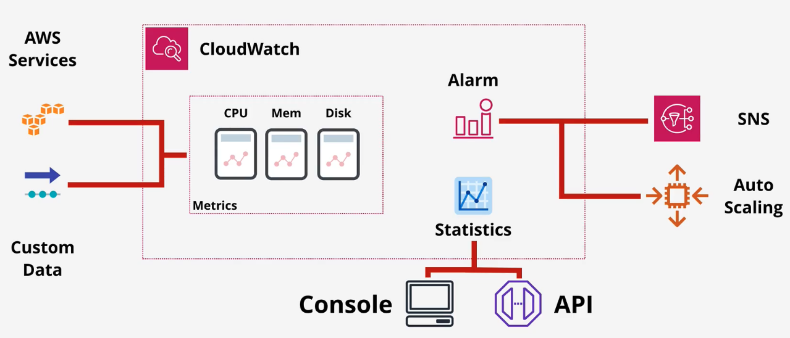

# Shared Responsibility Model

The Shared Responsibility Model is how AWS provide clarity around which areas of systems security are theirs and which are owned by the customer.

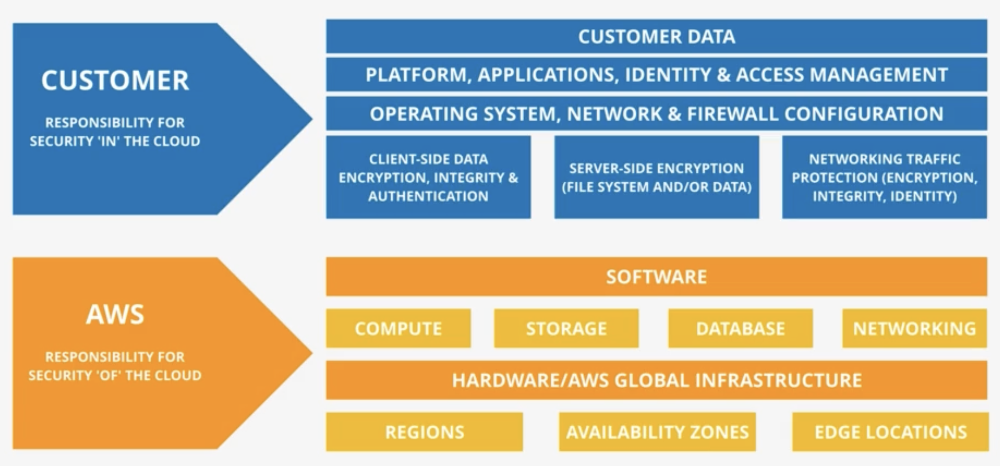

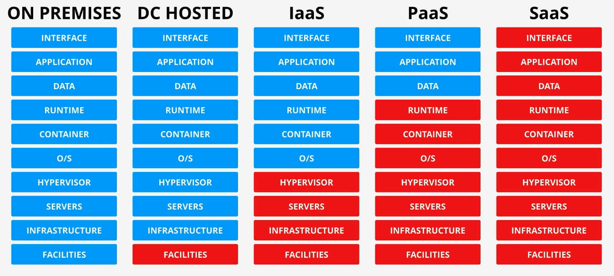
Red is what AWS is responsible for.

# High Availability (HA) vs Fault Toulerance (FT) vs Diaster Recovery (DR)

## High Availabilit (HA)

* Aims to ensure an agreed level of operational performance, usually uptime, for a higher than normal period
* Goal: Maximize system online time
* User disruption is acceptable
* Achieved by having redundant/extra equipment
* Analogy: You switch tires to get back on the road as fast as possible. You don't drive through the failure

## Fault Tolerance (FT)

* The property that enables a system to continue operating properly in the event of one or more component failures
* Goal: Operate through failure without disruption
* Analgoy: A plane with extra engines. Backup engines are on standby and kick in automatically if one fails with no interruption to the flight

## Diaster Recovery (DR)

* A set of policies, tools, and procedures to enable the recovery or continuation of vital technology infrastructure following a natural or human-induced diaster
* Goal: Recover when HA and FT have failed
* Analogy: An ejection system on a plane, when all else fails it saves the pilot

# Route53

* Register Domains
* Host Zones managed name servers
* **Global Service**
    * Meaning single database
* **Globally Resilient**
    * Can operate with the failure of one or more regions

## Hosted Zones

* Can be public
* Zone Files in AWS
* Hosted on four managed name servers
* Or private
	* means it is linked to VPCs
* Stores records which are *recordsets (used inside of Route53)*

## DNS Records

### A Records

* Map hostnames to IP address
* *A* record maps to *IPv4*
* *AAAA* record maps to *IPv6*

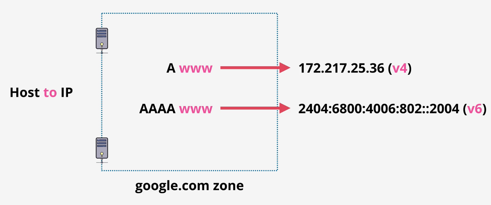

### NS Records

* Which allow delegation to occur in *DNS*

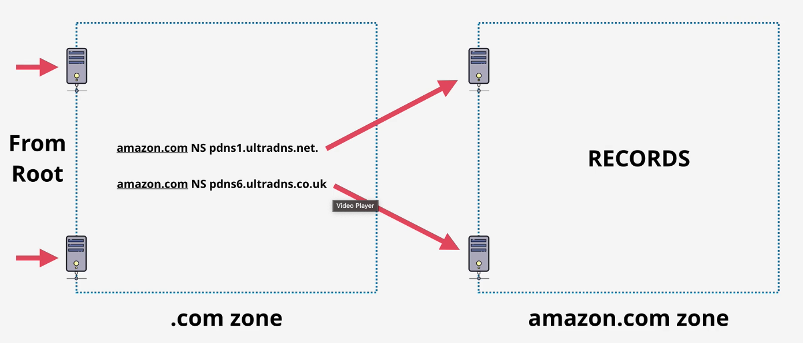

### CNAME Records

* Lets you create the equivalent to DNS shortcuts
* *ftp/mail/www CNAME* records will all point to the same IPv4 address
* Use *CNAME* to reduce admin overhead
* *CNAME* cannot point to IP addresses only other names

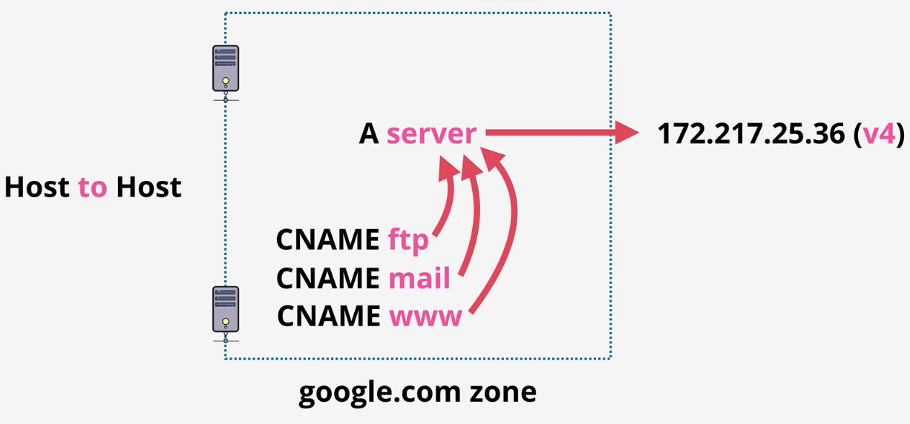

### MX Record

* Lower values for priority have higher priority

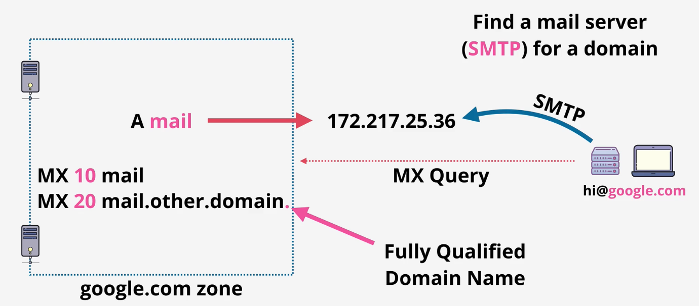

### TXT Record

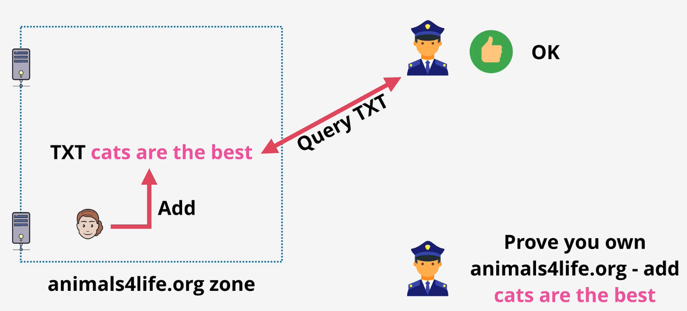