# IAM Identity Policies
* Identity  Policies are attached to AWS identities and either `ALLOW` or `DENY` access to AWS resources.
* **IAM Policies** are just a set of security standards to AWS
	* Grants or denies access to AWS products and features to any identity that use that policy.
	* Identity policies, also known as **policy documents**, are created using JSON:

```json
// IAM Policy Document
{
	"Version": "2012-10-17",
	"Statement": [
		{
			// ⬇️ Identifies a Statement and what it does (optional)
			"Sid": "FullAccess",
			// ⬇️ Controls what AWS does
			// ⬇️ Explicit Allow example
			"Effect": "Allow",
			// ⬇️ Syntax is [service:operation]
			"Action": ["s3:*"],
			// ⬇️ Use ARN format to individual resources
			"Resource": ["*"]
		},
		{
			"Sid": "DenyCatBucket",
			"Action": ["s3:*"],
			// ⬇️ Explicit Deny example
			"Effect": "Deny",
			"Resource": ["arn:aws:s3:::catgifs", "arn:aws:s3:::catgifs/*"]
		}
	]
}
```

- `Statements` grant or deny permissions to AWS services
	- **Authentication**
		- When an identity attempts to access AWS resources, that identity needs to prove who it is to AWS. 
	- **Authenticated Identity**
		- Identity is authenticated to access AWS resources
	- A `Statement` only applies if the interaction that you're having with AWS match the action and the resource
- *Explicit DENY* > *Explicit ALLOW* > *Default Implicit DENY*
	- *Explicit DENY* always wins.
	- AWS Identities start off with NO ACCESS to any AWS resources
	- Acronym of `D.A.D` 
		- Deny
		- Allow
		- Deny
- When a given identity accesses a resource, it collects *all of the statements in all of the policies* which apply and evaluates them all **at the same time**
	- Same rules applies `D.A.D`
		- If there is any *Explicit DENY* it's game over
		- If there is an *Explicit ALLOW* then you're allowed access, unless there is a deny
		- No *Explicit* statement then there is always the *Default Implicit DENY*
- Two Main Types of Policies (difference between the two are how they are managed):
	- `Inline Policies`
		- Applies the JSON (IAM Policy Document) to individual accounts
		- **Not best practice**
		- If you have 3 JSON then you have 3 isolated bits of JSON
			- Meaning if you change any access rights then you need to change it for all three inline policies
	- `Managed Policies`
		- Created as their own object
		- You attach that policy to any identities who you want to gain those access rights.
		- Reusable and Low Management Overhead
		- Use if you want multiple identities to have common access rights
- **Use Inline Policies when you have exceptions to the normal access rights that you want to grant (special circumstances)**
- Two main types of `Managed Policies`:
	- `AWS Managed Policies`
		- Created and managed by AWS
	- `Customer Managed Policies`
		- Customer created and managed policies

# IAM Users and ARNs

## IAM Users

- `IAM Users`
  - One of the identity type available inside AWS
  - Are an identity used for anything requiring long-term AWS access 
- `IAM` Example
  - Humans, Applications, or Service-Accounts
- `Principals`
  - Can be individual people, computers, or services or a group of any of those things
  - Needs to authenticate and be authorized to do anything
  - Authentication for `IAM Users` is done using
    - Username and password 
    - Accessing Keys
      - Applications or humans using CLI
    - Once authenticated it turns into an **Authenticated Identity**
      - AWS knows which policies to apply identity 
  - **Authentication**
    - Is how a `Principal` can prove to IAM that it is identity it claims to be using username and passwords or access keys
  - **Authorization**
    - Is `IAM` checking the statements that apply to that identity and either allowing or denying that access

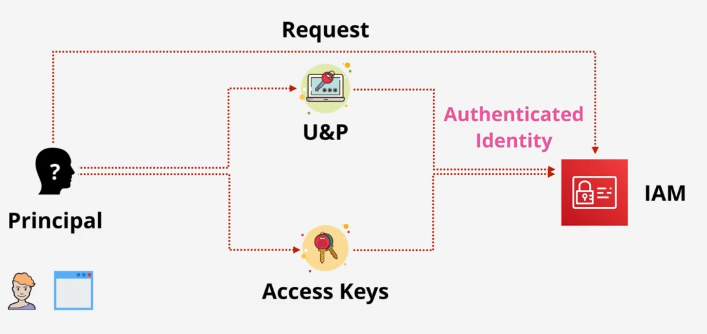

## Amazon Resource Name (ARN)

- Uniquely identify resources within any AWS accounts
- **Remember** that `S3 Buckets` are **globally unique** so *region and account-id* are not needed 

```text
// Syntax for the ARN:
arn:partition:service:region:account-id:resource-id
arn:partition:service:region:account-id:resource-type/resource-id
arn:partition:service:region:account-t:resource-type:resource-id

// ⬇️ References to a bucket
arn:aws:s3:::catgifs

// ⬇️ References objects in the bucket
arn:aws:s3:::catgifs/*
``` 

## Summary

* **5,000** IAM Users **per account**
* IAM User can be a member of **10** groups
* This has systems design impacts
	* If you have a system that requires more than 5,000 identities then you can't use IAM users for each identity (IAM Roles and Identity Federation fix this)
		* Might be a limit for Internet Scale Applications
		* Might be a limit for Large orgs and org merges

# IAM Groups

- `IAM Groups`
  - Are an admin or container feature
  - `IAM Users` can be a member of multiple `IAM Groups`
  - Able to add `IAM Users` to groups and add permissions to `IAM Groups`
  - Are NOT real identities, which can't be used from resource policies and have NO CREDENTIALS TO LOGIN WITH
- Groups have two main benefits
  - Allow effective administration style management of users
  - Groups can have policies attached to them both `Inline` and `Managed`
- You can not have nesting groups
  - No groups within groups
- There is a **limit of 300 groups per account** but can be increased with a support ticket
- `Resource Policy`
  - Controls access to a specific resource and it allows or denies identities to access that bucket 
  - A policy on a resource can reference `IAM Users` and `IAM Roles` by using ARN
    - Groups are not a true identity
      - They cannot be referenced as a principal in a policy

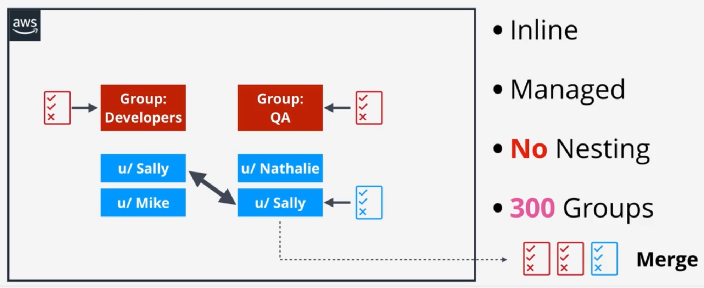

# IAM Roles

- `IAM Roles`
  - When To Use?
    - If you can't identify the number of principals which an **identity** then it could be be a candidate for an `IAM Role`
    - Or if you have more then 5,000 principals, because of the number limit for `IAM users`, it could be a candidate for an `IAM Role`
  - **Roles are identities**
- `IAM Roles` are used on a temporary basis
  - The role isn't that represents you
  - A role is something which a level of access inside an AWS Account 
  - Other identites assume that role a short time, they became that role, the user the permissions that the rules has, then stop being that role essentially borrowing the permissions for a short time

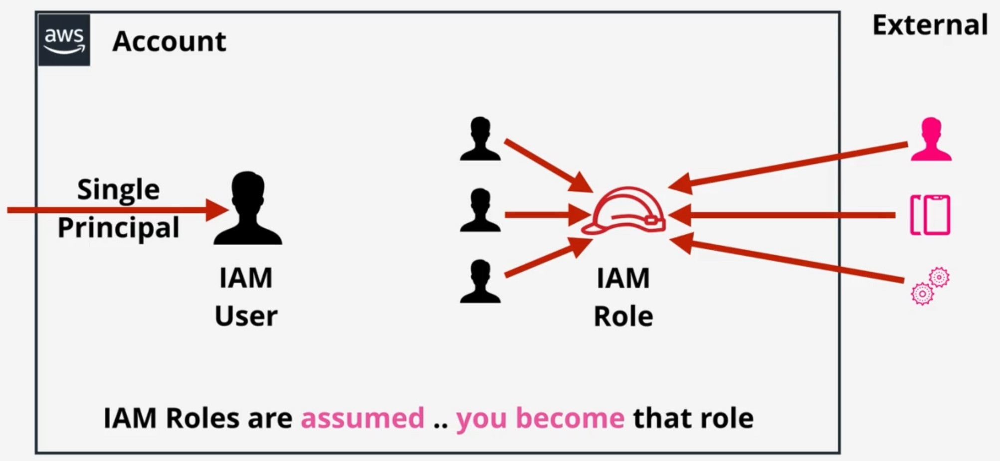

- What's the difference between logging into a user and assuming a role?
  - In both cases, you get the access rights that the identity has
- **IAM Roles have two types of policies** that can be attached
  - `Trust Policy`
    - Which identities can assume that role
    - Answers *Who is allowed to use this role?*
  - `Permissions Policy`
    - Access AWS resources (changing of permissions policy = permissions of temporary credentials also changes)
    - Answers *What can this identity do?*

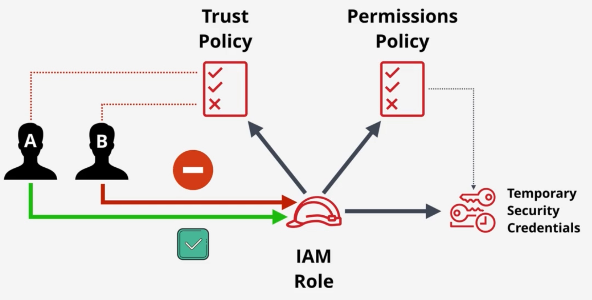

- `sts:AssumeRole` (Secure Token Service) and this is the operation to assume the role and get the credentials.

# When To Use IAM Roles

- External accounts (e.g., Microsoft Active Directory) cannot be used directly in AWS
  - You cannot access AWS resources (like S3) directly with external identities
  - The workaround is to create an IAM role inside your AWS account that can be **assumed** by an external identity
- When using AWS services it is always preferred to use a role because you don't need to provide any static credentials
- 5000 `IAM User` limit per account which is limiting because its a hard limit and can't be raised 

## Scenario: ECS Task Accessing S3 and Secrets Manager

- You have a containerized API that needs to read config from `S3` and pull database credentials from `Secrets Manager` at startup
  - **Without a role**: You'd have to bake AWS access into the container or pass them as environment variables, which terrible for security and painful to rotate
  - **With a task execution role**: Which is used by ECS agent 
- Pull image `ECR`
- Send logs to `CloudWatch`
- **Task Role**
  - Read `S3` bucket
  - Get secrets

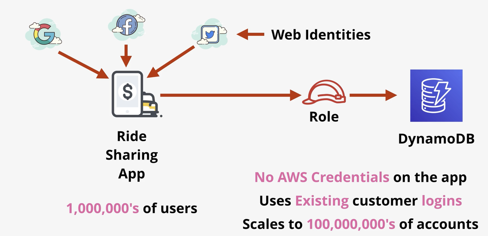

## Cross Account

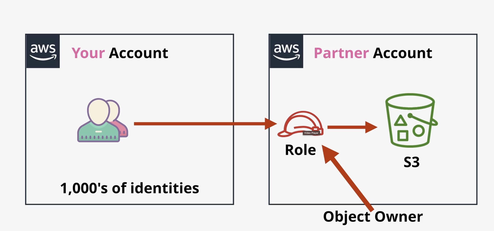

# Service-Linked Roles and Pass Roles

## Service-Linked Roles 

- `Service Link Role`
  - Is a unique of `IAM Role` that is **linked directly to an AWS service**
  - Predefined by the service and include all permissions that the service requires to call other AWS services on your behalf
  - The linked service also defines how you create, modify, and delete a service linked role
    - A service might automatically create or delete roles
    - It might allow you to create, modify, or delete roles
    - Or it might require that you use `IAM` to create or delete role
  - [User guide using service link roles](https://docs.aws.amazon.com/IAM/latest/UserGuide/using-service-linked-roles.html)
  - **You can't delete the role until it's no longer required**

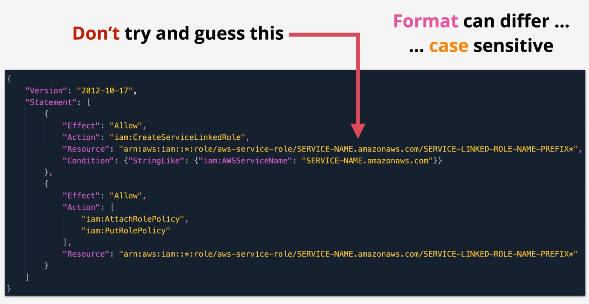

## PassRoles

- Allows a user to pass an existing role into an AWS service
- Use Case
  - User needs to use role with a service but should not be able to create or edit that role
- Require Permissions
  - `ListRoles` and `PassRoles` for the specific role
- Role Separation
  - Enables separation between teams
- PassRole gives you the ability to implement role separation, its something you can also use with service linked roles
- **Role Separation Example**
  - Security team creates roles, other team members (like Bob) configure services using those pre-created roles
- **PassRole Permissions**
  - Bob could configure a service with a role that was already created by a member of the security team
- **CloudFormation Example**
  - Bob has access to create a stack and pass in a role, but Bob himself doesn't have permissions to create AWS resources, the passed role is what the provides `CloudFormation` with the permissions it needs to interact with AWS

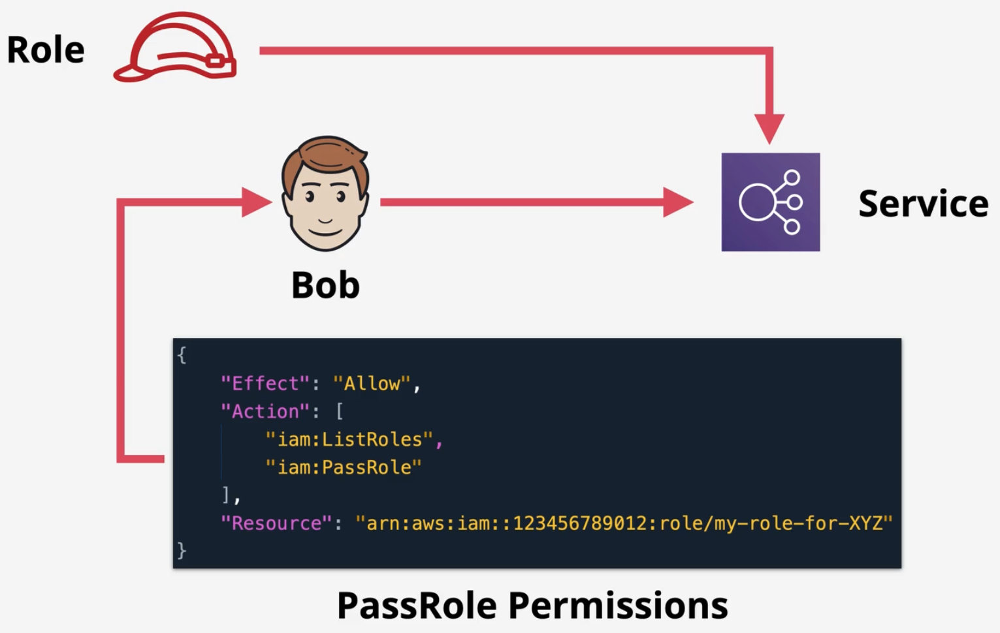

# AWS Organization 

- `AWS Standard Account`
	- AWS account which is not within an organization
- `Management Account`
	- Standard account used to create the AWS organization
	- Only one `Management Account` per organization
	- Can be also called `Master/Pay Account`
- `Member Account`
	- When `Standard Account` join an `AWS Organization`
	- Individual billing methods are removed for the `Member Accounts` within the organization
- `Organization Root`
	- Just a container for AWS account within an `AWS Organization`
	- Don't confuse this with the `Account Root User`
    - Can contain `Member` or `Management` accounts
- `Organization Unit`
	- `Organizational Root` can contain this
	- Can contain accounts or other units

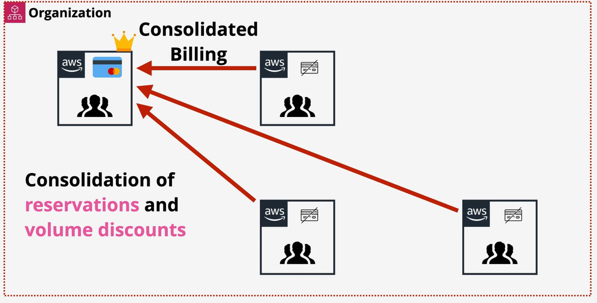

- With `Organizations` you **don't need to have IAM Users inside every single** `AWS Account`
	- Instead `IAM Roles` **can be used to allow** `IAM Users` to access other AWS Accounts
	- The architectural pattern is to have a single AWS Account which contains all of the identities are logged into
	- Larger enterprises might have their own existing identity system, and they might want to use those existing identities and use `Identity Federation` to access this single identity account
- `Role Switch` switch between other AWS Accounts

# Service Control Policies

- `Service Control Policies (SPCs)` 
	- Is a feature of `AWS Organization` which allow restrictions to be placed on the `MEMBER Accounts` in the form of boundaries
	- Can be applied to the `Organization` to `Organizational Units (OU)` or to individual accounts
		- `Member Accounts` can be effected the `Management Account` cannot
	- Can be attached to **one or more** `Organizational Units (OU)` and be attached to individual `AWS Accounts`
- SPCs don't give permission, they just control what an account CAN and CANNOT grant via identity policies
- `SPCs` are `Policy Documents (JSON Documents)`
- `SPCs` inherit down the organizational tree
	- Means if they are attached to the **whole organization as a whole**
	- So the root container of the organization, then they affect all of the accounts inside the organization
	- If they are attached to a **whole** `Organizational Unit (OU)` then they impact all accounts directly inside that `Organizational Unit (OU)`, as well as all accounts withing the OUs inside that OU 
		- Basically nested OUs it will go down

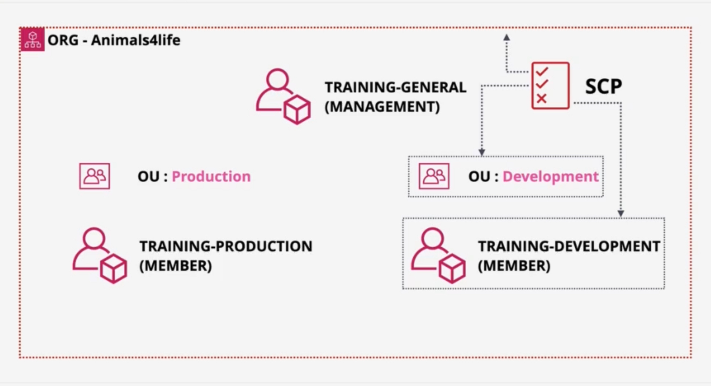

- What makes the `Management Account` special?
	- If the account has a `SCP` attached, either directly via an OU, or on the root container of the organization itself, then the account is **NEVER** affected by `SCP`
		- Because of this then generally in production avoid using the `Management Account` for any AWS resources
- `SPCs` are **account permission boundaries**
	- They limit what the account, **including account root user** can do
	- You can never restrict the `Account Root User`, but if you restrict the account then you also restrict the `Root User`
	- SPCs don't grant permissions

## Allow vs Deny List

- `Full AWS Access`
	- **Default Policy** when you enable SCPs on your organization
	- Applied to the Organization and all OUs
	- This means that in the default implementation, SPC policies have no effect sense nothing is restricted

```json
// FULL AWS Access
{
	"Version": "2012-10-17",
	"Statement": [
		{
			"Effect": "Allow",
			"Action": "*",
			"Resource": "*"
		}
	]
}
```

- SPCs don't grant any access rights, but they established which permissions can be granted in an account
- If you had no initial *Allow* then everything would be DENIED
	- This has the effect of making SPCs a **Deny List Architecture**
		- So you need to add any restrictions that you want to any AWS Account within Organizations
- You could something like this *DenyS3*:

```json
// Deny all operations of S3
// The implicit default deny 
// No initial Allow
{
	"Version": "2012-10-17",
	"Statement": [
		{
			"Effect": "Deny",
			"Action": "s3:*",
			"Resource": "*"
		}
	]
}
```

- Anything explicitly allowed in a SCP is a service which can have access granted **to identities within that account**, unless there is an **explicit any within an SCP**, then the service cannot be granted
	- `DAD`, *Explicit Deny* always win
- Two implement *Allow Lists* its a two part architecture:
	- Is to remove the `AWS Full Access Policy`
		- Means that only the *Implicit Default Deny* is place and active
	- Then you need to add any services which you want to allow into a new policy

```json
// Part 2 of Allow List architecture
// We are explicitly allowing s3 and ec2 access
{
	"Version": "2012-10-17",
	"Statement": [
		{
			"Effect": "Allow",
			"Action": [
				"s3:*",
				"ec2:*"
			],
			"Resource": "*"
		}
	]
}
```

- `Allow Lists`
	- Much more admin overhead because you have to add services as your business requirements dictate
		- You have to explicitly add each and every service which you want identities within the account to be able to access

- `Deny Lists` 
	- Are much lower admin overhead.

## SPCs Impact Permissions

- Orange Circle 
	- Represents different services that have been granted access to identities in an account using identity policies. 
	- Grants access to four different services (3 middle and 1 on the left).
- Red Circle 
	- Represents which services an SCP allows access to. 
	- The SPC states that the three services in the middle and on the right are allowed access as far as the SCP is concerned. 
- Overlap
	- Now only permission which are allowed in the identity policies in the account and are allowed by SPC are actually active.

# CloudWatch Logs

- `CloudWatch Logs` 
	- Is a service which can accept logging data, store it, and monitor it. 
	- Often the default place where AWS Services can output their logging too. 
	- Is a **public service** an can also be utilized in an on premises environment and even from other public cloud platforms.
- **Public Service** - usable from AWS or on-premises
- **Store**, **Monitor**, and **access** logging data
- **AWS Integrations** - EC2, VPC Flow Logs, Lambda, CloudTrail, R53 and more
- Can generate metrics based on logs (**metric filter**)
- [CloudWatch Logs Pricing](https://aws.amazon.com/cloudwatch/pricing/)

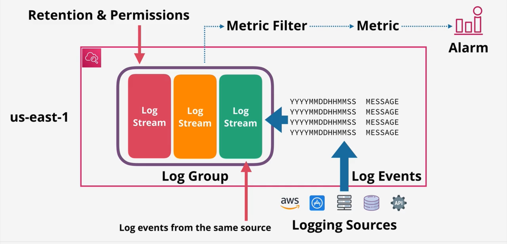

# CloudTrail

- `CloudTrail` 
	- Is a product which logs API calls and account events. 
	- Used to diagnose security or performance issues, or to provide quality account level traceability.
- [CloudTrail Pricing](https://aws.amazon.com/cloudtrail/pricing/)
- Enabled by default in AWS accounts and logs free information with a 90 day retention.
- Can be configured to store data indefinitely in S3 or CloudWatch Logs.
- Logs API Calls/Activities as a **CloudTrail Event**
- 90 days stored by default in **Event History**
- Enabled **by default** - no cost for 90 day history
- To customize the service, create one or more **Trails**
- `Management Events` and `Data Events`
	- `Management Events`
		- provide information about management operations that are performed on resources on your AWS account (create ec2, create vpc, terminate ec2)
	- `Data Events`
		- Contain data information about resource operations performed on or in a resource (objects being uploaded to s3, lambda function being invoked) 
		- Needs to be enabled
- **By default** CloudTrail only logs `Management Events`
- A trail logs events for the AWS region that it is created in. CloudTrail is a regional service
- Global services (IAM, STS, CloudFront), would be classified as global service events and that would need to be enabled on a trail
	- Automatically gets log to `US East 1` and trail needs to be enabled to get global service events
	- Otherwise a trail will only log events for that isolated region that it's created in
- When you create a trial its one of two types
	- `One Region`
		- Always isolated to that region
	- `All-Region Trail`
		- Encompasses all of the region in AWS
		- Automatically updated as AWS add new regions
- A `trail` can store events in a definable S3 Bucket, and the logs which are generated and stored in an S3 Bucket can be stored in there indefinitely 
	- Only charged for the storage S3
	- Can also store data in `CloudWatch Logs`
- `Organizational Trail`
	- Created from an `Member Account`
		- Can store all of the information for all of the accounts inside that organization
	- Single management point for all API and account events across every account in the organization
- Not real-time logging, there is a delay (within 15 minutes of the account activity occurring)

# AWS Control Tower

- `AWS Control Tower`
  - Offers a straightforward way to setup and govern an AWS multi-account environment
  - **Orchestrates the capabilities of the several other AWS services, including AWS Organization, AWS Service Catalog, and AWS IAM Identity Center** (successor to AWS Single Sign On) to build a landing zone in less than an hour
  - Resources are setup and managed on your behalf
  - AWS Control Tower orchestration extends the a capabilities of AWS Organizations
  - `Drift`
    -  Divergence from best practices
 -  To help keep your organization and accounts from `drift`, AWS Control Tower applies **preventive and detective controls (Guard Rail)**
 -  **Guard Rails Example**
    -  You can use guardrails to help ensure that security logs and necessary cross-account permissions are created, not altered 
- **Quick** and **easy** setup of **multi-account** environment
- **Orchestrates** other **AWS** services to provide this functionality
- Organizations, IAM Identity Center, CloudFormation, Config and more
- **Landing Zone** multi-account environment provides SSO/ID Federation, Centralized Logging and Auditing
- **Guard Rails** which **detect/mandate** rules/standards across all accounts
- **Account Factory** which **automate** and **standardizes** new account creation
- **Dashboard** single page oversight of the entire environment

## Landing Zone
- **Well Architected** multi-account environment - **Home Region**
- ... build with AWS **Organizations**, AWS **Config**, **CloudFormation**
- **Security** OU - Log Argive and Audit Accounts (**CloudTrail and **Config Logs**)
- **SandBox OU** - Test/less rigid security
- You can create other OU's and Accounts
- **IAM Identity Center (AWS SSO)** - **SSO, multiple** accounts, ID **Federation**
- Monitoring and Notifications - CloudWatch and SNS
- **End User** account provisioning via **Service Catalog**

## Guard Rails
- **Guardrails are rules** - multi account governance
- Three types: **Mandatory, Strongly Recommended, or Elective** (optional)
- Function in two different ways
	- **Preventive**: stop you doing things (AWS ORG SCP) 
		- Enforced or not enabled
		- Allow or deny regions or disallow bucket policy changes
		- Prevent or stop things from occurring
	- **Detective**: compliance checks (AWS CONFIG Rules)
		- Clear
		- In Violation
		- Not Enabled
		- Example: detect CloudTrail is enabled within an AWS account or whether any EC2 instances have public IPv4 addresses
		- Identify things occurring

## Account Factory

- **Automated** Account **Provisioning**
	- Cloud **admins** or **end users** (with appropriate permissions)
- **Guardrails** **automatically** added
- Account **admin** given to a **named user** (IAM Identity Center)
- Account and network **standard configuration**
- Accounts to be **closed** or **repurposed**
- Can be fully **integrated** with a businesses Software Development Life Cycle
