# 04 - Simple Storage Service (S3)

## S3 Security (Resource Policies & ACLs)

- **S3 Security** is controlled via combination of 
	- `Identity Policies`
	- `Bucket Policies (Resource Policies)`
	- `Legacy Bucket and Object ACLs`
- **S3 is private by default**
	- The only identity that has access to an S3 bucket is the `Account Root User`
	- Anything else has to *Explicitly Granted*, this can be achieved in a few ways
		- `S3 Bucket Policy (Resource Policy)`
		- `Identity Policies`
		- `Access Control Lists (ACLs)`S3 is private by default**
	- The only identity that has access to an S3 bucket is the `Account Root User`
	- Anything else has to *Explicitly Granted*, this can be achieved in a few ways
		- `S3 Bucket Policy (Resource Policy)`
		- `Identity Policies`
		- `Access Control Lists (ACLs)`
- `Resource/Bucket Policies`
	- Provide **resource perspective permissions**
		- Basically *Who can access this resource?*
	- `ALLOW/DENY` **anonymous principals**
		- Meaning it does not have to be attached to a valid identity by referencing all principals even those not authenticated by AWS
	- `ALLOW/DENY` **same or different** accounts
- `Identity Policies`
  - Controlling what that identity can access
	- Limitation
		- Attaching to identities in your **own account**. So only control security inside your account
- `Access Control Lists (ACLs)`
	- Applies security to **objects and bucket**
	- A sub resource
	- **AWS prefers S3 Bucket Policies**
	- Is Legacy
	- Inflexible and Simple permissions
		- Can't have conditions
- Two use cases for `Bucket Policies`
	- **Grant access to other AWS accounts**
	- **Grant access to anonymous accounts**

```json
// S3 Bucket Policiy Example
// The principal part of a STATEMENT in a policy
// defines who that statement applies to, which identities
// which principals. Now in an Identity Policy this generally isn't there
// because it is applied to is the principal.

{
	"Version": "2012-10-17",
	"Statement": [
		{
			"Sid": "PublicRead",
			"Effect": "Allow",
			// ⬇️ Difference between Identity Policies
			// ⬇️ Presence of EXPLICIT Principal Component
			// ⬇️ Defines which principals are affected by the policy
			"Principal": "*",
			"Action": ["s3:GetObject"],
			"Resource": ["arn:aws:s3:::secretcatproject/*"]
		}
	]
}
```

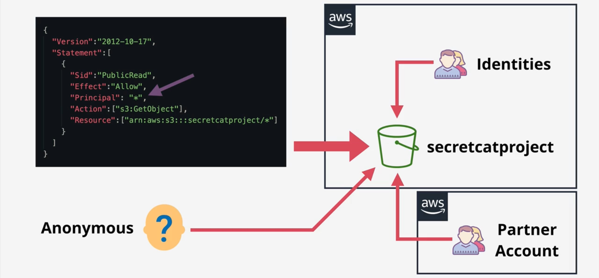

- `Resource/Bucket Policies`
	- Should be your default when it comes to anonymous access to objects in buckets, and they're one way of granting external accounts that same access. 
	- Can be used to set default permissions on a bucket.
	-  If you want to grant everyone access to Boris's picture for example and then grant certain identities extra rights or even deny certain rights.
  
```json
// This Bucket Policiy denies access to any bucket policies unless your IP address 1.3.3.7

{
	"Version": "2012-10-17",
	"Id": "BlockUnLeet",
	"Statement": [
		{
			"Sid": "IPAllow",
			"Effect": "Deny",
			"Principal": "*",
			"Action": ["s3:*"],
			"Resource": "arn:aws:s3:::secretcatproject/*",
			// ⬇️ Only imples if this condition is true
			// ⬇️ If your IP address, the source IP address is not 1.3.3.7
			// ⬇️ then the statement applies and access is denied
			"Condition": {
				"NotIpAddress": {
					"aws:SourceIp": "1.3.3.7/32"
				}
			}
		}
	]
}
```

```json
// One specific prefix, which is called Boris, 
// is protected with MFA. Accesses to the Boris prefix are denied
// if the identity you're using if it DOES NOT USE MFA. 

// The second statement allows read access to objects in the whole bucket. 
// Because an explicit deny overrides
// an allow the top statement applies to just that specific prefix
// in the bucket, so just Boris

{
	"Version": "2012-10-17",
	"Id": "protectboris",
	"Statement": [
		{
			"Sid": "",
			"Effect": "Deny",
			"Principal": "*",
			"Action": "s3:*",
			"Resource": "arn:aws:s3:::secretproject/boris/*",
			"Condition": {
				"Null": {
					"aws:MultiFactorAuthAge": true
				}
			}
		},
		{
			"Sid": "therest",
			"Effect": "Allow",
			"Principal": "*",
			"Action": ["s3:GetObject"],
			"Resource": "arn:aws:s3:::secretproject/*"
		}
	]
}
```

- There can only be ONE BUCKET POLICY on a bucket but it can have multiple statements
- **S3 Access Evaluation by Principal Type**
	- **Same-account access** 
		- Effective permissions = union of all applicable identity policies (IAM user/role policies) + bucket policy. Either side can grant access.
		- **Cross-account access**
			-  Effective permissions = intersection of the external account's identity policies + bucket policy. Both sides must explicitly allow.
		- **Anonymous access** 
			- Effective permissions = bucket policy only. No identity exists to evaluate.

DON'T USE ACLs

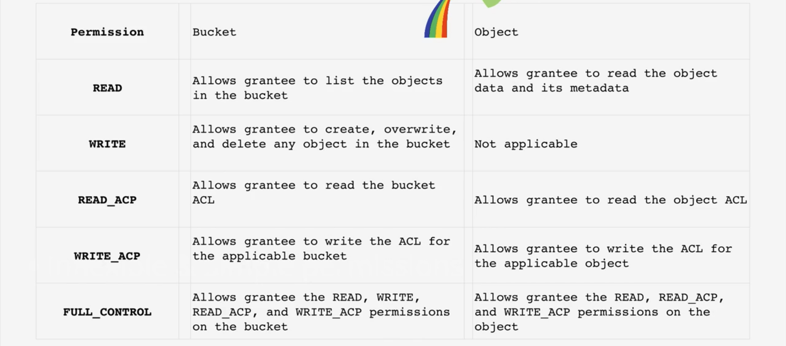

### Block Public Access Settings

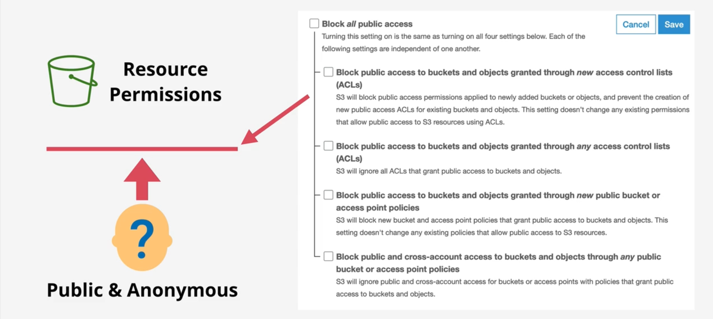


  - `Block Public Access`
    - Settings applies no matter what the `Bucket Policy` says
	- **Only apply to just the public accesss**
	- Applies to only an `anonymous principal`
	- Can be set when creating a bucket and altered after creation
- `Block all public access`
	- Which blocks any public access to the bucket no matter what the resource policy says
- `Block public access to buckets and objects granted through new access control lists (ACLs)`
	- Which allows any public access granted by any existing ACLs when you enable the settings, but it blocks any new ones
- `Block public access to buckets and objects granted through any access control lists (ACLs)`
	- Blocks any public access granted by ACLs no matter if it was enabled before or after the Block Public Access settings were enabled
- `Block public access to buckets and objects granted through new public bucket or access point policies`
	- Allows any existing public access granted by bucket policies or access point policies. SO anything enabled at the time when you *enabled* this specific Block Public Access setting, they're allowed to continue but it blocks any new ones
- `Block public and cross account to buckets and objects through any public bucket or access point policies`
	- Blocks both existing and new bucket policies from granting any public access

### Exam Power Up
- Identity: Controlling difference resources
- Identity: You have a preference for IAM
- Identity: Same account
- Bucket: Just controlling S3
- Bucket: *Anonymous* or *Cross-Account*
- ACLs: *NEVER* - unless you must

## S3 Static Hosting

### Static Website Hosting
- Normal access is via `AWS APIs`
- This feature (static website hosting) access via *HTTP* - e.g. Blogs
- *Index* and *Error* documents are set
- *Website Endpoint* is created
	- Endpoint is influenced by the bucket name that you choose and the region that the bucket is in
- Custom Domain via *Route53* - *BUCKETNAMES MATTERS*
	- You can only use a custom domain with a bucket if the name of the bucket matches the domain 
		- So if i wanted to have a website called `top10.animalsforlife.org` then my bucket name would need to be called `top10.animalsforlife.org`
- **There are two specific scenarios which are perfect for S3**:
	- **Offloading**
		- Take all media and move to an s3 bucket and not a compute service (like ec2 and database)
		- Storage of large data at scale
	- **Out-of-band pages**
		- So if you have a server that is offline for maintenance or it was experiencing stability or performance bigs, then we could change our DNS and point customers at a backup static website hosted on S3 and this could provide a status message or maybe details for our business' support team

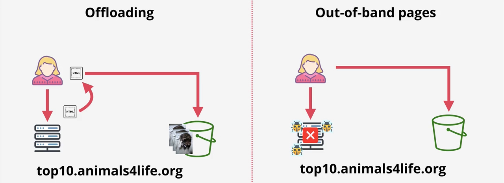

## Object Versioning and MFA Delete

*Object versioning* is a feature which can be enabled on an S3 bucket - allowing the bucket to store multi versions of objects, These objects can be referenced by their version ID to interact or omit this to reference the latest version of an object. *Objects aren't deleted* - object deletion makers are put in place to hide objects. 

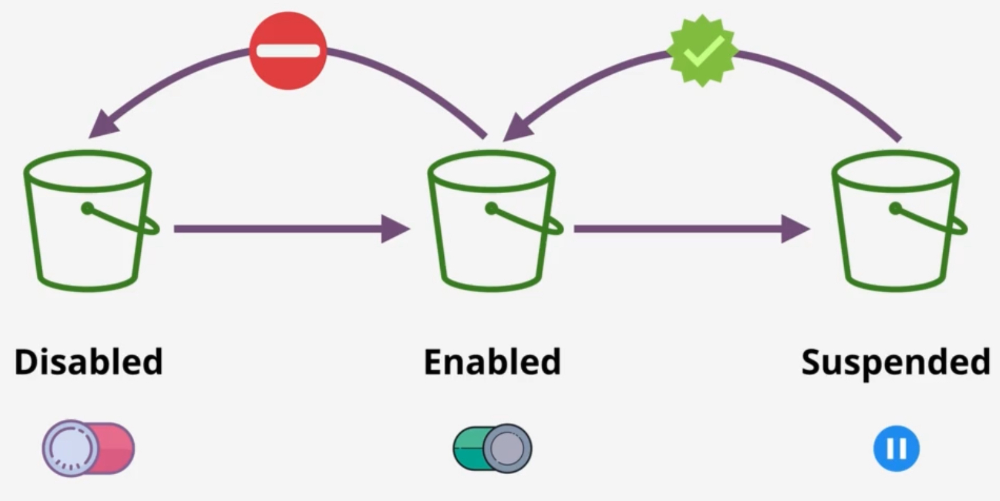

- **An enabled bucket cannot be moved back to disabled**
	- When versioning is disabled all objects have an `id` as null
- Versions can be **individually accessed** by specifying the `id`
- Versioning lets your store **multiple versions of objects** within a bucket
	- Operations which would modify objects **generate a new version**
- `Delete Marker`
	- Is a special version of an object which **hides all previous versions** of that object
	- You can also delete that `delete marker`
	- To fully delete a version of an object you need to delete an object and specify the particular version ID that you want to remove

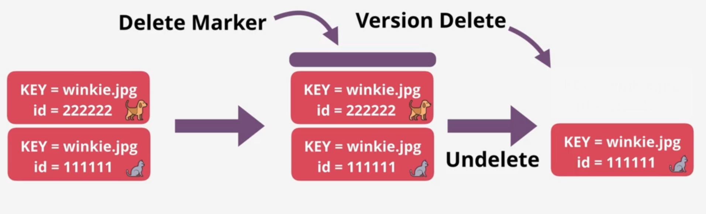

- **OBJECT VERSIONING** CANNOT BE SWITCHED OFF - ONLY SUSPENDED
- **Space is consumed by ALL versions**
- **You are billed for ALL versions**
	- Only way to 0 costs is to delete the bucket and then re-upload all those objects to a bucket without versioning enabled
	- Suspending a bucket does not actually remove any of those old versions
		- So you are still billed for them

### MFA Delete

- Enabled in *versioning configuration*
- When enabled it means that MFA is **required** to change bucket versioning state
	- Suspended ➡️ Enabled you need MFA to do that
- MFA is required to *delete versions* of an object (fully delete)
- Serial Number (MFA) + Code passed with *API CALLS*

## S3 Performance Optimization

### Single PUT Upload

- Single data stream to S3
	- Con to this if the stream fails *(upload fails)* this requires a **full restart**
- Speed and reliability = limit of 1 stream
	- much slower speeds
- Any upload upp to 5 GB

### Multipart Upload

- Improves the speed and reliability for S3. **Minimum data size is 100MB for mulitpart**. It does by doing the following:
- Data is broken up to individual parts
- Can be split into *10,000 max parts* that can range from *5MB* ➡️ *5GB*
- Last part can be smaller than *5MB* if needed
- Each part is treated as its own isolated upload
	- Parts can fail, and be restarted
- Transfer rate = speeds of all parts

### S3 Accelerated Transfer

- `AWS Edge Locations`
	- Located in lots of convenient locations globally
- **Edge Locations**
  - Instead of data being uploaded to S3 directly it is uploaded to the closet best performing `AWS Edge Location`. This occurs **over public internet**. At this point the `Edge Locations` transit the data being uploaded over the `AWS Global Network`. 
- `S3 Bucket` needs to be enabled for transfer acceleration (basically to use `Edge Locations`)
	- The **default is off** with some restrictions
		- The **bucket name** cannot contain periods (".")
		- The name needs to be **DNS Compatible** in its naming
- `AWS Global Network`
	- Is a network which is directly being uploaded under the control of AWS
	- This tends to be a direct link between these edge locations and other areas of the `AWS Global Network`

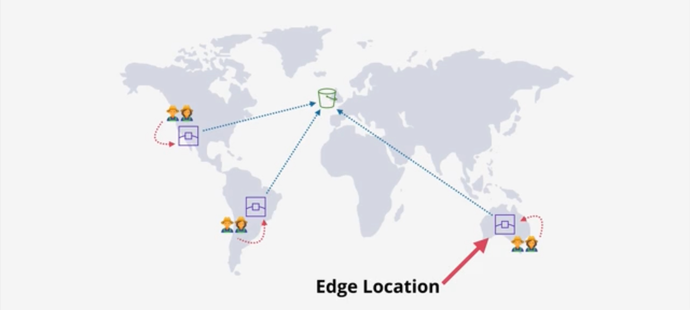

## Key Management Service (KMS)

- `AWS Key Management Service (AWS KMS)`
	- Create and manage cryptographic keys and controls their use across a wide range of AWS services and in your applications
	- Secure and resilient service that uses hardware security modules that have been validated under **FIPS 140-2** or are in the process of being validated to protect your keys
- Is a **Regional and Public Service**
	- Occupies AWS public zone
- Create, Store, and Manage Keys
	- *Symmetric* and *Asymmetric* Keys
- Capable of performing cryptographic operations (**encrypt, decrypt, etc..**)
- **KEYS NEVER LEAVE KMS** - Provides FIPS 140-2 (**Level 2**)
	- KMS primary function is to ensure that the keys never leave and are held securely in the service
- `KMS Keys`
	- Are **logical** meaning they have ID, date, policy (**resource policy**), description and state
	- Every key is backed by **physical key material**
		- Its this data which is held by KMS and its material, which is actually used to encrypt and decrypt things you give to KMS
		- Can be generated or imported
		- This material can be used for up to **4KB of data** to directly encrypt and decrypt
- KMS does not need to be told which KMS key to use for the decrypt operation
	- That information is encoded into the ciphertext of the data, which the user wants to encrypt
- Permissions to encrypt, decrypt, and generate keys are all different and separate

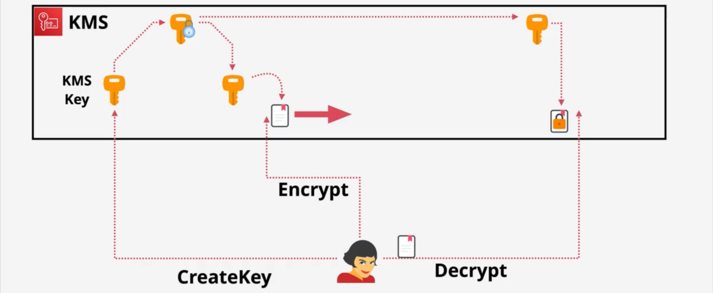

**How does KMS get around encrypting 4KB in size ??**

Data encryption keys, also known as DEKs, are another type of key that KMS can generate. They're generated using a KMS key using the *GenerateDataKey* operation. This *GenerateDataKey* can be used to encrypt and decrypt data which are more than 4KB in size. DEKs are **linked** to the KMS Key which created them. So KMS can tell that specific data encryption key was created using a specific KMS key, but KMS doesn't store the data encryption in any way. It provides it to you or the service using KMS and then it discards it. The reason it discards it is that KMS doesn't actually do the encryption or decryption of data using data DEKs. You do or the service using KMS do.

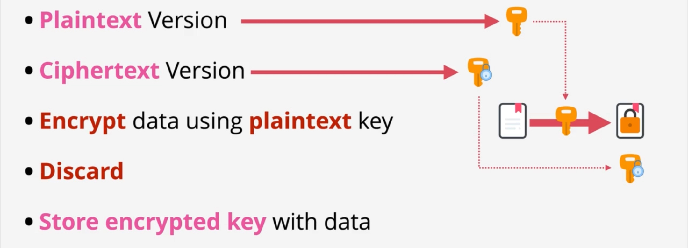

- KMS does not encrypt data greater than 4KB, you do or the service does
- KMS doesn't track the usage of data encryption keys
	- That is also you or the service using KMS
- S3 generates a DEK for every single object


### Key Concepts KMS
- KMS Keys are isolated to a **region** and never leave
	- Does support multi region keys (discussed later)
	- AWS Owned and Customer Owned Keys
		- AWS Owned keys are a collection of KMS keys that an AWS service owns and manages for use in multiple AWS accounts
		- They operate in the background and you largely don't need to worry about them
		- Two types of Customer Owned Keys
			- *AWS Managed* 
				- Created automatically by AWS when you use a service such as S3 which integrates with KMS
			- *Customer Managed*
				- Created explicitly by the customer to use directly in an application or within AWS service
				- More configurable 
				- Rotational is optional
		- KMS Key Support Rotation
- **Backing key** (and **previous backing keys**)
	- Means that as a key is rotated, data encrypted with old versions can still be decrypted 
- Can create Aliases
	- Per Region
	- Neither aliases or keys are global by default

### Key Policies and Security

- Key Policies (Resource Policy)
	- Account trust is *explicitly added* on a key policy or not
	- Every KMS key has one

```json
// Typical Key Policy
// The key will allow the account 11112223333 to manage it
// This trust isn't automatic like the rest 

{
	"Sid": "Enable IAM User Permissions",
	"Effect": "Allow",
	"Principal": {
		"AWS": "arn:aws:iam::11112223333:root"
	}
	"Action": "kms.*",
	"Resouce": "*"
}
```

```json
// IAM Policy
// Gives the holder the policy the right to use this key to encrypt or decrypt data

{
	"Version": "2012-10-17",
	"Statement": {
		"Effect": "Allow",
		"Action": [
			"kms:Encrypt",
			"kms:Decrypt"
		],
		"Resource": [
			"arn:aws:kms:*:11112223333:key/*"
		]
	}
}
```

## S3 Object Encryption CSE/SSE

- Three types of `S3 Server Side Encryption`:
	- `Server Side Encryption with Customer-Provided Keys (SSE-C)`
	- `Server Side Encryption with Amazon S3-Managed Keys (SSE-S3)` 
		- **This is the default**
	- `Server Side Encryption with KMS KEYS Stored in AWS Key Management Service (SSE-KMS)`

### SSE-C

To *decrypt*, you need to provide S3 with the request and the key used to encrypt the object. If it's correct, S3 decrypts the object, discards the key, and returns the plaintext. The returning of plaintext is transmitted through an HTTPS tunnel so from the perspective of an observer it's not visible. 

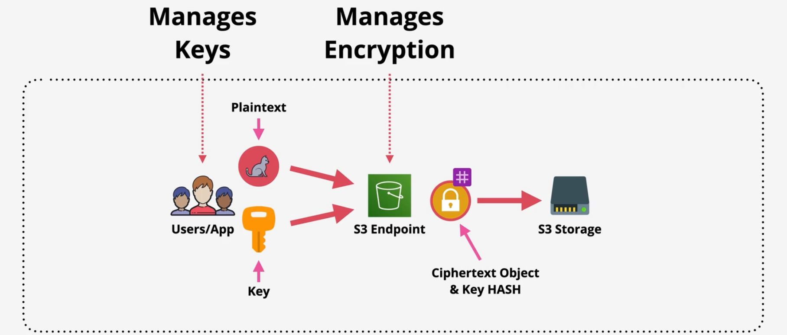

- Pros
	- Regain control of the process of managing your keys which is good in some regulation heavy environments
	- Save **CPU requirements** versus `CSE` because S3 *performs* encryption and decryption
- Cons
	- You *need to trust* that S3 will discard the keys after use

**Choose `SSE-C` when you absolutely need to **manage your own keys**, but content to allow S3 to perform the encryption and decryption processes**

### SSE-S3 (AE256)

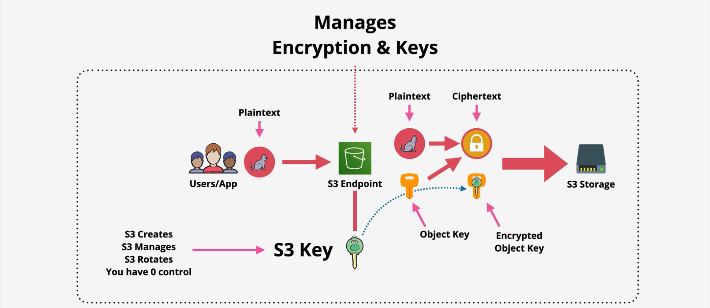

- Pros
	- Customer does not have any admin overhead
- Cons
	- If you are in an environment which is strongly regulated, this is not suitable
	- If you need to control rotation of keys, this is not suitable
	- If you need role separation, this is not suitable

**What do we mean by role separation ?**

Is that a full S3 Administrator, somebody who has full S3 permissions to configure the bucket and manage the objects, then he or she can also decrypt and view data. You can't stop an S3 full administrator from viewing data when using this type of SSE. Certain industries, such as medical, you might not be allowed to have this full and open access for service administrators. You might have certain groups within the business who can access the data but can't manage permissions

### SSE-KMS

- This where S3 and KMS work together. 
- The power and flexibility with this SSE comes from creating a customer managed KMS key. 
- If you use a custom managed KMS key it means this created by you within KMS
	- Managed by you, and it has *isolated permissions*. In addition the key is fully configurable. 

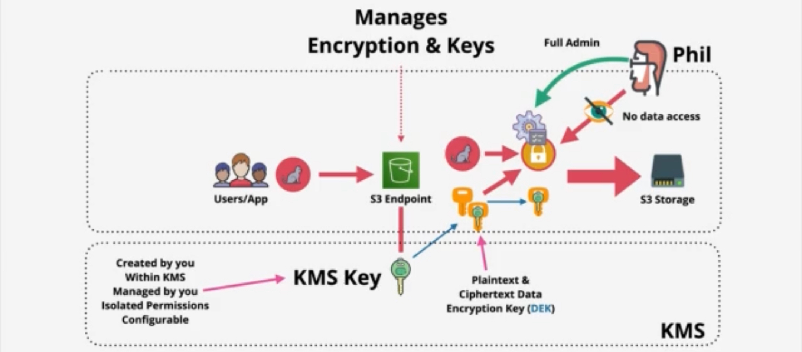

Phill can administer S3 but can't see the data in objects because he can't decrypt the data inside of Objects.

- Pros
	- Gives control over the KMS key
	- Gives control over the rotation as well
	- You have logging and auditing with KMS key and with CloudTrail you will be able to see any calls made against that key
	- Has role separation

### SSE Summary


| Method  | Key<br>Management | Encryption<br>Processing | Extras                                  |
| ------- | ----------------- | ------------------------ | --------------------------------------- |
| CSE     | You               | You                      | S3 Never sees plaintext                 |
| SSE-C   | You               | S3                       |                                         |
| SSE-S3  | S3                | S3                       | No Key control<br>No Role Separation    |
| SSE-KMS | S3 and KMS        | S3                       | KEY Rotation control<br>Role Separation |


## S3 Buckets

- `S3 Bucket Keys` reduce the cost of `S3 SSE`
	- Using `AWS KMS (SSE-KMS)`
- Bucket-level keys for `SSE` can reduce `AWS KMS` request costs by up to 99% by **decreasing the request traffic from Amazon S3 to AWS KMS**

### S3 Without Bucket Keys

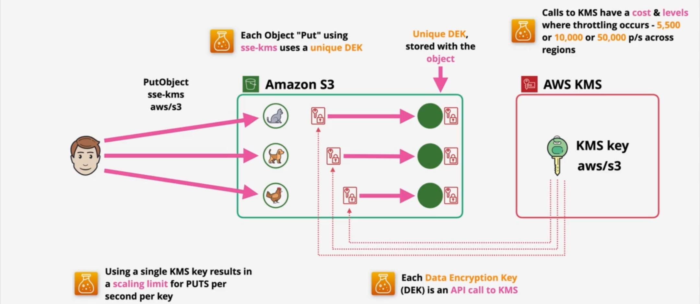

### S3 Bucket Keys

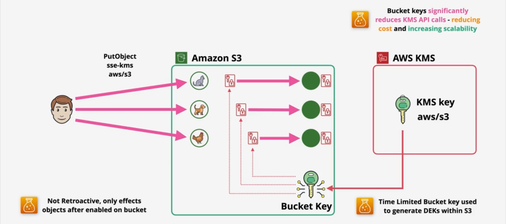

- Pros
	- Offloads the work from KMS to S3
	- Reduces the number of KMS API calls, so reduces the cost and increases scalability
- **S3 Bucket Keys Info**
	- CloudTrail KMS events now show the bucket and not the object
		- After you enable an `S3 Bucket Key`, if you are using CloudTrail to look at KMS logs
			- Logs are going to show the bucket ARN instead of your object ARN
	- Works with **replication**, the object encryption is maintained
		- When `S3` replicates an encrypted object, it generally preserves the encryption settings of that encrypted object
			- The encrypted object in the destination bucket generally uses the same settings as the source
	- If you are replicating plaintext to a bucket using bucket keys the object is encrypted at the destination side (`ETAG` changes)
		- Something that is not encrypted and you're replicating that through to a destination bucket which uses default encryption or an `S3 Bucket Key` then `S3` encrypts that object on its way through to destination with the destination bucket's configuration

## S3 Object Storage Classes

### S3 Standard

**Use S3 Standard for Frequently Accessed Data which is important and Non Replaceable.**

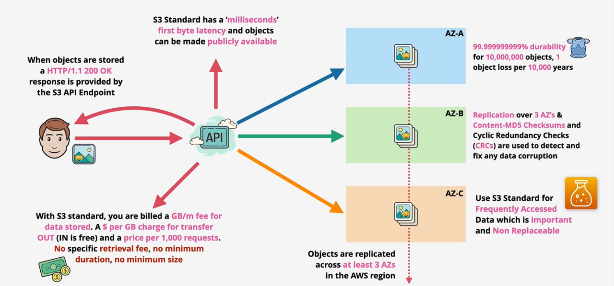

### S3 Standard-IA

**Use S3 Standard-AI for INFREQUENTLY accessed data or you do not need to store it short term.**

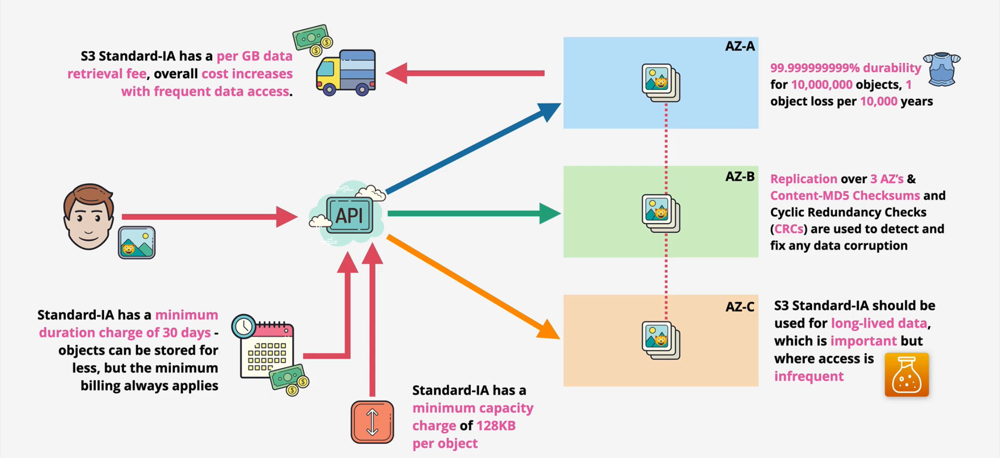

### S3 One Zone-IA

**S3 One Zone-IA should be used for long-lived data, which is NON-CRITICAL and REPLACEABLE and where access is infrequent.**

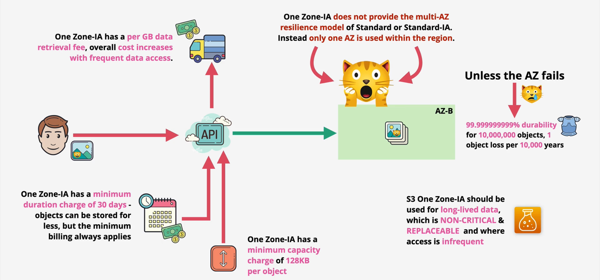

### S3 Glacier - Instant

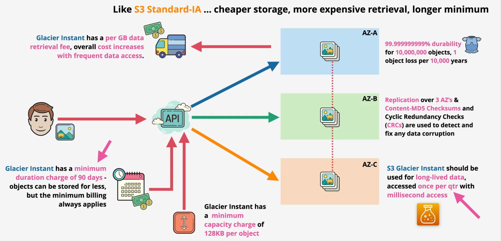

### S3 Glacier - Flexible

Objects are *cold*. Meaning they are not immediately available. They can not be made public. *First byte latency (minutes or hours)*. *One of the cheapest forms of storage*

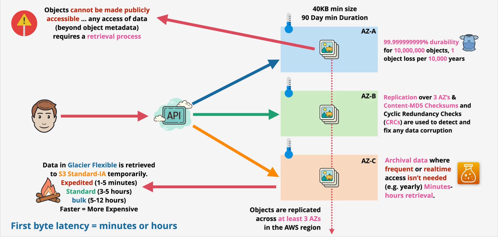

### S3 Glacier - Deep Archive

**THE CHEAPEST FORM OF STORAGE IN S3**
<br/>
Data is in a frozen state!

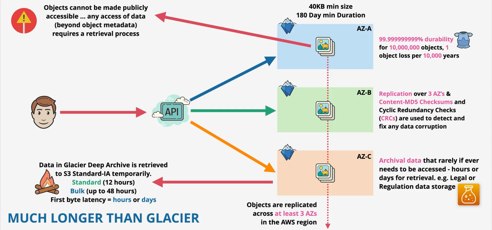

### S3 Intelligent Tiering

Monitors the usage of the objects. When an object is in regular use would stay within the frequent access tier.

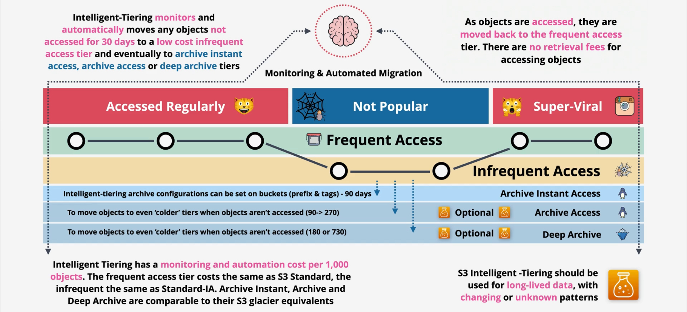


## S3 Lifecycle Configuration

- You can create `Lifecycle Rules` on `S3 Buckets` which can automatically transition or expire objects in the bucket
	- **Rules are a great way to optimize costs for larger `S3 Buckets`**
* You can create `Lifecycle Rules` on `S3 Buckets` which can automatically transition or expire objects in the bucket
	* **Rules are a great way to optimize costs for larger `S3 Buckets`*
* `LifeCycle Configuration` 
	- Is a set of rules
	- Rules consist of actions
	- Rules can be applied on a *Bucket* or *groups of objects* in that bucket defined by prefix or tags
- `Transition Actions`
	- Which change the storage class of whichever object or objects are affected. 
		- Transition objects from *S3 Standard* to *S3 Infrequent Access* after 30 days
- `Expiration Actions` 
	- Which can delete whatever object/objects/object versions are affected 
		- So you might want to expire objects or versions entirely after a certain time period.

### Transitions

- Transitioning flows down like a waterfall.
- Transition can't happen in an upward direction, only down. 

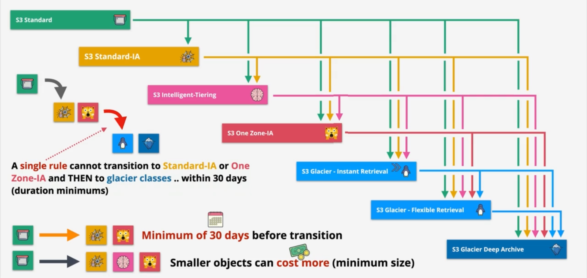

## S3 Replication

- S3 has two replication features which allow objects to be replicated between SOURCE and DESTINATION buckets in the same or different AWS Accounts.
	- `Cross-Region Replication (CRR)` 
		- Is the process used when Source and Destination are in different AWS regions.
	- `Same-Region Replication (SRR)` 
		- Is used when the buckets are in the same region.

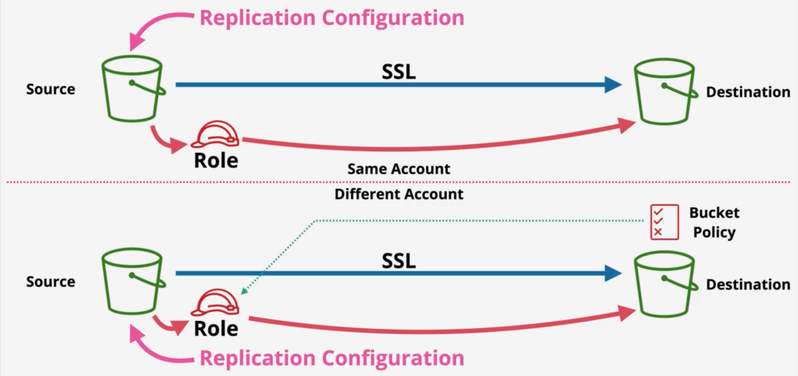


Because the destination bucket is in a different AWS account, the destination bucket doesn't trust the source account or the role that's used to replicate the bucket contents. There is also a requirement to add a *bucket policy* on the destination bucket. Which allows the role in the source account to replicate objects into it. 

### Replication Options

* Replicate all objects or a subset using rules with prefix/tag filters
* Choose the destination **Storage Class** (defaults to matching the source)
* Set object **ownership** in the destination bucket (defaults to the source account, but you can override so the destination account owns replicated objects — important for cross-account scenarios to avoid access issues)
* **Replication Time Control (RTC)** adds a guaranteed **15-minute replication SLA** plus monitoring to track queued objects — only use it when strict business requirements demand tightly synced source and destination buckets

### Considerations for Replication

- **Not retroactive by default** — versioning must be ON in both source and destination buckets
- **Batch Replication** can replicate existing objects retroactively
- **One-way (source → destination) by default** — objects added to the destination aren't replicated back; bidirectional replication exists but requires extra configuration
- Supports **unencrypted, SSE-S3, SSE-KMS (with extra config), and SSE-C** objects
- **Source bucket owner needs permissions** on the objects being replicated
- **Excludes**: system events, and any objects in **Glacier** or **Glacier Deep Archive** storage classes
- **Deletes are NOT replicated** by default — can be enabled with **DeleteMarkerReplication**

### Why use Replication?

**Same Region Replication (SRR)**
- **Log aggregation** — consolidate logs from multiple buckets into one
- **Prod/Test synchronization** — copy data between environments, often across AWS accounts
- **Resilience with strict data sovereignty** (data must stay in the same region)

**Cross Region Replication (CRR)**
- **Global resilience** — backup data across regions to survive large-scale failures
- **Latency reduction** — replicate data closer to users for faster access from remote regions

## S3 PreSigned URLs

- `Pre-signed URL's` 
	- Are a feature of S3 which allows the system to generate a URL with access permissions encoded into it, for a specific bucket and object, valid for certain time period. 

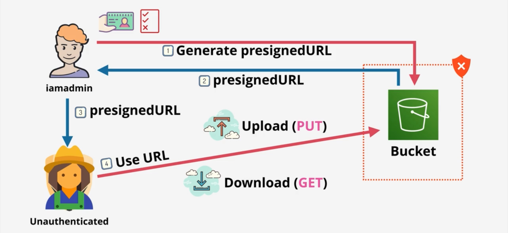

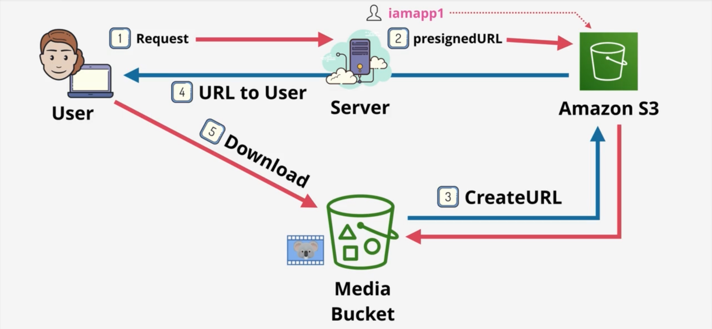

 - You can create a URL for an object you have **no access to**
	 -  When using the URL, the permissions match the **identity which generated it has RIGHT NOW**
 -  Access denied could mean the generating ID **never had access** or **doesn't now**
 - **Don't generate with a role** URL stops working when temporary credentials expire
	 - A pre-signed URL can have a much longer validity period than the temporary credentials of an IAM role

## S3 Select and Glacier Select

**S3 Select & Glacier Select** let you retrieve **partial objects** from S3/Glacier using SQL-like queries.

**The problem:**
* S3 supports huge objects (up to 5 TB)
* Retrieving the full object is slow, costly, and uses massive bandwidth
* Client-side filtering doesn't help — you've already paid to transfer the entire object

**The benefit:**
* Filter data **server-side** before retrieval, dramatically reducing cost and improving performance
* Supports **CSV, JSON, Parquet**, and **BZIP2-compressed** CSV/JSON

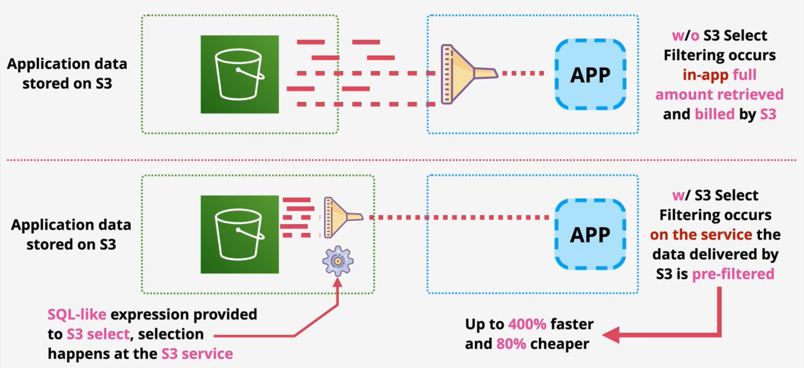

## S3 Events

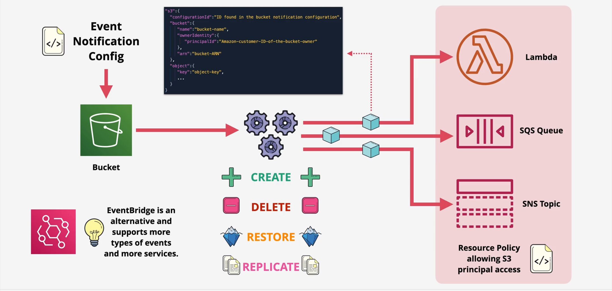

**S3 Event Notifications** trigger alerts when events occur in a bucket, sent to **SNS, SQS, or Lambda**.

**Setup:** Configure notifications by specifying:
* Which **events** to publish
* The **destination** to send them to (stored in the bucket's notification sub-resource)

**Supported events:**
* **Object created** — Put, Post, Copy, CompleteMultiPartUpload
* **Object deletion** — *, Delete, DeleteMarkerCreated
* **Object restore** — Post (initiated), Completed
* **Replication events** — OperationMissedThreshold, OperationReplicatedAfterThreshold, OperationNotTracked, OperationFailedReplication

## S3 Access

**S3 Server Access Logging** records detailed information about every request made to a bucket. Useful for:

* **Security and access audits** — track who accessed what
* **Customer analytics** — understand usage patterns
* **Cost analysis** — identify what's driving your S3 bill

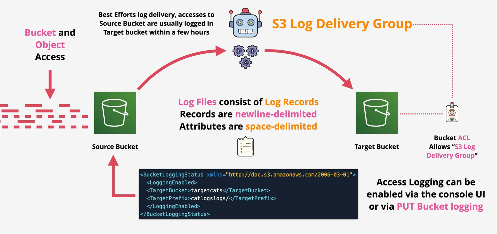

## S3 Object Lock

**S3 Object Lock (WORM — Write-Once-Read-Many)**
* Prevents object deletion or overwriting for a fixed period or indefinitely
* Used for **regulatory compliance** or extra protection against accidental changes
* **Requires versioning** — individual object versions are locked
* Two protection mechanisms (can use both, one, or none): **Retention Period** and **Legal Hold**

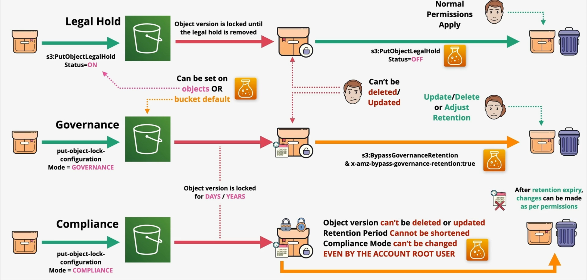

**Retention Period** — time-based protection (specified in days/years)
* **Compliance mode** — strictest: object can't be modified, deleted, or overwritten during the retention period. Retention period can't be shortened, mode can't be changed, **not even by the root user**
* **Governance mode** — flexible: privileged users with `s3:BypassGovernanceRetention` permission (and the `x-amz-bypass-governance-retention:true` header) can override the lock. Good for accidental deletion prevention or testing settings before committing to compliance mode

**Legal Hold** — indefinite protection (no retention period)
* Set on an object version as **ON** or **OFF**
* No deletes or changes allowed until manually removed
* Requires `s3:PutObjectLegalHold` permission to add/remove
* Used to prevent accidental deletion of critical objects (e.g., during litigation)

## S3 Access Points

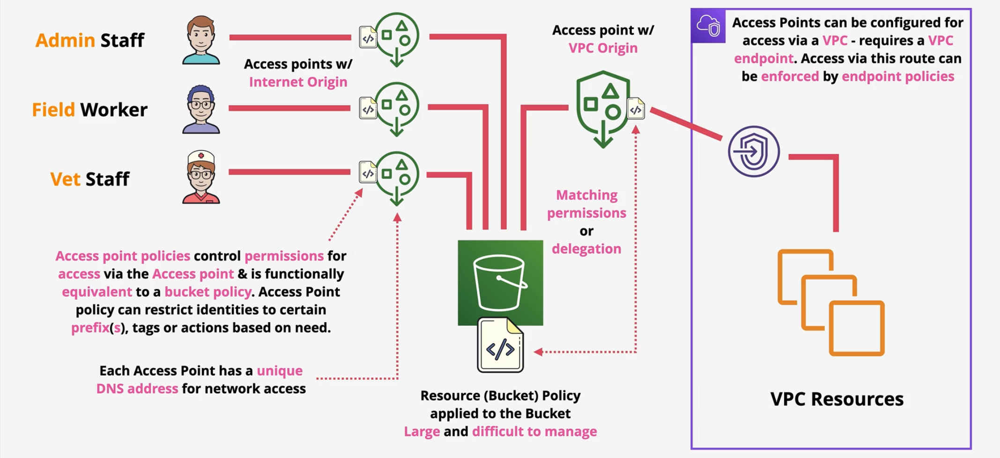