# EC2 Basics

## Virtualization 101
- EC2 provides infrastructure as a Service (IaaS Product)
- Servers are configured in three sections without virtualization
	- CPU Hardware
	- Kernel
		- Operating System
		- Runs in privilege mode and can interact with the hardware directly
	- User Mode
		- Runs applications
		- Can make a `system call` to the Kernel to interact with the hardware
		- If an app tries to interact with the hardware without a system call, it will cause a system error and can crash the server or at minimum the app

### Emulator Virtualization - Software Virtualization

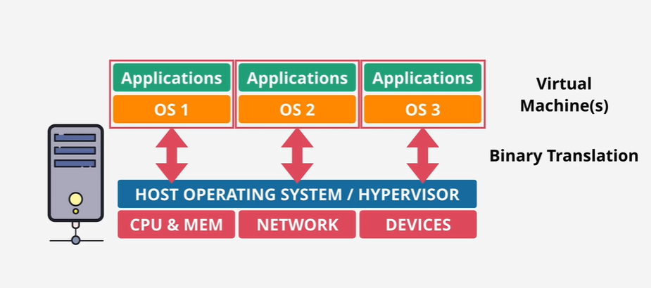

- **Host Level Control**
	- A host OS runs directly on the physical hardware and includes a hypervisor that operates in *privilege mode*, granting it full, direct access to the server's hardware resources
- **Encapsulated Guests**
	- Guest operating systems are *"wrapped"* inside Virtual Machines (VMs). They are unaware they are virtualized and believe they have exclusive control over the physical hardware
- **Software Emulation**
	- Instead of direct access, the Guest OS interacts with emulated devices (like graphics cards or network adapters) mapped by the hypervisor. These are entirely software-defined, not physical
- **Binary Translation**
	- The hypervisor acts as an intermediary, intercepting the Guest OS's hardware calls. It uses *binary translation* to convert these instructions into a format the physical hardware can execute
- **Flexibility vs Performance**
	- While this method allows for a Guest OS to run without any modifications, the *"middleman* process of intercepting and translating calls creates significant software overhead, leading to slower performance compared to other virtualization types

### Para-Virtualization

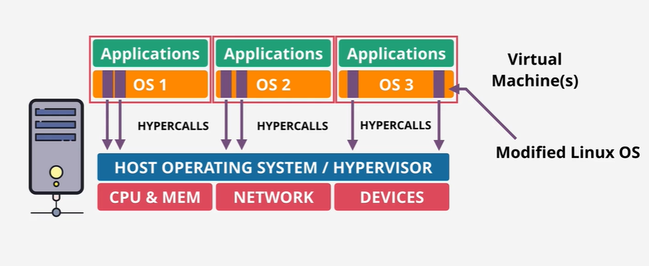

- **No Binary Translation**
	* Skips the slow process of intercepting and translating every hardware command in real-time
- **Modified Guest OS**
	- This method requires the Guest OS kernel to be modified because of this, it only works with a small subset of operating systems (typically open-source ones like Linux) where the source code can be change
- **Virtualization**
	- The Guest OS is *aware* that is running on a hypervisor rather than directly on physical hardware 
- **Hypercalls**
	- Instead of OS making the standard `system calls` to hardware, it is modified to make `hypercalls` directly to the hypervisor
- **Vendor Specific**
	- Due to the OS being modified to talk to the hypervisor the modifications are often specific to the particular virtualization vendor
- **Performance Boost**
	- By removing the *"middleman"* of binary translation the system runs significantly faster, though it is still essentially a sophisticated "software trick" rather than a hardware level feature

### Hardware Assisted Virtualization

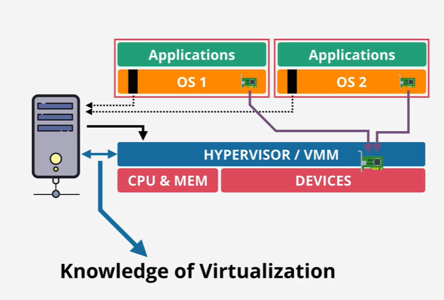

- **Hardware Awareness**
	- Unlike purely software-based methods, the physical CPU is designed with specific instructions to natively support virtualization
- **Privilege Instruction Trapping**
	- When a Guest OS attempts to execute a privilege instruction (thinking that it owns the hardware), the CPU *"traps"* that call
- **Hardware Redirection**
	- Instead of process halting or crashing, the CPU hardware itself redirects the request to the hypervisor for handling
- **Unmodified Guest OS**
	- Because the hardware handles the redirection, the Guest OS does not need to be modified (unlike Para-Virtualization), allowing it run at near-native speeds
- **I/O Bottleneck**
	- While the CPU handles logic directly, the main challenge remains **I/O operations (Network and Disk)**. Performance can still lag when multiple Guest OSs compete for the same physical hardware resources simultaneously 

### SR-IOV (Single Route IO Virtualization)

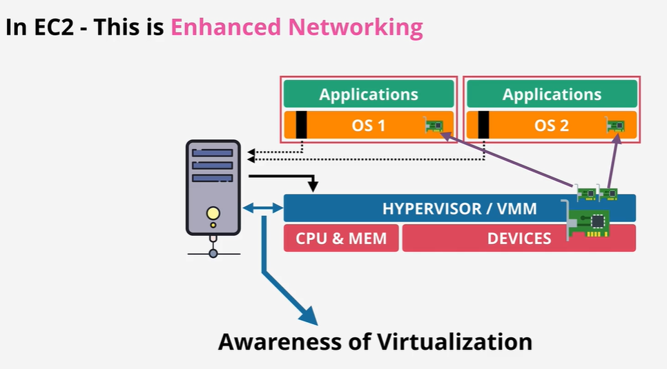

- **Hardware Partitioning**
	- Allows a single physical PCIe device (like a network interface card) to appear as multiple separate *"Virtual Functions (FV)*
- **Dedicated Mini Cards**
	- Each Guest OS sees its own dedicated hardware instance. To the OS, it looks like it has its own real, physical card rather than a shared slice of one
- **Hypervisor Bypass**
	- Because the physical hardware handles the data separation internally, the hypervisor doesn't need to intercept or translate the I/O traffic
- **Direct Pathing**
	- This removes the *"middleman"* overhead, significantly reducing the CPU cycles required for networking and storage tasks
- **AWS Implementation**
	- In the context of EC2, this technology powers `Enhanced Networking`, providing higher I/O performance (PPS) and lower latency/filter

## EC2 Architecture and Resilience

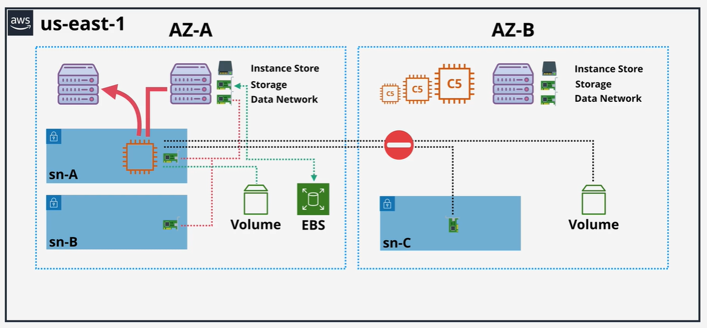

- **The EC2 Host and Multi-Tenancy**
  - Virtual Machine (VM) Definition
    - An `EC2` instance is a combination of an OS an allocated hardware resources (CPU, RAM)
  - Shared vs Dedicated
    - *Shared*
      - Multiple customers run instances on the same physical hardware, but are logically isolated
    - *Dedicated*
      - You pay for the entire physical server
      - You don't pay for individual instances on that host, just the host itself
  - Generation and Type
    - Generally instances on the same physical host share the same *family* (type) and hardware generation\
      - Usually differ in their *size*
- **AZ Resilience and Networking**
  - `AZ` locked
    - `EC2` is an `Availability Zone (AZ)` resilient service. An instance, its located local hardware, its subnet, and its `EBS` volumes are all *"locked"* within a single specific `AZ`
  - `Elastic Network Interfaces (ENI)`
    - When provisioned in a `VPC` subnet, a primary `ENI` is created that maps to the physical hardware
      - Instances can have multiple `ENIs`
      - `ENIs` can be different subnets, but those subnets must be in the same `AZ`
- **Storage: Local vs Remote**
  - `Instance Store (Ephemearl)`
    - This is *"local"* storage physically attached to the host
      - RISK: If the instances moved to a different host, the data is lost
  - `Elastic Block Store (EBS)`
    - Remote, persisted storage
    - **Constraint**: Like the instance itself, `EBS` is `AZ` specific. You cannot attach an `EBS` volume to an instance in a different `AZ`

### Start vs Stop vs Restart Lifecycle

| **Action**           | **Host Placement**                                       | **Storage (Instance Store)** |
| -------------------- | -------------------------------------------------------- | ---------------------------- |
| **Restart (Reboot)** | Stays on the **same** physical host.                     | Data is **preserved**.       |
| **Stop & Start**     | Relocates to a **new** physical host in the same AZ.     | Data is **lost**.            |
| **Host Failure**     | AWS moves the instance to a **new** host in the same AZ. | Data is **lost**.            |

### EC2 Strengths

- **Traditional OS Hardware**
- **Persistent and Long Running Compute**
  - HAS NO RUNTIME LIMITS
  - Ideal for apps that need to run 24/7
- **Server Side Applications**
  - Ideal for *"listening"* applications
    - Those waiting for network responses or handling constant incoming traffic
- **Flexible Load Patterns**
  - Efficiently handles both **steady state loads** and **burst workloads**
- **Monolithic Applications Stack**
  - The best fit for *"all-in-one"* applications that require specific middleware or unique runtime components
- **Migration and Diaster Recovery (DR)**
	- Easily migrate existing on-premises server workloads directly to the cloud
    - Is realiable

| **Feature**        | **Why EC2?**                                                                     |
| ------------------ | -------------------------------------------------------------------------------- |
| **Duration**       | Unlimited (Run as long as you need).                                             |
| **Customization**  | Full root/admin access to the OS and kernel.                                     |
| **Legacy Support** | Can run older "Monolithic" apps that can't be broken into microservices.         |
| **Networking**     | Best for apps that need a static IP (Elastic IP) or specific network interfaces. |

## EC2 Instance Type

### EC2 Categories

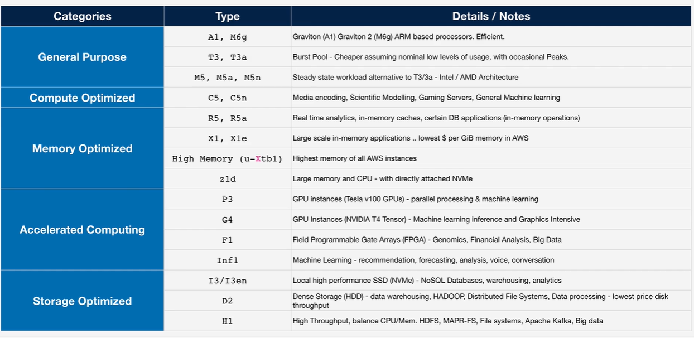

| **Category**              | **Best For...**                    | **Example Use Cases**                                       |
| ------------------------- | ---------------------------------- | ----------------------------------------------------------- |
| **General Purpose**       | Balanced resources.                | Web servers, small databases, dev environments.             |
| **Compute Optimized**     | High-performance processors.       | Media transcoding, scientific modeling, gaming servers.     |
| **Memory Optimized**      | Processing large datasets in RAM.  | In-memory databases (SAP HANA), big data analytics (Spark). |
| **Storage Optimized**     | Massive local I/O (IOPS).          | NoSQL databases, data warehousing, Elastic Search.          |
| **Accelerated Computing** | Specialized hardware (GPUs/FPGAs). | Machine Learning, 3D rendering, video encoding.             |

### Naming Schema

- **AWS uses a specific shorthand.** For example `R5dn.8xlarge`
  - The Prefix `R5dn`
    - `R` (Instance Family)
      - The first letter tells you the category. `R` is for **Memory Optimization**
    - `5` (Generation)
      - The number indicates the hardware age
      - Always aim for the newest generation for better price to performance
    - `d`, `n` (Additional Capabilities)
      - `a`: AMD Processor
      - `g`: AWS Graviton (ARM Based) Processor - usually the most cost effective
      - `d`: Includes **Direct** local NVMe storage (`Instance Store`)
      - `n`: Network optimized (higher throughput)
      - `e`: Extra capacity (more RAM or storage than standard)
    - The Size `.8xlarge`
      - Linear Scaling
        - As you go up in size (from `medium` to `large` to `8xlarge`), AWS generally double CPU and RAM
      - Scaling Strategy
        - It is often cheaper and more resilient to scale **horizontallY** (many small instances) rather than **vertically** (one massive instance)

## Storage Refresher

### Key Terms

* `Direct (Local) Attached Storage`
	* These are physical disks physically plugged into the same rack as your EC2 host.
	* Because there is no network *"hop"*, the speed is fast
	* This is `Instance Store`
* `Network Attached Storage`
	* Volumes delivered over the network (`EBS`)
* `Ephemeral Storage`
	* Temporary storage
	* Only lasts as long as the instance is running on that specific host
	* If instance is **stopped** or the host fails data is lost
	* `Instance Store`
* `Persistent Storage`
	* You can terminate the instance entirely and the data remains safe on the volume, and ready to be attached to a new instance
	* `EBS`

|**Feature**|**EC2 Instance Store**|**Elastic Block Store (EBS)**|
|---|---|---|
|**Connection**|**Direct** (Local)|**Network** Attached|
|**Lifespan**|**Ephemeral** (Temporary)|**Persistent** (Permanent)|
|**Cost**|Included in instance price|Billed per GB/month|
|**Risk**|Lost on **Stop** or Host Failure|Resilient; survives Stop/Start|

### Types of Storage

| **Type**   | **How it's Delivered**                     | **Key Characteristic**                        | **Bootable?**                            | **Mountable?**                           |
| ---------- | ------------------------------------------ | --------------------------------------------- | ---------------------------------------- | ---------------------------------------- |
| **Block**  | Collection of blocks (EBS/Instance Store). | OS creates its own file system (NTFS/EXT4).   | ✅                                   | ✅                                  |
| **File**   | Managed file share (EFS/FSx).              | Accessed via a hierarchy/structure (NFS/SMB). | &#10008; | ✅                                   |
| **Object** | Flat collection with Keys (S3).            | Scales infinitely; accessed via API/Key.      | &#10008; | &#10008; |

### Storage Performance

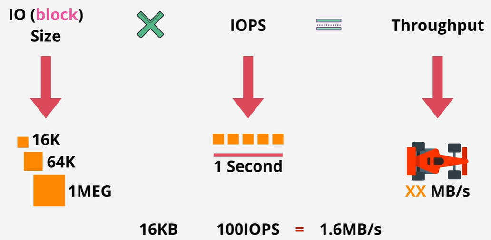

A key simplification for the exam:

$$Throughput = Block\ Size \times IOPS$$

- **IOPS**: How many *"requests"* per second
- **Throughput**: How much *"total data"* per second (MB/s)
- **Constraint**: If you use a very large Block Size, your total IOPS will decrease beacause you'll hit the throughput cap of the volume or the instance first

## Elastic Block Storage

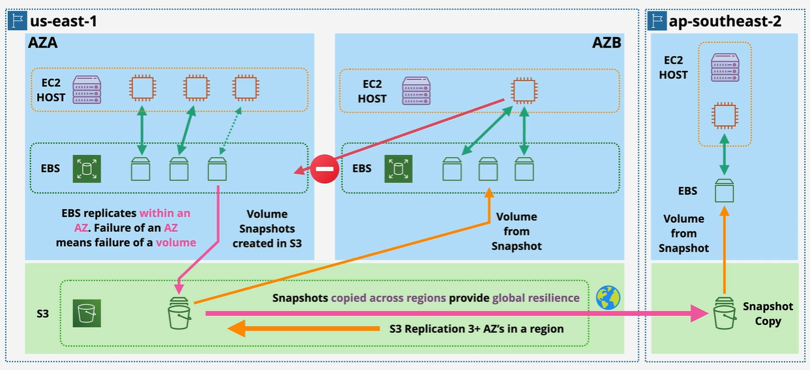

- **Network Attached**
  - Delivered over the network
  - Performance can be limited by the instance's network bandwidth
    - Use `EBS Optimized`
- **AZ Resilient**
  - Highly available within **one** `AZ`
  - Data is automatically across multiple physical hard drives in that zone
- **Persistent**
  - Data lives on even if the instance is stopped or terminated
    - If `DeleteOnTermination` is set to false

### EBS Volume Types

#### gp2

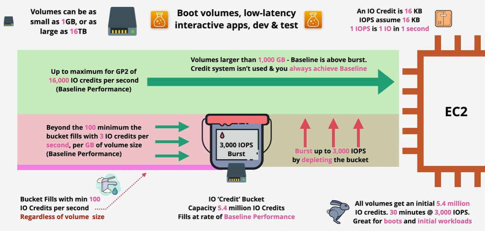

#### gp3

N/A

#### io2

- `io2` **Block Express (High Performance)**
  - Stats
    - Up to `256k IOPS` and `4000MB/s` throughput per volume
  - Durability
    - `5 nines` 
  - Multi-Attach
    - Can be shared by up to 16 Nitro-based instances in the same `AZ`

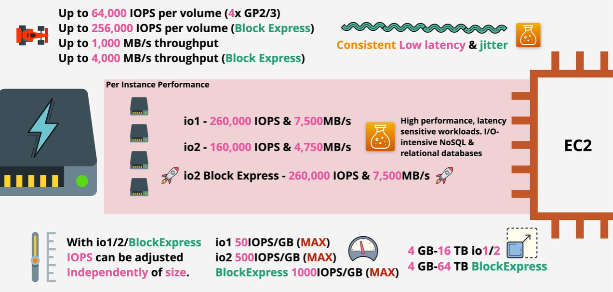

#### HDD

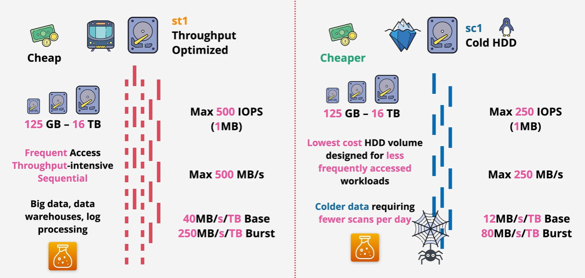

* **`st1 & sc2` (HDD)**
	* Cannot be used as boot volumes
	* Best for sequential large block data (Logs, Big Data)
	* Good for price consensus
		* Great value for high Throughput vs IOPS
	* Good for streaming data on a hard disk
		* Media conversion with large amounts of storage 
* **`st1`: Throughput Optimized HDD**
	* Credit
		* Starts with `1TB` of credit per `TiB` of volume size
	* Baseline
		* `40MB/s` per `TiB`
	* Burst
		* `250MB/s` per `TiB`
	* Max
		* `500MB/s` total per volume
* **`sc1`: Cold HDD**
	* Credits
		* Fills slower for infrequent access
	* Baseline
		* `12MB/s` per `TiB`
	* Burst
		* `80MB/s` per `TiB`
	* Max
		* `250MB/s` total per volume
	* Inefficiently
		* High penalty for small/random I/O
		* Requires large, sequential blocks

### Exam Powerup

- **AZ Bound:** Created and isolated in a **single AZ**. Highly available/resilient only within that zone.
- **Connectivity:** Standard is 1-to-1; **Multi-attach** only for **io1/io2** (max 16 instances).
- **Billing:** Billed by **GB/month** regardless of whether the instance is running.
- **Performance Limits (2026):**
    - **Instance Max:** **80,000 IOPS** / **2,375 MB/s**
    - **Volume Max (io1):** **64,000 IOPS** / **1,000 MiB/s**.
    - **Booting:** SSDs only (**gp2/gp3/io1/io2**). You cannot boot from **st1/sc1**.

## Instance Store Volumes

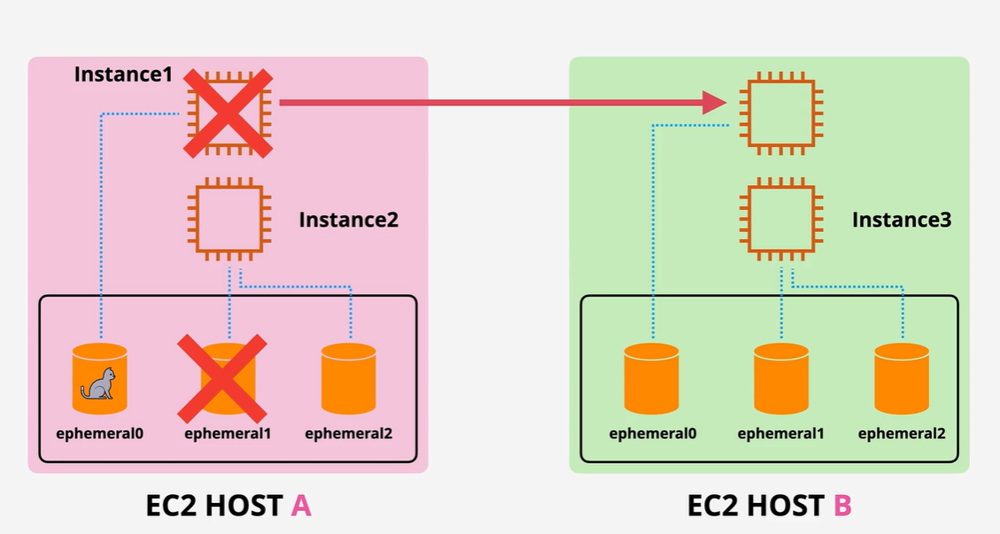

* Local physical storage directly attached to the `EC2` host
	* Block storage, similar to `EBS`
* **Host-Isolated** only instances on that specific host can access them
* **Highest storage performance** on AWS
* **Included in the instance price**
	* Use it or lose it
* **Must be attached at launch**
	* Cannot be added afterward
* **Data is ephemeral**
	* Tied to the physical host not the instance, data is lost when;
		* Instance is stopped and started (migrates to a new host)
		* AWS performs host maintenance
		* Instance type is changed 
		* Underlying hardware fails
* **Varies by instance type**
	* Number, size, and performance differ; some instances have none at all
* **Instance Store Performance**
	* Much higher than EBS can provide
	* These volumes perform at much higher volumes than `EBS`

### Exam Powerup
* `Instance Store` volumes are local to `EC2` host
* Can only be added at launch time and cannot be added later
* Any data on `Instance Store` data is lost if it gets moved, or resized
* Highest data performance in all of AWS
* You pay for it anyway, it's included in the price
* TEMPORARY 

## EBS vs Instance Store

- **`EBS` should be your go-to choice for storage unless you have a specific reason not to use it**
- **When To Use `EBS`**
	- High available and reliable in an `AZ`
		- Can self correct against hardware issues
	- Persist independently from `EC2` instances
		- Can be removed or reattached
		- You can terminate instance and keep the data
	- Multi-attach feature of `io1`
		- Can create a multi shared volume
	- Region resilient backups
	- Require up to 64,000 IOPS and 1000 MiB/s per volume
	- Require up to 80,000 IOPS and 2,375 MB/s
- **When To Use `Instance Store`**
	- Great value, they're included in the cost of an instance
	- More than 80,000 IOPS and 2,375 MB/s
	- If you need temporary storage or can handle volatility
	- Stateless services, where the server holds nothing of value
	- Rigid lifecycle link between storage and the instance
		- This ensures the data is erased when the instance goes down 

## Snapshot, Restore, and Fast Snapshot Restore

### EBS Snapshots
- Efficient way to backup `EBS` volumes is to `S3`
- Protects data against `AZ` issues
- Makes data region resilient
- Can be used to migrate data between hosts, `AZ`, and volumes

#### How they work
- Snapshots are incremental volume copies stored in `S3`
- First snapshot is a **full copy** of the data
	- This can take some time
- `EBS` is not impacted during the snapshot, but runs in the background 
- Future snapshots are incremental
	- Consume less space and are quicker to perform
- If you delete an incremental snapshot, it moves the data to ensure subsequent snapshots still work properly
	- Example
		- Snapshot 1 - full copy (10GB)
		- Snapshot 2 - only changes from Snap1 (2GB)
		-  Snapshot 3 - only changes from Snap2 (1GB)
	- If you delete Snapshot 2, Snapshot 3 would be broken because it relied on Snap2 as its reference point
		- What AWS does instead, is before deleting Snapshot2, AWS moves any data that Snapshot3 depends on into Snapshot3 itself, so the chain remains intact. 

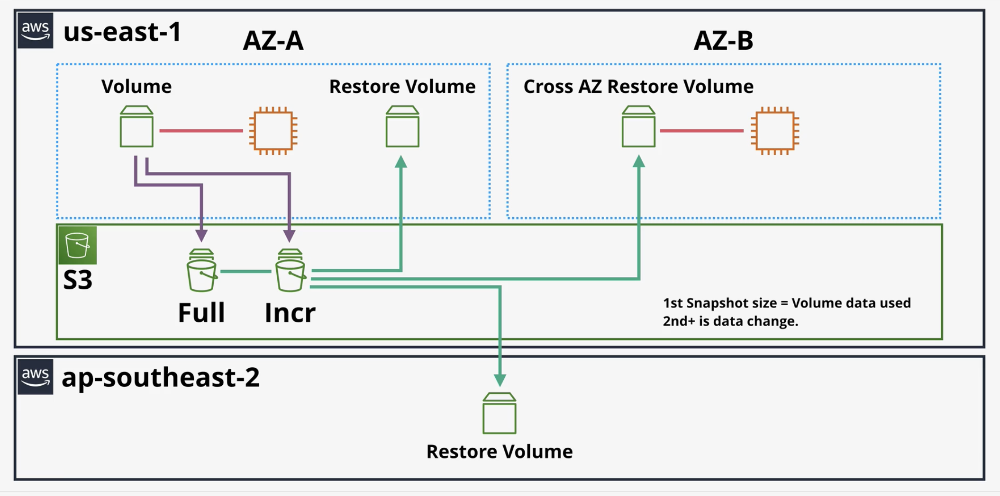

#### Use Case For Snapshots

- Restore/create volumes from snapshots
- Move `EBS` volumes between `AZs`
- Migrate data between volumes

### Snapshot and Volume Performance
- When creating a new `EBS` volume created without a snapshot, the performance is available immediately
- If you restore a snapshot it does it **lazily**
- If you restore a volume, it will **transfer it slowly in the background**
- If you attempt to read data that hasn't been restored yet, it will pull it from `S3`, but this will achieve lower levels of performance than reading from `EBS` directly
- You can force a read of all data immediately
	- This is something you would do right when using a volume

#### Fast Snapshot Restore (FSR)
- Enables immediate restore without lazy loading, but has a performance penalty
- Up to 50 FSR snaps per region
	- Set on the snapshot and `AZ`
- `FSR` is **not free** and can get expensive with many different snapshots

### Snapshot Consumption and Billing
- Billed using a `GB/month` metric
	- 20GB stored for half a month = 10GB-month
- Charged on used data, not allocated data
	- 40GB volume with only 10GB used
		- You're only charged for 10GB
		- Note this is unlike `EBS` itself which charges for allocated data
- Data is stored incrementally
	- Snapshotting every 5 minutes won't necessarily cost more than snapshotting every hour

## EBS Encrpyption At Rest

- Provides at rest encryption for block volumes and snapshots
- Without `EBS` encryption, the volume is not encrypted
	- Physical hardware encryption is a separate thing

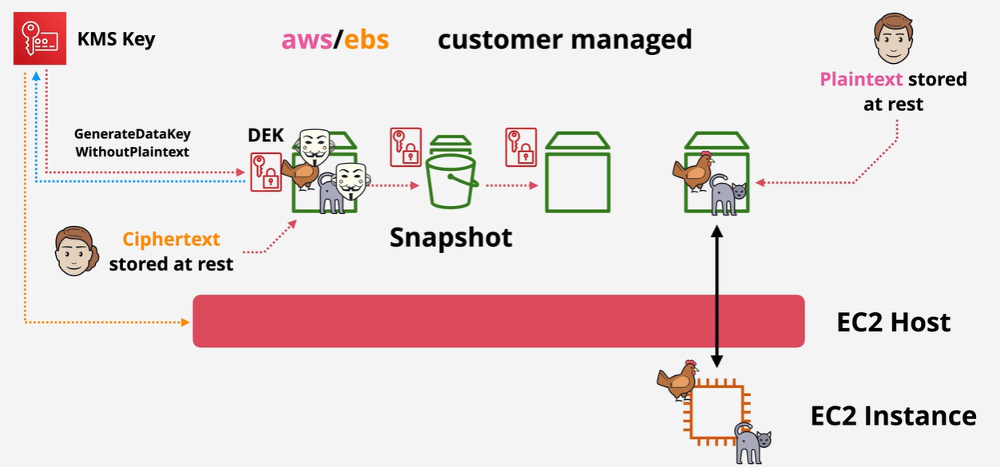

### How it works
- `EBS` uses `KMS` and a `Customer Master Key (CMK)` when setting up an encrypted volume
	- Can use the `EBS` default CMK (`aws/ebs`) or a customer managed CMK
- The CMK generates an encrypted `Data Encrpyion Key (DEK)` which is stored with the volume on the physical disk
	- The `DEK` can only be decrypted by `KMS` when a role with proper permissions makes the request
- When the volume is first used, `EBS` asks `KMS` to decrypt the key and stores the **decrypted DEK in memory** on the `EC2` host while in use
	- At all other times, it is stored on the volume in encrypted form
- The decrypted `DEK` is used for all cryptographic operations when data moves to end from the volume
- Data stored at rest is stored as cipher-text
- If the `EBS` volume is moved, the key is **disabled**

### Snapshots & New Volume
- Snapshots of an encrypted volume use the same `DEK`
- Anything created from that snapshot is also encrypted with the same `DEK`
- Every new `EBS` volume created from scratch gets a new **new unique DEK**

### Exam Power-Ups

- AWS accounts can be set to encrypt `EBS` volumes by default 
	- Uses the default `CMK` unless another is chosen
- Each volume uses `1 unique DEK`
	- Snapshots and the future volumes from it share the same `DEK`
- Cannot change an encrypted volume to be unencrypted 
	- You can copy data to an unencrypted volume but cannot change the original
- Encryption uses `AES-256`
- If an exam question mentions OS-level encryption or OS holding keys, that is **full disk encryption**, not `EBS` encryption
- Full disk encryption can be performed on both encrypted and unencrypted `EBS` volumes

## EC2 Network Interfaces, Instance IPs and DNS

- An `EC2` instance starts with at least one `ENI (Elastic Network Interface)`
- An instance may have `ENIs` in separate subnets, but everything must be within one `AZ`
- `Security Groups` are on the network interface, not the instance

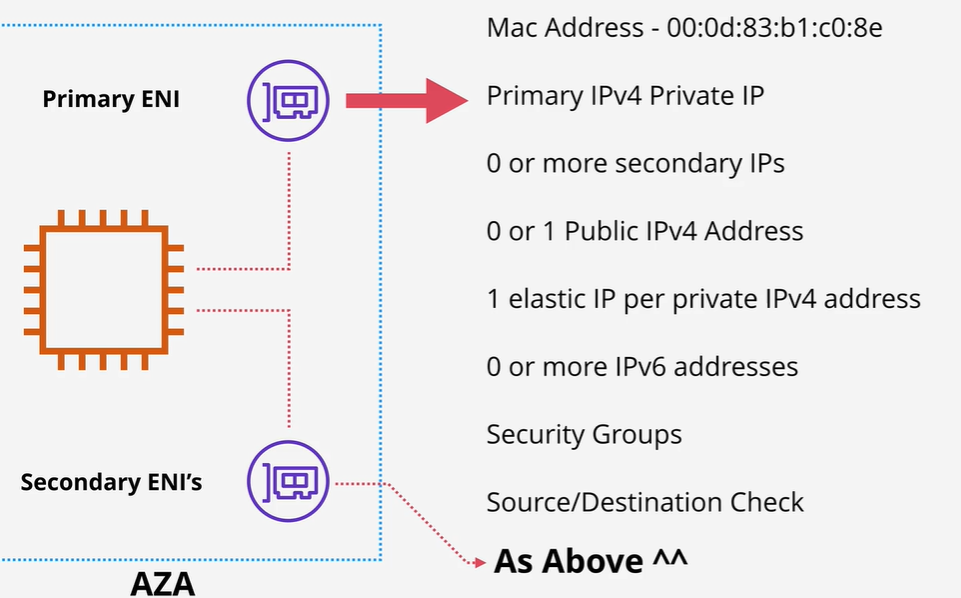

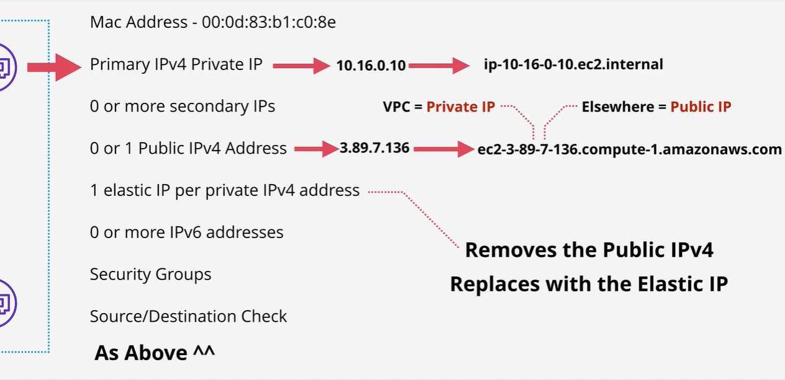

### Elastic Network Interface Properties

- MAC Address
- Primary `IPv4` private address
	- From the range of the subnet the `ENIs` is within
	- Static and does not change for the lifetime of the instances (10.16.0.10)
	- Given a `DNS` name associated with the address (`ip-10-16-0-10.ec2.internal`)
		- Only resolvable inside the VPC
		- Always points to the private IP address
- 0 or more secondary private IP addresses
- 0 or 1 public IPv4 address assigned in two ways
	- Instance manually set to receive an IPv4 address
	- Default subnet settings automatically allocate an IPv4
	- Dynamic IP - not fixed
		- If you stop an instance, the address is deallocated
		- Starting the instance again assigns a brand new IPv4 address
		- Restarting the instance will not change the IP address
		- Changing between `EC2` hosts will change the address
	- Allocated a public DNS name
        - Inside the VPC — public DNS resolves to the **primary private IPv4 address**
        - Outside the VPC — public DNS resolves to the **public IP address**
        - Allows one single DNS name to resolve internally to a private address and externally to a public address
- **1 Elastic IP per private IPv4 address**
    - Can have 1 public Elastic IP per private IP address on the interface
    - Allocated to your AWS account
    - Can associate with a private IP on the primary or secondary interface
    - If you assign an Elastic IP while using a public IPv4, the original IPv4 address is lost and cannot be recovered
- **0 or more IPv6 addresses on the interface**
    - These are public addresses by default
- **Security Groups**
    - Applied to network interfaces
    - Impact all IP addresses on that interface
    - If you need different IP addresses impacted by different security groups, you need multiple interfaces with different security groups applied
- **Source / Destination Checks**
    - Traffic on the interface is discarded if it is not going to or coming from one of the IP addresses on the interface

### Secondary ENIs
- Function the same as primary interfaces
- Can be detached and moved to other EC2 instances

### Exam Power-Ups
- Legacy software licensed by MAC address — provision a secondary ENI for a specific license and move it between EC2 instances
- Multi-homed (subnets) management and data
- Different security groups can be attached to different interfaces
- The OS does **not** see the public IPv4 address — always configure the private IPv4 address on the interface
- Never configure an OS with a public IPv4 address
- Public IPv4 addresses are dynamic — stopping and starting an instance will lose it
- Public DNS for an instance resolves to the **primary private IP address inside the VPC** — instance-to-instance communication within the VPC never leaves the VPC and does not need to touch the internet gateway

## Amazon Machine Image (AMI)

- Images of EC2
- AMIs can be used to launch EC2 instances
    - When you launch an EC2 instance, you are using an Amazon provided AMI
    - Can be Amazon or community provided
    - Marketplace (can include commercial software)
        - Charges for both the instance cost and an extra cost for the AMI
    - Regional, unique ID — `ami-<random set of chars>`
- Controls permissions
    - Default: only your account can use it
    - Can be set to public
    - Can grant access to specific AWS accounts
- Can create an AMI from an existing EC2 instance to capture the current config

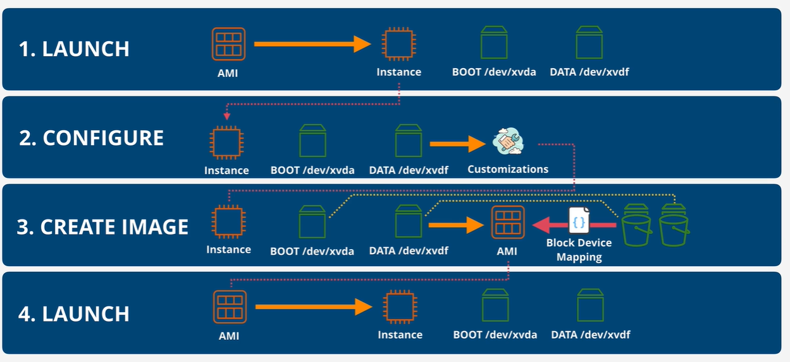

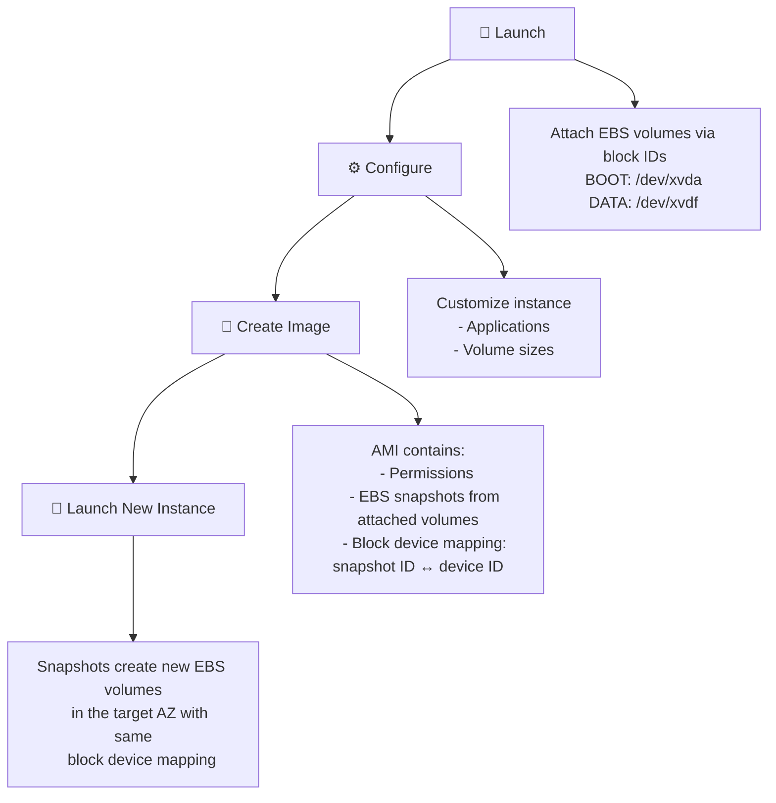
```mermaid
flowchart TD
    A[🚀 Launch] --> B[⚙️ Configure]
    B --> C[📸 Create Image]
    C --> D[🚀 Launch New Instance]

    A --> A1["Attach EBS volumes via block IDs
    BOOT: /dev/xvda
    DATA: /dev/xvdf"]

    B --> B1["Customize instance
    - Applications
    - Volume sizes"]

    C --> C1["AMI contains:
    - Permissions
    - EBS snapshots from attached volumes
    - Block device mapping: snapshot ID ↔ device ID"]

    D --> D1["Snapshots create new EBS volumes
    in the target AZ with same
    block device mapping"]
```

#### Launch
- EBS volumes are attached to EC2 devices using block IDs
    - BOOT `/dev/xvda`
    - DATA `/dev/xvdf`

#### Configure
- Can customize the instance — applications, volume sizes, etc.

#### Create Image

- Once customized, an AMI can be created from the instance
- AMI contains:
    - **Permissions** — who can use it
    - **EBS snapshots** created from attached volumes
        - Block device mapping links the snapshot IDs and a device ID for each snapshot

#### Launch
- When launching an instance, snapshots are used to create new EBS volumes in the AZ of the EC2 instance
- New volumes contain the same block device mapping

### Exam Power-Ups

- AMI can only be used in **one region**
- **AMI Baking** — creating an AMI from a configured instance
- An AMI **cannot be edited** — to update one, launch an instance, make changes, then create a new AMI
- AMIs can be **copied between regions**
- Permissions default to **your account only**
- Billing is for the **storage capacity of the EBS snapshots** the AMI references

## EC2 Pricing Models

### On-Demand Instances 

- Default pricing model
- Hourly rate based on OS, size, options, etc.
- Billed in seconds (60s minimum) or hourly — depends on the OS
- No long-term commitments or upfront payments
- Best for:
    - New or uncertain application requirements
    - Short-term, spiky, or unpredictable workloads that can't tolerate any disruption

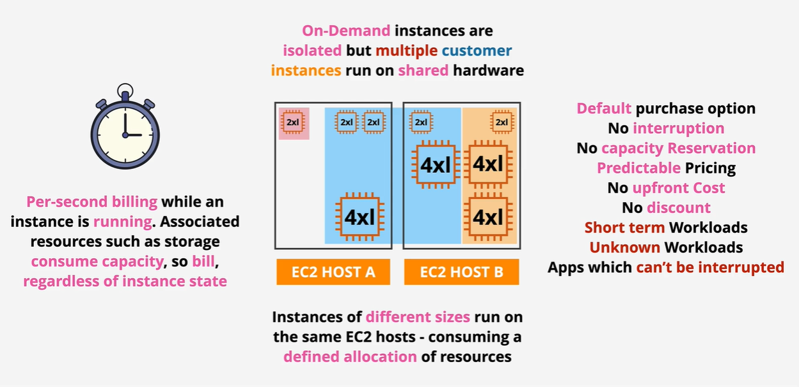

### Spot Instances 

- Up to **90% off** on-demand
- Price depends on spare capacity
- Set a maximum hourly rate for a specific `AZ` and `Region`
    - If your max is above the spot price, you pay for the instance
    - As spot price increases, you keep paying until the price exceeds your max
    - Once the price exceeds your max, the instance is terminated
- Best for: interruptible workloads e.g. data analytics where the process can run later

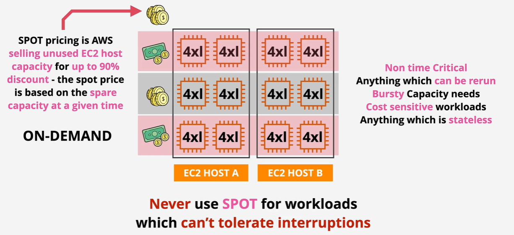

### Reserved Instances (2 Types)

- Up to **75% off** on-demand
- Trade-off is commitment — 1 or 3 year terms
- Payment flexibility:
    - All upfront
    - Partial upfront
    - No upfront
- Best discount: **3 years all upfront**
- Can be reserved at region level, or AZ level with capacity reservation
- Reserved instances take **priority** for AZ capacity
- Supports **scheduled reservations** for specific committed time windows
- Best for: known steady state usage e.g. email servers, domain servers
- Cheapest option with no tolerance for disruption

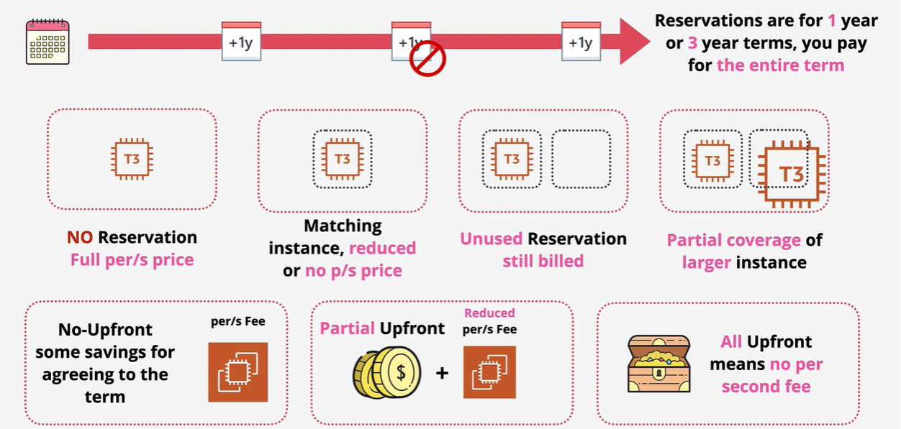

#### Scheduled Reserved Instances

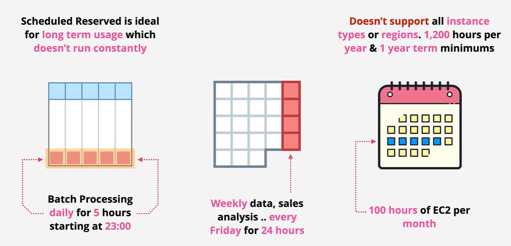

#### Capacity Reservations

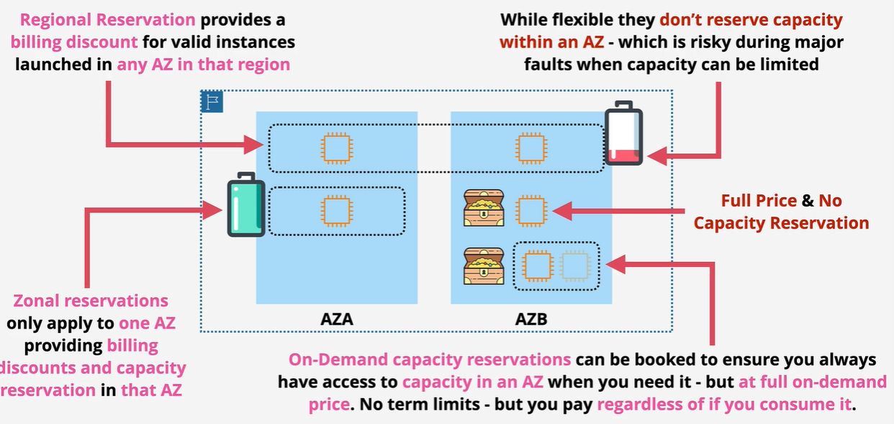

### Dedicated Instances

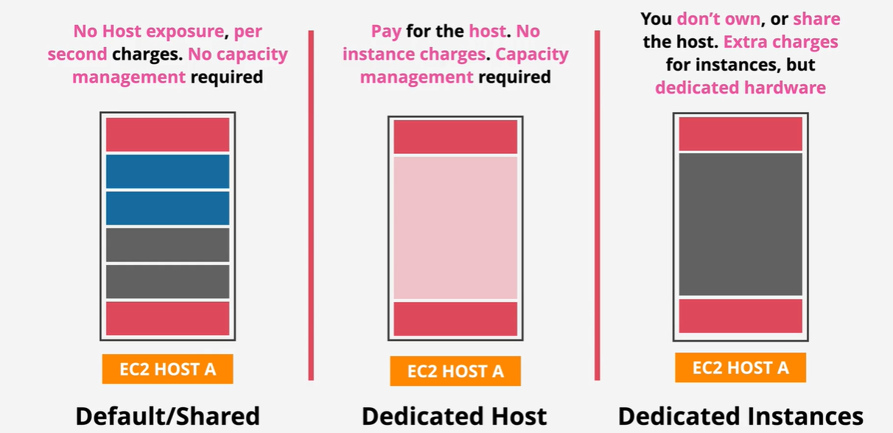

## Instance Status Checks and Auto-Recovery
- Every instance has two high level status checks

#### System Status Checks

- Failure indicates software or hardware problems with the EC2 service or the host

#### Instance Status Checks

- Specific to the file system or a corrupted kernel
- If not intentionally launched in this state, it needs to be fixed

#### Create Status Check Alarm

- Four options available when a status check fails:
    - **Recover this instance** — steps taken depend on the type of failure
    - **Stop this instance**
    - **Terminate this instance** — useful in a cluster
    - **Reboot this instance**

## Horizontal and Vertical Scaling

### Vertical Scaling
- As customer load increases, the server increases in capacity to handle more data
- Requires a **reboot** to resize
- Often can only occur during **planned outages**
- Larger instances carry a **$ premium** compared to smaller instances
- There is an **upper cap** on performance — limited by instance size
- No application modification needed
- Works for all applications, even **monoliths** (all code in one app)
### Horizontal Scaling
- As customer load increases, additional instances are added instead of resizing
- Requires a **load balancer** — distributes load equally across servers
- Multiple copies of the application run across multiple servers
- **Sessions are everything** — instances must handle sessions via:
    - Application support, or
    - Off-host session storage
    - Servers are **stateless** — session data is stored elsewhere
- No disruption while scaling up or down
- No real limits to scaling
- Uses smaller instances — lower cost and better granularity

## Instance Metadata

- EC2 service provides data to instances
- Accessible inside all instances

> 📌 Memorize: `http://169.254.169.254/latest/meta-data/`

- Metadata contains:
    - Information about the environment the instance is in
    - **Networking** — primary reason for using metadata
    - **Authentication information** — instances can use this to gain access to other services
    - **User-data**
- ⚠️ **No authentication or encryption**
    - Anyone who gains access to the instance can access the metadata
    - Can be restricted by local firewall