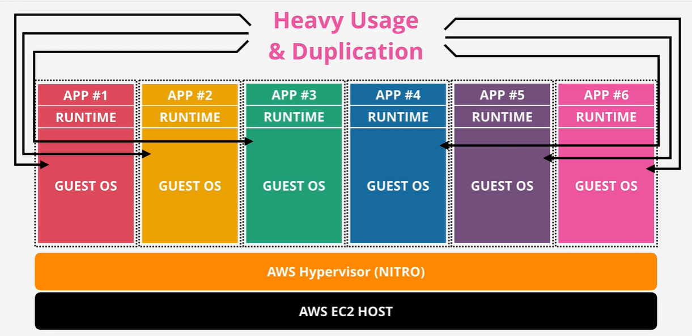
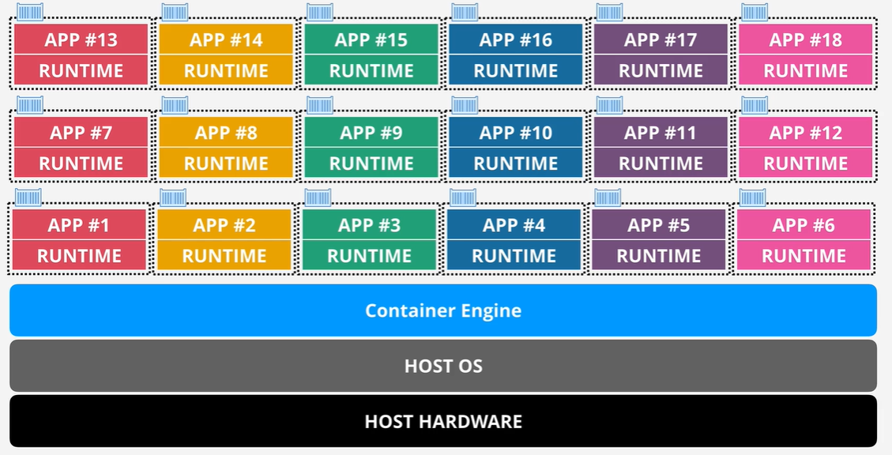
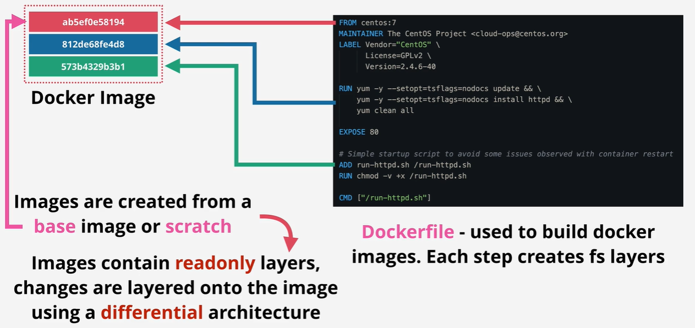
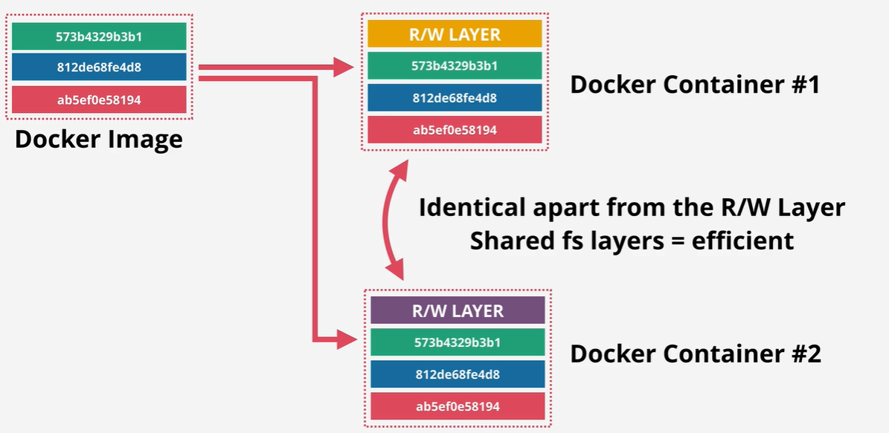
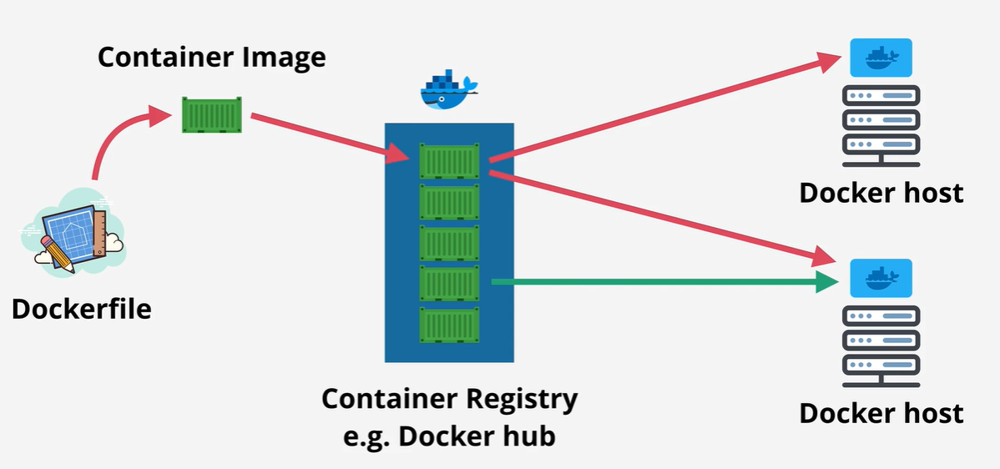
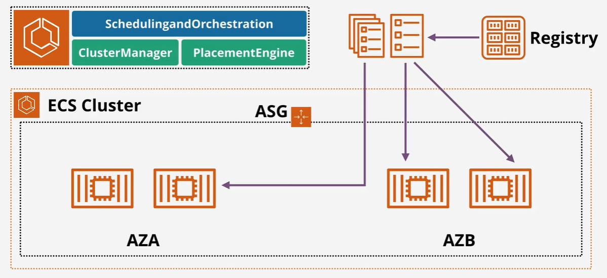
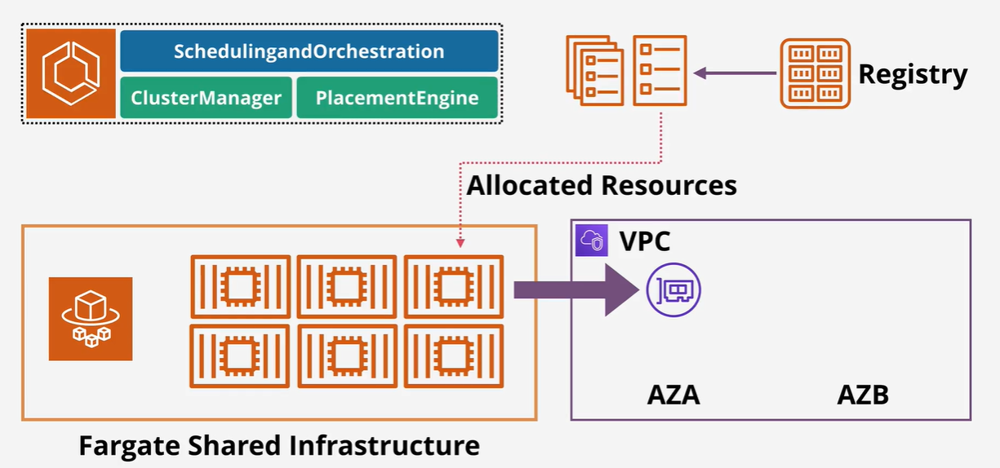
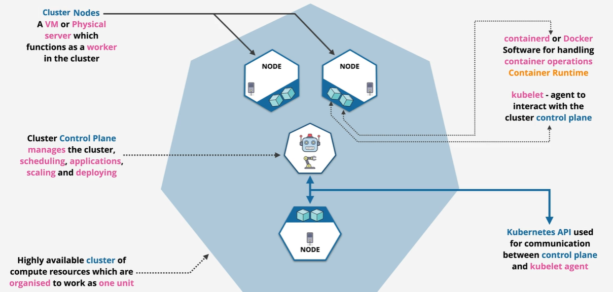
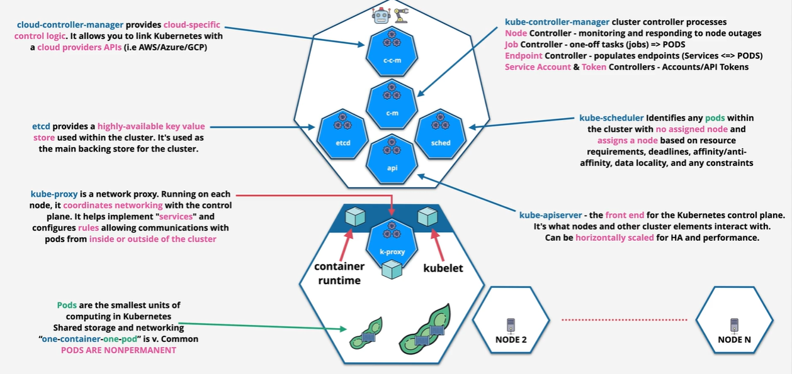

# Containers and ECS

## Intro To Containers

If you run a virtual machine with 4GB ram and 40GB disk, the OS can consume 60-70% of the disk and little available memory. If all of the OS uses the same or similar resources, they are duplicates. Every restart must manipulate the entire OS.

### Containerization 

Containers have an isolated OS from each other.

### Image Anatomy

- Container is a running image of docker image
- These are stacks of layers and not a monolithic disk image
- Each line of a docker image creates a new filesystem layer
- Images are created from scratch or base image
- Images contain read only layers, images are layer into images
- Docker container is the same as a docker image, except it has an additional READ/WRITE layer of the container

### Container Anatomy

### Container Registry

### Container Key Concepts

- `Dockerfiles` are used to build images
- Portable
- Containers are super lightweight, use the host OS for heavy lifting but otherwise are light
  - File system layers are shared when possible
- Docker hosts can run many containers between one or more images

## Elastic Container Service (ECS)

- Accepts containers and instructions you provide
- Allows you to create a **cluster** — where containers run from
- Container images are located on a registry — AWS provides **ECR (Elastic Container Registry)**

### Container Definition

- Tells ECS where the container image is
- Defines the image and the ports that will be exposed
- Acts as a pointer to where the container is stored

### Task Definition

- Represents the application as a whole
- Stores all information needed to run the application:
    - Resources and networking used by the task
    - Compatibility of how the container runs
    - **Task Role** — an IAM role that allows the task to interact with other AWS resources
        - Best practice way to give containers access to other AWS services
- A task definition can include **one or more container definitions**
- A task by itself is **not highly available**

### Task Role

- IAM role assumed by the task
- Temporary credentials allow access to AWS products and services

### ECS Service

- Defined by a **Service Definition**
- Defines how many copies of a task are allowed to run
- Used to provide **scalability and high availability** via load balancing

### Deployment

- Tasks or services are deployed to an **ECS cluster**

## ECS Cluster Types

### ECS Cluster Manages

- Scheduling and Orchestration
- Cluster Manager
- Placement Engine

### EC2 Mode

- ECS cluster is created within a VPC — benefits from multiple AZs
- Specify an initial size which drives an **auto scaling group**
- **Not a serverless solution** — you need to manage capacity for your cluster
- Container instances are not managed — handled as normal EC2 instances
- Supports **spot pricing** and **prepaid EC2 servers**

### Fargate Mode

- Removes management overhead — no need to manage EC2
- Uses a **Fargate shared infrastructure pool** accessible by all customers
- Fargate deployments still use a cluster with a VPC where AZs are specified
- ECS tasks are **injected into the VPC** via an Elastic Network Interface
    - Each task gets an IP address within the VPC
    - Tasks run like any VPC resource
- **Pay only for the container resources you use**

## EC2 vs ECS (EC2 Mode) vs Fargate

|Scenario|Recommendation|
|---|---|
|Already using containers|ECS|
|Large workload, price conscious|EC2 Mode — supports spot pricing and prepayment|
|Large workload, overhead conscious|Fargate|
|Small or burst style workloads|Fargate|
|Batch or periodic workloads|Fargate|

## Kubernetes 101

### Cluster Structure

### Cluster Detail

### Summary

- Cluster
	- A deployment of Kubernetes, management, orchestration
- Node
	- Resources; pods are placed on nodes to run
- Pod
	- Holds one or more containers
	- Smallest unit in Kubernetes
	- Often 1 container and 1 pod
- Service
	- Abstraction, service running on 1 or more pods
- Job
	- Ad-hoc, creates one or pods until completion
- Ingress
	- Exposes a way into a service
	- *Ingress --> Routing --> Service --> 1+ Pods*
- Ingress Controller
	- Used to provide ingress
	- AWS Load Balancer uses ALB/NLB
- Persistent Storage (PV)
	- Volume whose lifecycle lives beyond any 1 pod using it

## Elastic Kubernetes Service (EKS) 101

- AWS Managed Kubernetes
	- Open source and cloud agnostic
- Control plane scales and runs on multiple `AZs`
- Integrates with AWS services
	- ECR
	- ELB
	- IAM
	- VPC
- `EKS Cluster` is `EKS Control Plane` and `EKS Nodes`
- `etcd` distributed across multiple `AZs`
- Nodes (three different types)
	- Self Managed
	- Managed node groups 
	- Fargate pods