# Bootstrapping EC2 Using User Data
* Bootstrapping
  * Is a process where scripts or other config steps can be run when an instance is first launched
    * This allows an instance to be brought to service in a particular configured state
* In system automation, bootstrapping allows the system to self configure or perform some self configuration steps
  * in AWS this is `EC2 Build Automation`
* Bootstrapping is done **using User Data**
  * Accessed via the **meta-data IP**
    * `http://169.54.169.54/latest/user-data`
* Bootstrapping ONLY happens on launch
* EC2 doesn't need to interpret or validate User Data
  * The OS needs to
* `User Data` is NOT secure
* `User Data` is opaque to `EC2`, its just a block of data
* `User Data` is limited to 16KB
* `User Data` can be modified when instance is stop

## Bootstrapping Architecture

- `AMI` is used to launch an `EC2 instance`, creating an `EBS` volume attached to the instance based on the AMI's block device mapping
- `EC2` service passes `user data` to the instance at launch
- A metadata agent running in the OS polls the **metadata IP** `(169.254.169.254)` for any `user data`
- If `user data` is found, it is executed automatically on first launch
- `User Data` runs like any other OS script — no special error handling or rollback
- After the script runs, the instance will be in one of two states:
  - **Running and ready** — script executed successfully, instance configured as expected
  - **Running but misconfigured** — bad config or script errors; instance likely still passes status checks but is **not configured as expected**
- Key gotcha: **a passing status check does not mean the instance is correctly configured** — user data failures are silent from EC2's perspective
- This is treated like any other script the OS runs
  - At the end of the runing script the instance will be in:
    - Running state and ready for service
    - Bad config but will still likely running
      - The instance will probably still pass its checks
      - It will not be configured as you expected

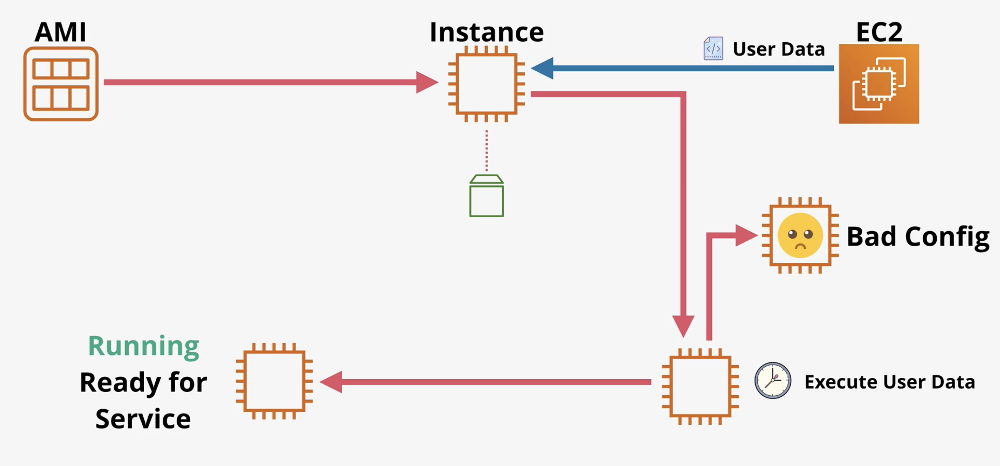

## User Data Key Points

- `EC2` doesn't know what the `user data` contains, its just a block of data
- The `user data`  is NOT secure
  - Anyone can see what gets passed in
  - For this reason its important not to pass passwords or long term credentials
- `User Data` is limited to 16KB in size
  - Anything larger than this will need to pass a script to download the larger set of data
- `User Data` can be modified when you:
  - First stop the instance
  - Change the `user data`
  - Restart the instance
- The contents are only executed once at launch
- `User Data` needs to be base64 encoded 
  - In UI console it is not necessary
  - In CLI or `CloudFormation` it needs to be base64
    - When using `CloudFormation` use the function `Fn::Base64`
- Helpful debug logs are found in `/var/log`
  - `cloud-init-output.log`
  - `cloud-init.log`

## Boot-Time-To-Service-Time
- How quickly after you launch an instance is it ready for service
  * This includes time for the `EC2` to configure the instance and any software downloads that are needed for the user

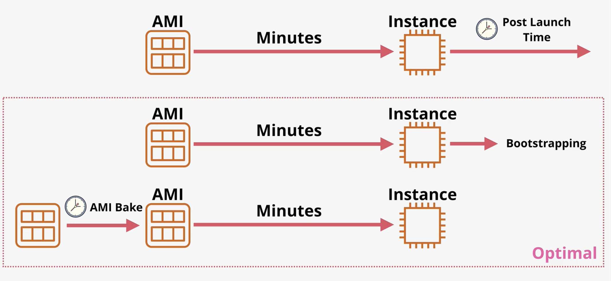

# Enhanced Bootstrapping With CFN-Init
- `cfn-init`
  - Is a helper script installed on `EC2` OS
- Reallly is a simple configuration management system
- Procedured (`User Data`) vs Desired State (`cfn-init`)
- Can help with packages, groups, sources, files, commands, service, and ownerships
- This is provided with directives via `Metadata` and `AWS::CloudFormation::Init` on a `CFN` resource
- `cfn-init` updates when the stack updates 

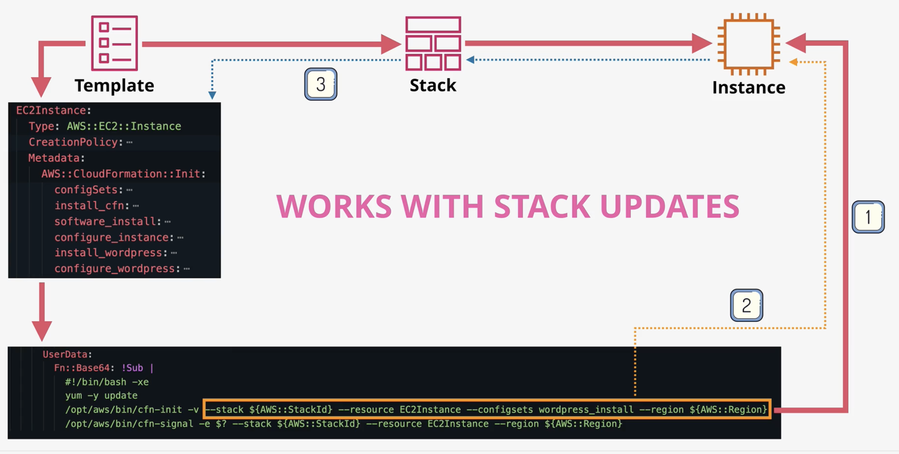
- `cfn-init` explained
  - Starts off with a `Cloud Formation Template`
    - This has a logical resource within it which is to create an `EC2` instance
    - This has a specific section called `Metadata`
  - This then passes in the information passed in as `UserData`
  - `cfn-init` gets variables passed into the `userdata` by `Cloud Formation`
  - It knows the desired state by the user and can work towards a final stated configuration
  - This can monitor the `userdata` and change things as the `EC2` data changes

## CreationPolicy and Signals
- The template has a specific part designated signals
- A `CreationPolicy` is added to a logical resource
  - It is provided a timeout value
  - The resource will trigger a signal that `CloudFormation` can contiue
    - Uses the exit code of the last command
  - Files that are great for debugging
    - `cfn-init.log`
    - `cfn-init-cmd.log`

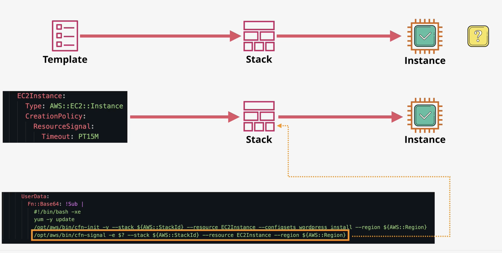

# EC2 Instance Roles
- `IAM Roles` are the best practice ways for services to be granted permissions
- Roles that an instance can assume to grant permissions for resources within AWS
- `EC2` instance role allows the `EC2` service to assume that role
- The `Instance Profile` is the item that allows the permissions inside the instance
- When `IAM Roles` are assumed you are provided temporary roles based on the permissions assigned to that role
  - These credentials are passed through instance **meta-data**
    - These credentials are always refreshed
      - Thanks to `EC2` and the secure token service

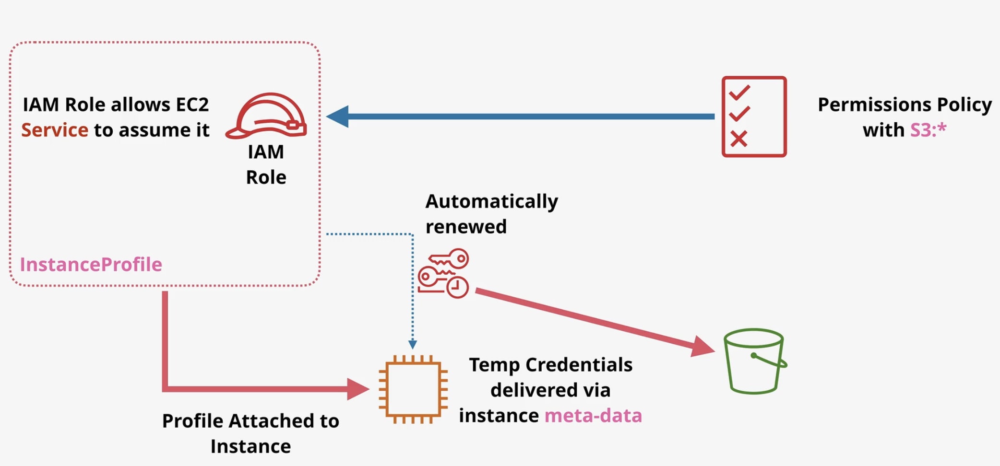

- **Key Facts**
  - Credentials are inside *meta-data*
    - `http://169.54.169.54/latest/meta-data`
  - Useful addresses
    - `http://169.54.169.54/latest/meta-data/iam/security-credentials`
    - `http://169.54.169.54/latest/meta-data/iam/security-credentials/<role_name`
      - Can see what credentials `EC2` is using
  - Credentials are automatically rotated and always valid
    - The resource needs to check the meta-data periodically
  - Should always use roles compared to storing long term credentials
  - Presedence of credentials
    - CLI Options
    - Environment Variables
    - CLI Credentials File
    - CLI Configuration File
    - Container Credentials
    - Instance Profile Credentials

# Systems Manager Parameter Store
- `SSM Parameter Store` is a service which is part of Systems Manager which allows the storage and retreval of parameters (strings, stringlists, and secure string)
- The service supports encryption which integrates with `KMS` versioning and can be secured using `IAM`
- Storage for configuration and secrets
- Supports hierarchies and versioning
  - hierarchies are like `/wordpress/db_name`
    - `/wordpress` is the hierarchy
- Supports plaintext and ciphertext
  - Ciphertext is uses with `KMS`

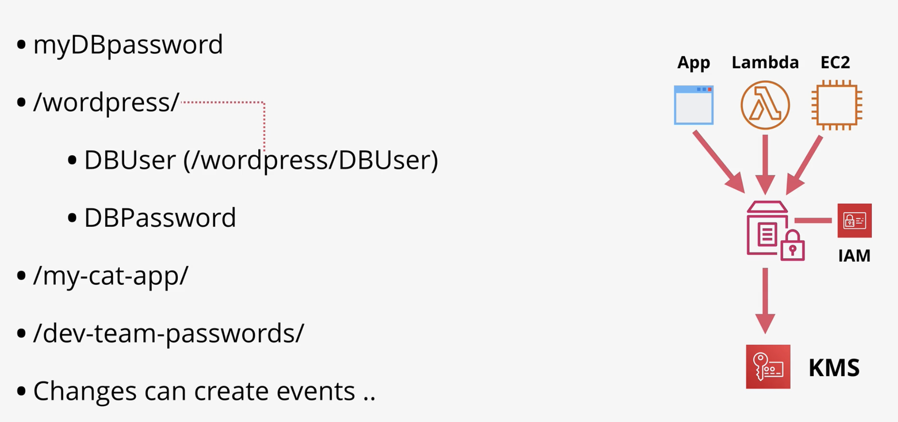 

# System and Applicaton Logging On EC2
- `CloudWatch` monitors the outside metrics of an instance `CloudWatch Logs` is for logging
  - Neither natively capture data inside an instance
- `CloudWatch Agent` is required for OS visible data
  - It sends this data into `CloudWatch`
  - Needs configuration and permissions
- There is one log group for each individual log we want to capture
- There is one log stream for each group for each instance that needs management
- Can use parameter store to store the configuration for `CloudWatch Agent`

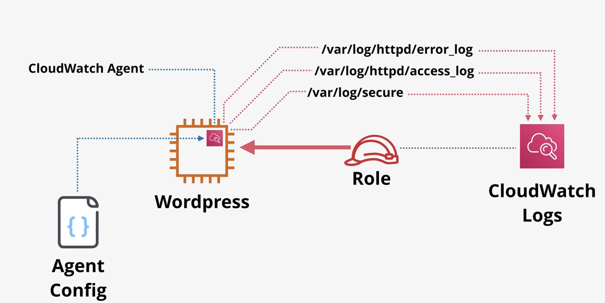

# EC2 Placement Groups
- Cluster 
  - Pack instances close together
- Spread
  - Keep instances separated
- Partition
  - Groups of instances spread apart

## Cluster

- Single `AZ`
- Same rack, sometimes same host
- Hardware fails, everything fails
  - Little to no resilience
- Can't span `AZs`
  - One `AZ` only
  - Locked when launching first instance
- Can span `VPC` peers but impacts performance
- Requires a supported instance type
- Use the same type of instance type (not mandatory)
- Launch at the same time (not mandatory ... very recommended)
- 10gbps single stream performance
- Use case
  - performance
  - fast speeds
  - low latency

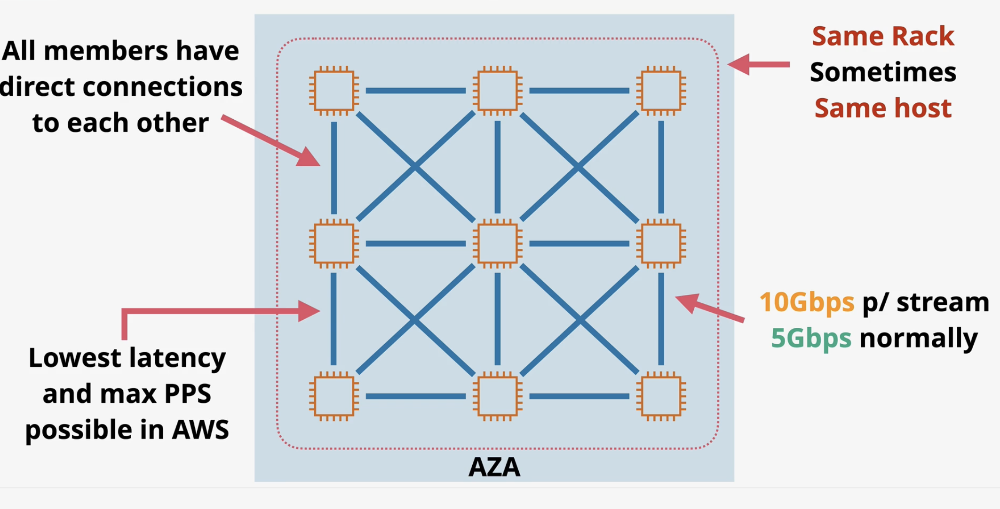

## Spread

- 7 instances per `AZ`
  - Isolated infrastructure limit
- Provided infrastructure isolation
  - Each Instance runs from a different rack
- Each rack has its own network and power source
- Not supported for Dedicated Instances or Hosts
- Use case
  - Small number of critical instances that need to be kept separated from each other

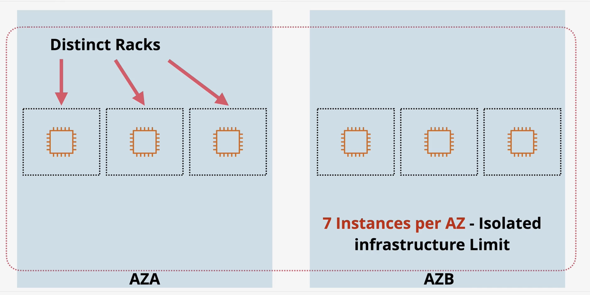

## Partition

- 7 partitions maxium per each `AZ`
- This is not supported on dedicated hosts
- Instances can be placed in a specific partition
  - Or auto placed
- Great for topology aware applications
  - HDFS, HBase, Cassandra
- Contains the impact of failure to part of an application

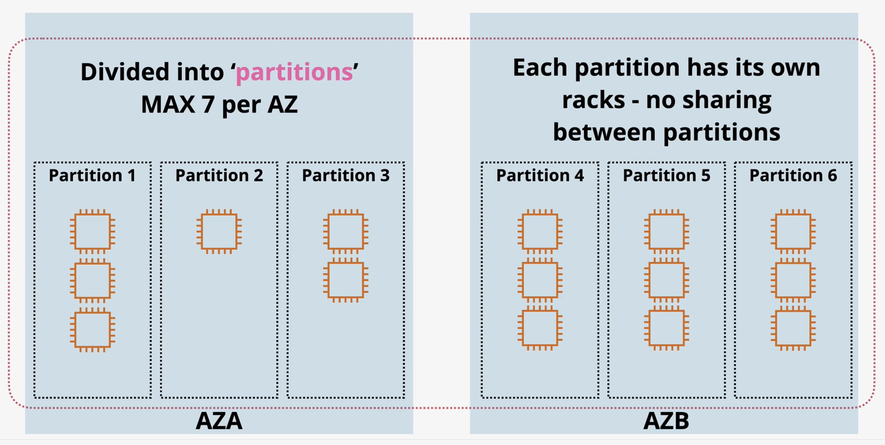

# EC2 Dedicated Hosts

- EC2 Host dedicated to you
- You pay for the host, which is designed for a specific family of instances
  - Specific family (a1 c5, m5)
- No instance charges 
  - You pay for the host
- On Demand and Reserved options available
  - 1 or 3 year reserved options
- Host hardware has physical sockets and cores
  - Dictates how many instances can be run on that host
  - Software which is licensed based on physical cores or sockets can utilize this visibility of the hardware
- With dedicated hosts you pay for the entire host so you can license based on that host which is available and dedicated to you

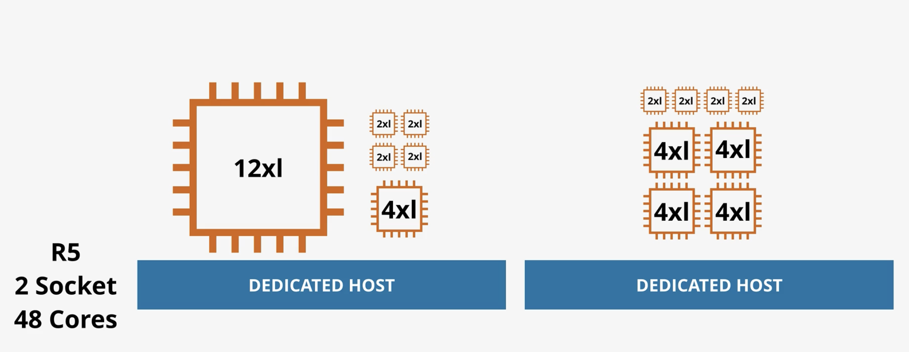

## Limitations and Features

- AMLI Limits
  - RHEL, SUSE Linux, and Windows AMIs aren't supported
- Amazon RDS instances aren't supported
- Placement groups aren't supported for Dedicated Hosts
- Hosts can be shared with other ORG accounts 
  - Things like RAM

# Enhanced Networking

- Uses SR-IOV
  - The physical network interface is aware of the virtualization. Each instance is given exclusive access to one part of a physical network interface card
- Higher I/O and lower host cpu usage
- More bandwidth
- Higher packers per second (PPS)
- Consistent lower latency
- No charge available n most EC2 types
 
 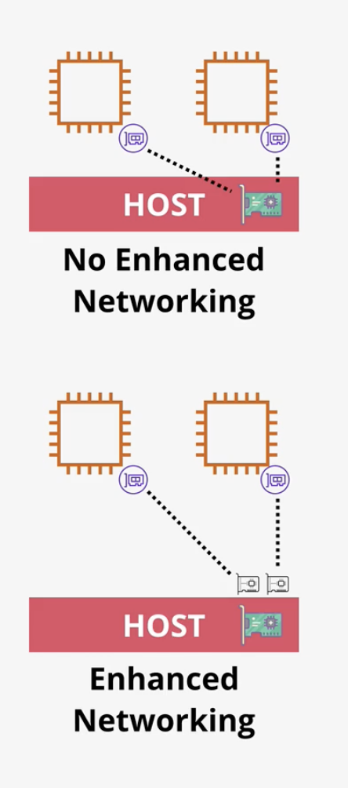

 ## EBS Optimized

 - `EBC` = block storage over the network
 - Means dedicated capacity for `EBS`
   - Faster speeds are possible
 - Most instances support and have enabled by default
 - Some instances (older) enabling costs extra