# Relational Database Schema

## ACID vs BASE

### ACID

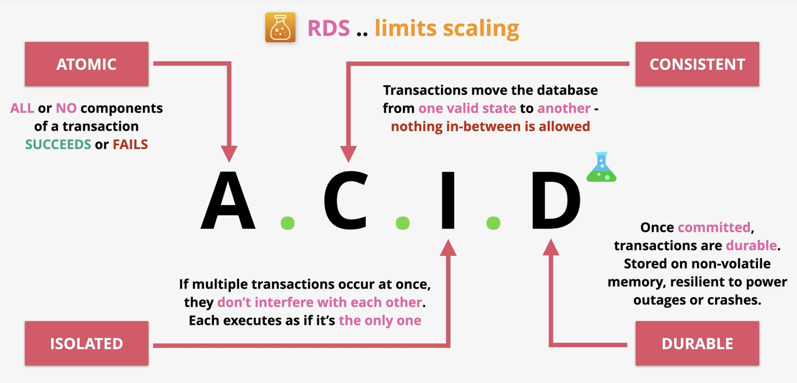

### BASE

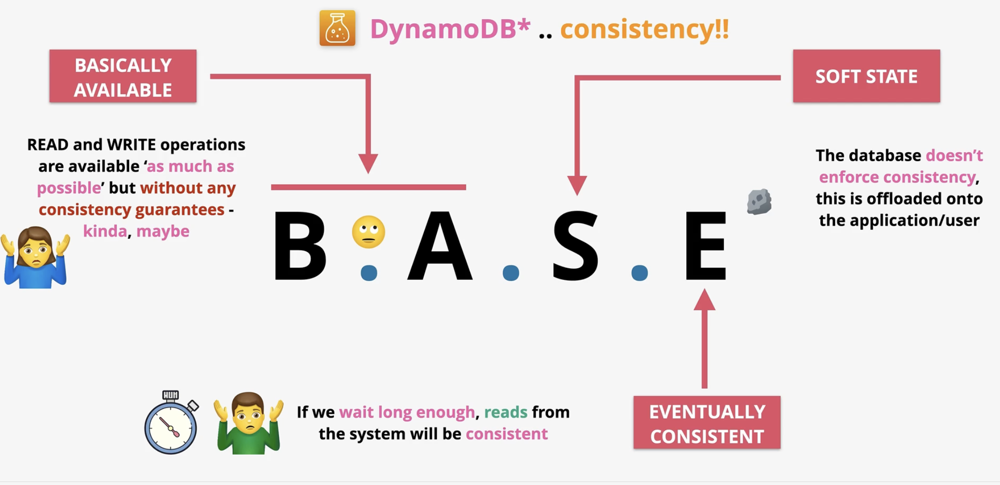

## Databases on EC2

- **It is always a bad idea** to split an instance over different `AZs` as moving data between `AZs` adds a small cost if it occurs.

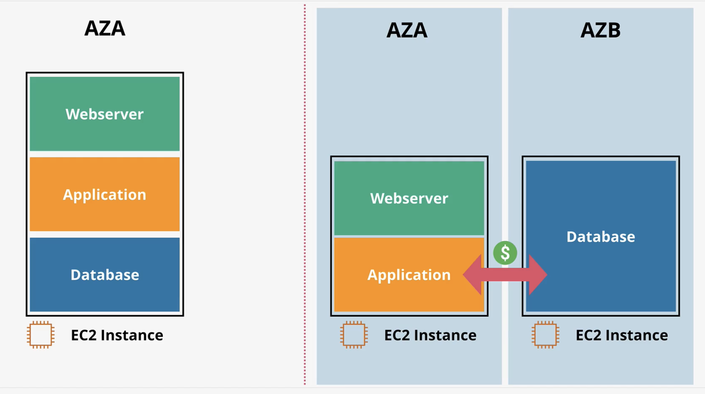

### Why Would You Do It?

- You need access to the OS of the database
  - Though this should be questioned as its rarely needed
- Advanced DB option tuning (`DBROOT`)
  - AWS porvides options against this and it's typically demanded by a vendor
- The DB or DB version isn't provided by AWS
- You need a specific version of an OS and DB that AWS doesn't offer

### Why You Really Shouldn't Run a Database On EC2

- Admin overhead is intense when managing `EC2` and a compatible DBHost
- Backup and diaster management adds significant complexity
- `EC2` runs in a single `AZ`
  - If the zone fails, database access fails entirely
- You miss out on features offered by AWS DB products
- `EC2` is ON or OFF with no easy way to scale
- Replication requires specialized skills and considerable setup and monitoring time
- Performance wil be slower than AWS native database options

## Relational Database Service

- **Database-as-a-Service (DBaaS)** or more accurately **DatabaseServer-as-a-Service**
  - A managed database instance for one or more databases
- Supported engines
  - `MySQL`
  - `MariaDB`
  - `PostgreSQL`
  - `Oracle`
  - `Microsoft SQL`
- `Amazon Auroa` is so different from standard `RDS` that is considered a separate product
- Costs
  - Instance Size and Type
  - Is it Multi-AZ or Not
  - Storage Type and Amount
  - Data Transferred
  - Backups and Snapshots

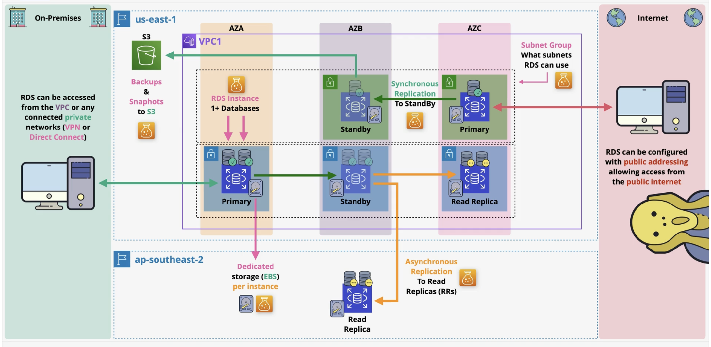

### Multi-AZ Instance

- Multi-AZ is a feature of `RDS` which provisions a highly available instance set
- The product provides Multi-AZ instance where a standby replica is kept in sync *Synchronously* with the primary instance
  - **The standby replica cannot be used for any performance scaling as its only for availability**
- Also provides multi-AZ cluster mode where a write and two reader instances are kept in sync *Synchronously*
  - **The reader instances can be used for read operations, allowing for limited read scaling**
- Backups, software updates and restarts can take advantage of MultiAZ to reduce user disruption

#### Synchronous Replication Process
- Database write occurs
- Primary database instance commits the changes
- Simultaneously replication to the standby begins
- Stand replica commits the writes

#### Failover
- If an error is detected on the primary, AWS will failover to the standby within **60-120 seconds**
- This does not provide full fault tolerance
  - There will be some impact during the changeover

#### Multi-AZ Instance

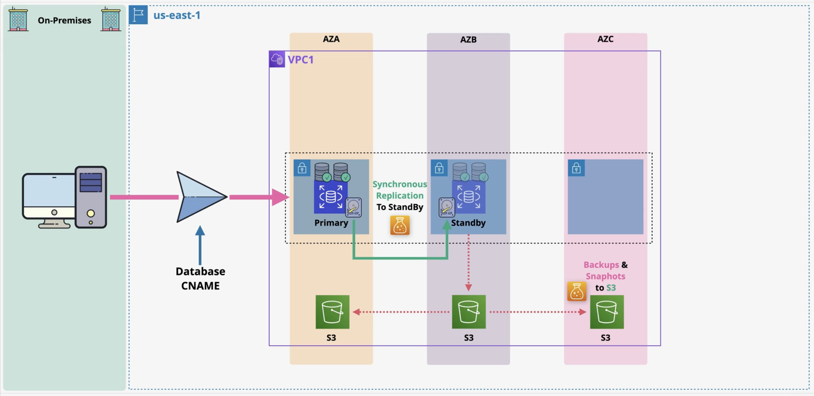

#### Multi-AZ Cluster

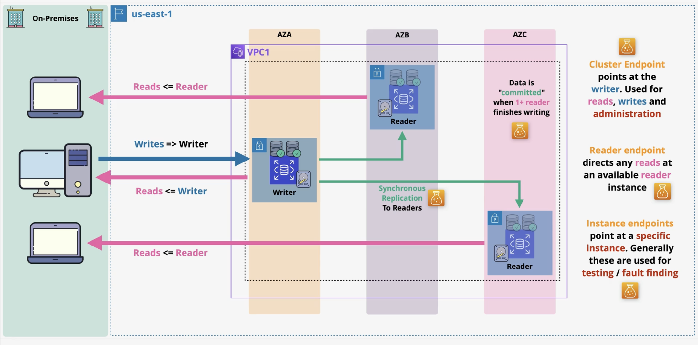

### Exam Powerups Multi-AZ Instance

- Multi-AZ is not free tier
  - It requires extra infrastructure for the standby, generally doubling costs
- **The standby replica cannot be accessed directly unless a failover occurs**
- Failover is highly available, but not fault tolerant
- Multi-AZ is same region only (other `AZs` within the same `VPC`)
- Backups are taken from the standby, removing any performance impact on the primary
- Failover is triggered by
  - `AZ` outage
  - Primary Failure
  - Manual Failover
  - Instance Type Change
  - Software Patching

## RDS Backups and Restores

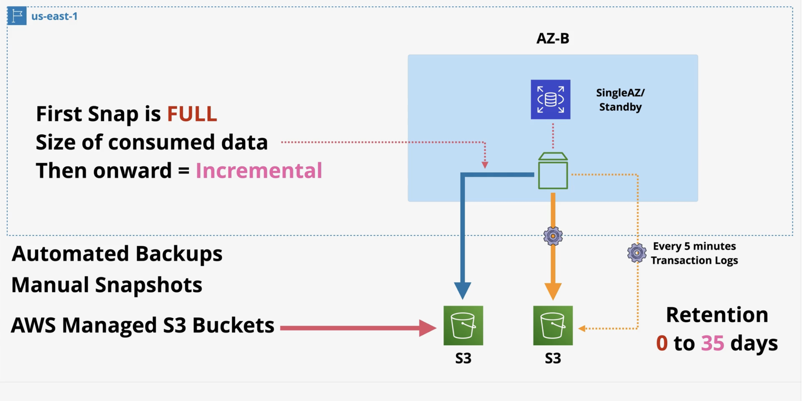

### RPO - Recovery Point Objective

- The time between the last backup and when the failure occurred
- Represents the maximum amount of acceptable data loss
- Influences the technical solution and its cost
- The business typically provides the RPO value

### RTO - Recovery Time Objective

- The time between the diaster recovery event and full recovery
- Influenced by processes, staff, techonology, and documentation

### RDS Backups

- The first snapshot is the full size of consumed data
- If using single `AZ`, performance may be impacted during the snapshot
- Manual snapshots persist in your AWS account even after the database is deleted must be removed manually
- When a database is deleted, snapshots can be retained but will expire based on their retention period

### RDS Exam Powerups

- When performing a restore, `RDS` creates a new `RDS` instance with a new endpoint address
- Restoring a manual snapshot sets the database to a single fixed point in time, directly influencing the RPO value
- Automated backups allow restore to any 5-minute point in time
- Backups are restored and transaction logs are replayed to bring the database to the desired point in time
- Restores are not fast
  - Always consider the impact on RTO

## RDS Read Replicas

- Kepts in sync using *asynchronous replication*
- Data is written fully to the primary instance first, then pushed to the replica once stored on disk
  - Meaning a small lag may exist
- Can be created in the same region or a different region (cross-region replication)

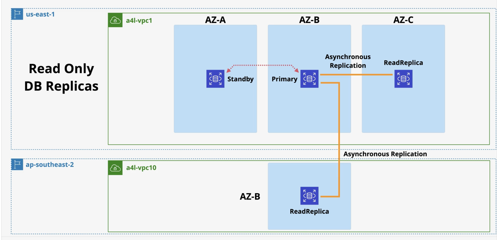

### Read Performance

- Up to 5 direct read replicas per DB instance, each providing an additional instance of read performance
- Allows you to scale out read operations for an instance
- Read-replicas can chain but lag becomes a problem the further down the chain
- Can provide global performance improvements

### Availability Improvements

- Snapshots and backups improve RPO but do not help RTO
- Read-replicas offer near 0 RPO
- If the primary instance fails, a read replica can be promoted to take over
- Once promoted the replica allows both read and write operations
- Only useful for failures 
  - Read replicas can replicate data corruption, so in that case fall back to snapshots and backups
- Promotion cannot be reversed
- Provided global availability improvements and global resilence

## RDS Data Security

- Encryption is in transit, which means data between the client and the RDS instance is encrypted
  - Encrypted via **SSL/TLS**
  - Can be set to mandatory on a per user basis
- Encyrption at rest can be supported
  - `RDS` supports `EBS` volume encryption
    - Does this with `KMS`
    - Handles by `RDS` host `EBS` storage
      - RDS engine writes unencrypted data and the `RDS` host encrypts the data
- AWS or Customer Managed CMK generates **data keys**
- **Data keys** used for **encryption operations**
- Storage, logs, snapshots, and replicas are encrypted using the same customer master key
- **Encryption cannot be removed**
- `RDS Microsoft SQL` and `RDS Oracle` support **TDE**
  - TDE stands for *Transparent Data Encryption*
    - Encryption is handled **within the DB engine**
- `RDS Oracle` supports integration with `CloudHSM`
  - Much stronger key controls (even from AWS)
  - Managed by you with no key exposure to AWS

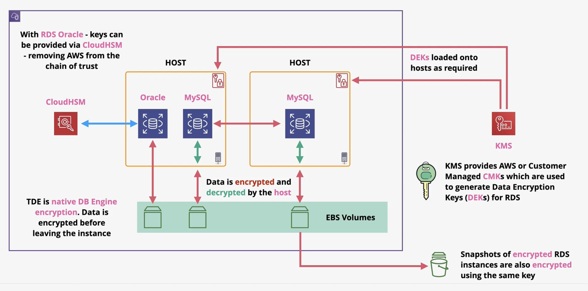

## RDS Custom

- Amazon RDS Custom is a managed database service for applications that require customization of the underlying operating system and database environment
- Benefits of RDS automation with the access needed for legacy, packaged, and custom applications

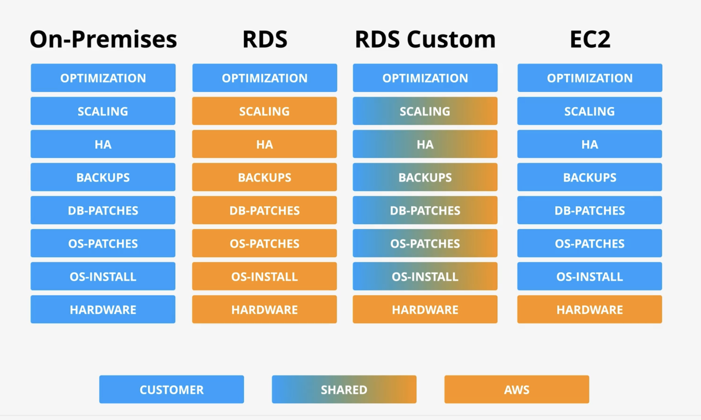

## Aurora Architecture

- **No free tier option**
- Aurora doesn't support Micro Instances
- Beyond `RDS` single-AZ (micro) Aurora offers better value
- Compute
  - Hourly Charge
  - Per Second
  - 10 minute minimum
- Storage
  - GB-Month consumed
  - IO cost per request
- 100% DB Size in backups are included
- Backups in Aurora work in the same way as `RDS`
- Restores create a **new cluster**
- Backtrack can be used which allo **in-place rewinds** to a previous point in time 
- Fast clones make a new database MUCH faster than copying all the data
  - **copy-on-write**

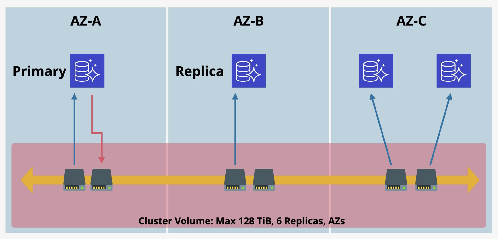

## Aurora Severless

- Provides a version of Aurora without managing resources, using **ACU (Aurora Capacity Units)**
- Min and max ACU can be set per cluster based on load
- Can scale down to 0 and be paused completely
- Billed on a per-second consumption basis
- Same resilience as Aurora
  - 6 copies across `AZs`

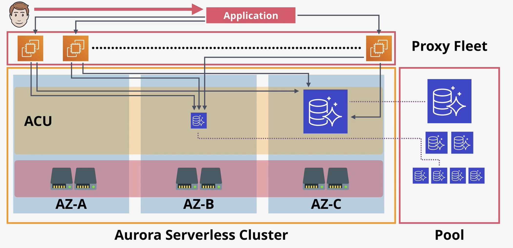

### Aurora Capacity Units (ACUs)

- Stateless and shared across many AWS customers with no local storage
- Have access to cluster storage in the same way as standard Aurora

### Proxy Fleet

- A shared proxy fleet sits between the customer and the ACUs
- When interacting with data, communication goes through the proxy fleet
- The proxy fleet brokers the connection between the application and ACUs, allowing seamless scaling in and out without impacting usage

### Aurora Serverless - Use Cases

- Infrquently used applications
  - Only pay for resources consumed on a per-second basis
- New applications where resource requirements are unknown
- Variable workloads
  - Scales in and out based on demand
- Unpredictable workloads where traffic patterns are uncertain
- Development and test databases
  - Scales back when not in use, reducing costs
- Mult-tenant applications
  - Scales naturally as the number of users grows

## Aurora Global Databases

- Replication occurs from the primary cluster volume to secondary replicas for read operations
- One-way replication with ~1 second or less latency between regions
- Replication happens at the storage layer, requiring no additional CPU usage
- Great for **cross region diaster recovery and business continuity**
- Global Read Scaling
  - Low latency performance improvements
- No impact on DB performance
- Secondary regions can have **16 replicas**
  - All of these can be promoted to read/write
- Currently there are a MAXIMUM of 5 secondary regions

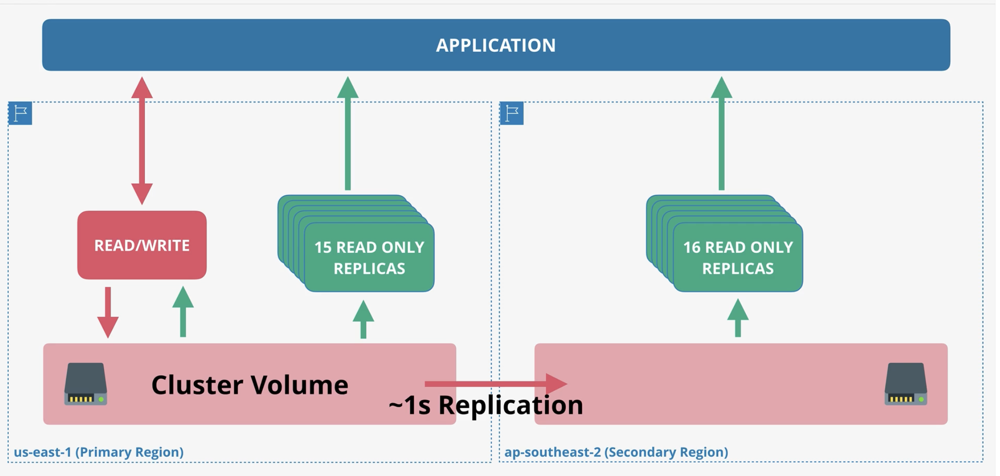

### Disaster Recovery and Business Continuity

- Great for cross region diaster recovery and business continuity
- Secondary regions can be promoted to read and write in the event of a diaster

### Global Read Scaling

- Provides low latency performance improvements for international customers
- Applications can perform read opeartions against the secondary read databases

### Limits and Configuration

- Secondary regions can have up to 16 replicas
- Maximum of 5 secondary regions supported

## Multi-Master Writes

- Multi-master write is a mode of Aurora Provisioned Clusters which allows multiple instances to perform reads and writes at the same time - rather than only one primary instance having write capability in a single-master cluster
- Allows an Aurora cluster to have multiple instances capable of writing simultaneously

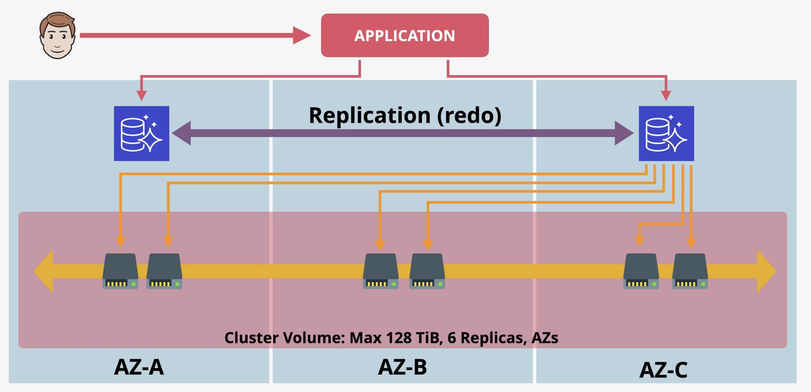

### Aurora Single Master

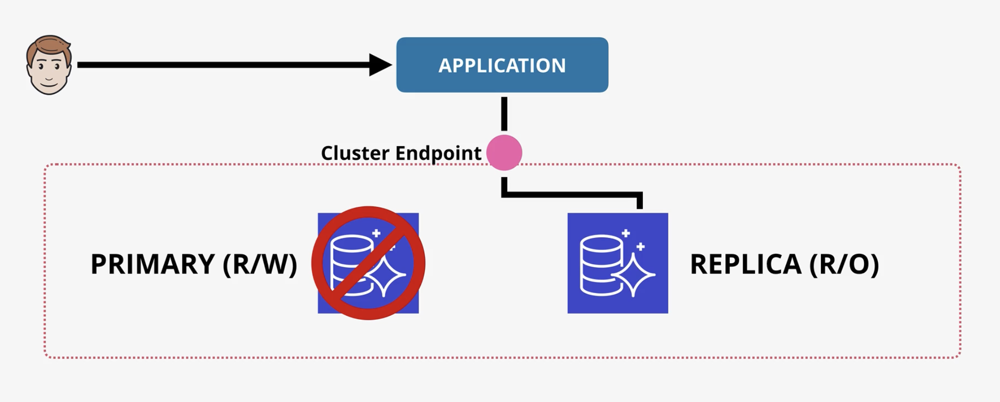

- No cluster endpoint or load balancing
  - The applicantion connects directly to one or both instances in the cluster
- When a R/W node receives a write, it proposes the data be commited to all storage nodes in the cluster
- Each storage node confirms or rejects whether the change is allowed
- If the majority agree, the write is commited and replicated across all storage nodes
- If rejected the write is cancelled with an error
- Committed writes are then copied to other master instances and in-memory caches are updated to ensure consistency

### Aurora Multi Master

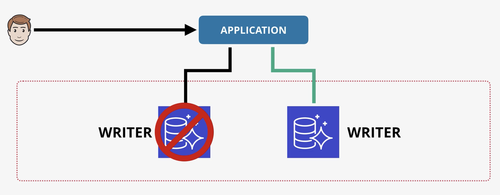

### Availability Benefits

- If a writer goes down, the application shifts all future load to the remaining writer with little to no downtime
- This provides a much faster failover compared to single master mode

## RDS Proxy

- Is a fuly managed, highly available database proxy for `Amazon RDS` that makes applications more scalable, more resilient to database failures, and more secure

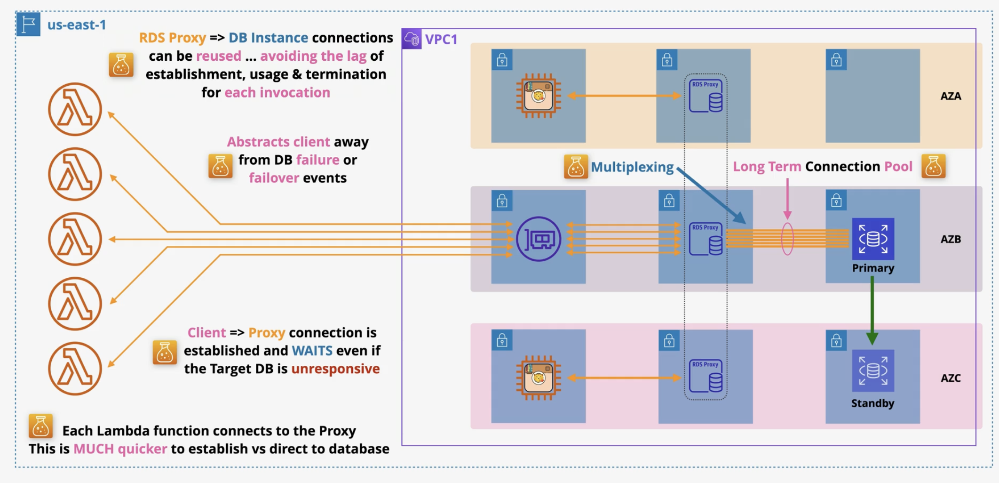

## Database Migration Service (DMS)

- A managed database migration service that runs using a replication instance
- Requires defining a source and destination endpoint, each pointing at their respective physical database
- At least one endpoint must be on AWS

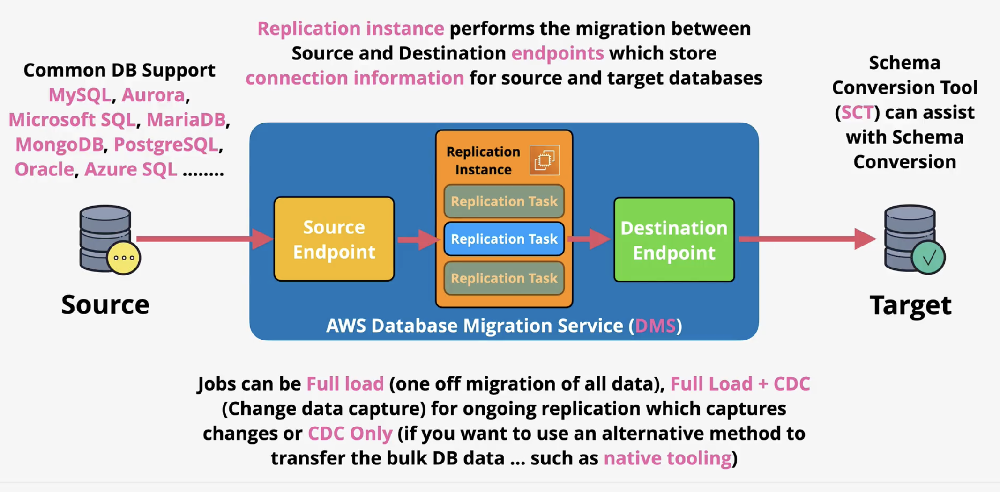
