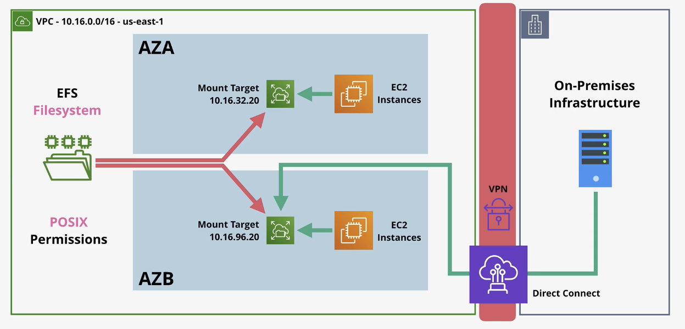

# Network Storage & Data Lifecycle

## Elastic File System (EFS)

- `EFS` is an implementation of **NFSv4**
  - Network File System version 4
- `EFS` file systems are created and mounted in Linux
- `EFS` storage exists separately from an `EC2` instance like `EBS` does
  - `EBS` is block storage
  - `EFS` is file storage
- Media can be shared between many `EC2` instances
- `EFS` is a private service
  - Isolated to the `VPC` its provisioned into
  - Access is via mount targets inside the `VPC`
- `EFS` access outside of the `VPC` with
  - `VPC` peering
  - VPN connections
  - AWS direct connect

## EFS Exam Powerup

- `EFS` is Linux only
- Two performance modes:
  - **General Purpose** is good for *latency sensitive* use cases
    - General purpose should be default for 99.9% of uses
  - **Max I/O performance** mode can scale to higher levels of aggregate throughput and IOPS but it does have increased latencies
- Two throughput modes
  - Bursting works like GP2 volumes inside `EBS` with a burst pool. The more data you store in FS, the better performance you get
  - Provisioned throughput modes can specify throughput requirements separately from size
- Two Storage classes available (can use lifecycle policies to move data between classes)
  - Standard
  - Infrequent Access

## Additional Readings Summary

### What is Amazon Elastic File System (EFS)?

- **Overview:** `EFS` is **not supported for windows based EC2 instances**
- **File System Types**
  - **Regional:* Stores data redundantly across multiple `AZs` for high availabiity, surviving single `AZ` failures
  - **One Zone:** Stores data in a single `AZ` to reduce costs. It provides continuous availbility but carries the risk of data loss if the `AZ` is damaged or destroyed
- **Security:** Access is controlled using `AWS IAM`, `VPC`, `Security Groups`, and POSIX file system permissions. `EFS` supports both **encyrption at rest** and **encryption in transit**

### EFS Performance Specifications

- **Storage Classes**
  - *Standard*
    - SSD-backed, delivering first-byte latencies as low as 1 millisecond for reads and 2.7 milliseconds for writes
  - *Infrequent Access (IA) & Archive*
    - Cost-optimized for less frequently accessed data, with first byte latencies in the tens of milliseconds
- **Performance Modes**
  - *General Purpose*
    - The default and recommended mode with the lowest per operation latency
    - **One Zone file systems must use this mode**
  - *Max I/O*
    - It is not supported for One Zone or Elastic throughput configurations
    - Designed for highly parallel workloads but has higher per operation latencies 
- **Throughput Modes**
  - *Elastic*
    - Automatically scales throughput up or down based on workload
    - Ideal for **spiky or unpredictable workloads** where performance is hard to forecast
  - *Provisioned*
    - You specify the exact throughput amount independent of your file system size
    - Best workloads with **known predictable performance requirements**
  - *Bursting*
    - Throughput scales automatically with the size of your file system (50 KiBps per GiB of standard storage)
    - It uses a burst credit system where credits accumulate during activity and are spend during peak loads

### Managing Storage Lifecycle

- **Lifecycle Management:** This feature automatically transitions files between storage classes based on when they were last accessed to help you save costs
- **Lifecycle Policies**
  - *Transition into IA*
    - Moves files out of Standard storage to the cheaper Infrequent Access class (by default if not accessed for 30 days)
  - *Transition into Archive*
    - You can configure `EFS` to move files back into Standard storage **on their first access** if your application requires the fastest latency
