# HA and Scaling

## Regional and Global AWS Architecture

### Global Architecture

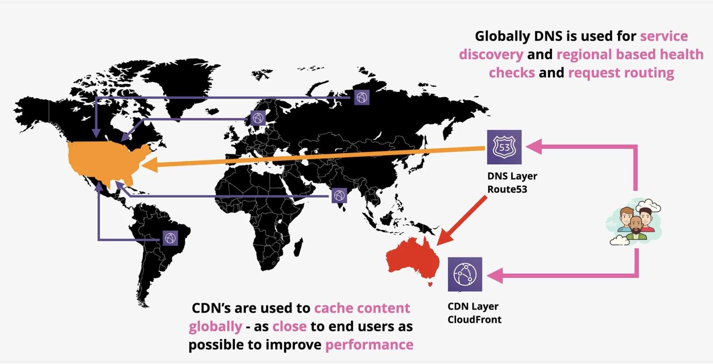

U.S. is the primary regiona and if that fails (checks with healthchecks) then `Route53` will redirect traffic to Australlia

### Regional Architecture

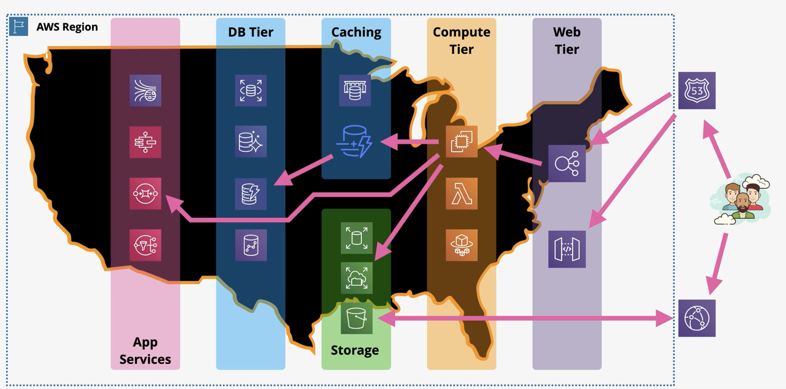

## Evolution of Elastic Load Balancer (ELB)

- 3 Types of load balancers (`ELB`) available within AWS
- Split between `v1` (avoid / migrate) and `v2` prefer
- Clasic Load Balancer (CLB)
  - `v1`
  - Can balance HTTP and HTTPS
  - Not really layer 7, lacking features 1 SSL per CLB
  - DEFAULT TO NOT USING CLBs
- `Application Load Balancer (ABL)`
  - `v2`
  - HTTP/HTTPS/WebSocket
- `Network Load Balancer (NLB)`
  - `v2`
  - TCP/TLS/UDP
- `v2` load balancers are
  - faster
  - cheaper
  - support target groups and rules

## Elastic Load Balancer Architecture

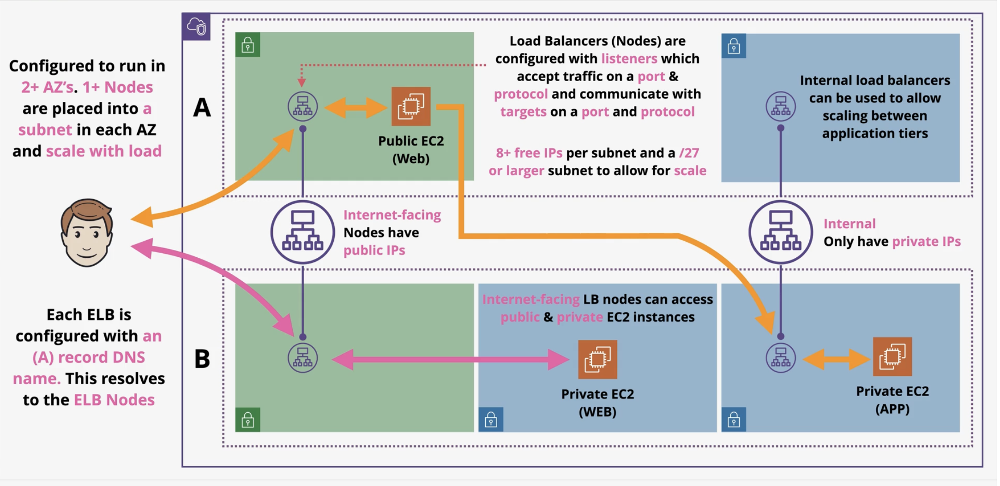

### Multi-Tier Application W/LB

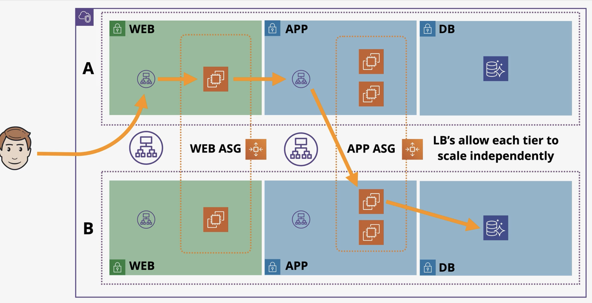

### Cross-Zone LB

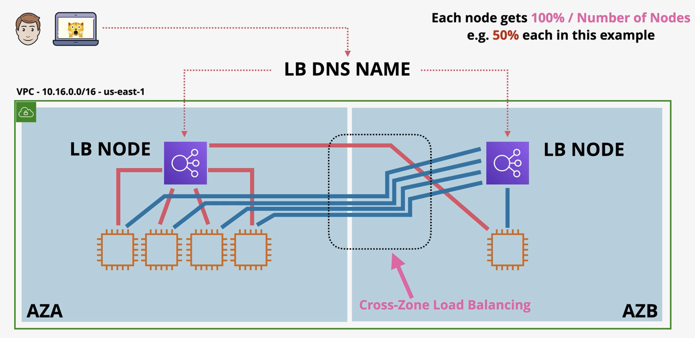

Each node in a load balancer distributes traffic evenly across all registered instances in every availability zone, supports health checks to ensure balanced routing to healthy targets, and uses rule-based target groups — where individual targets can belong to multiple groups — to direct connections based on DNS or other criteria.

### Summary ELB Architecture

- `ELB` is a **DNS *A record***  pointing at **1+** nodes per `AZ`
- Nodes (in one subnet per `AZ`) can scale
- Load Balancers come in two types
  - **Internet Facing**
    - means nodes have **public IPv4 IPs**
  - **Internal**
    - is **private only IPs**
- `EC2` **doesn't need to be public** to work with a LB
- Listener Configuration controls **WHAT** the LB does
- **8+** free IPs per subnet, and **/27** subnet to allow scaling

## Application Load Balancers (ALB) vs Network Load Balancing (NLB)

### Load Balancer Consolidation

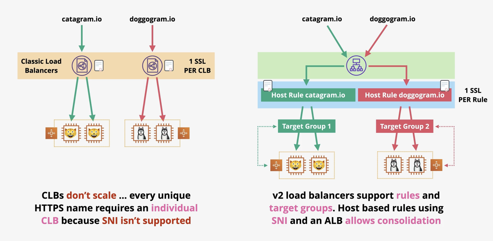

### Application Load Balancer

- **Layer 7** Load Balancer
  - Listens on **HTTP** and/or **HTTPS**
- **No other Layer 7 protocols**
  - Doesn't understand SMTP, SSH, Gaming, etc
- **NO TCP/UDP/TLS Listeners**
- Can understand **Layer 7** content
  - Cookies
  - Custom Headers
  - User Location
  - App Behavior
- HTTP/HTTPS (SSL/TLS) always terminated on the ALB
  - **No unbroken SSL** 
  - A new connection is made (after terminated on the ALB) to the application
- **MUST have SSL certs** if HTTPS is used
- **SLOWER THAN NLB**
  - This is due to more levels of the network stack to process
- Health checks **evaluate application health**
- Rules **direct connections** which arrive at a listener
- Processed in **priority order**
  - **DEFAULT RULE** = **catch all**
- **Rule Conditions**
  - host-header
  - http-header
  - http-requet-method
  - path-pattern
  - query-string
  - source-ip
- **Actions** these are the things the rules do with the traffic
  - forward
  - redirect
  - fixed-response
  - authenticate-odic
  - authenticate-cognito

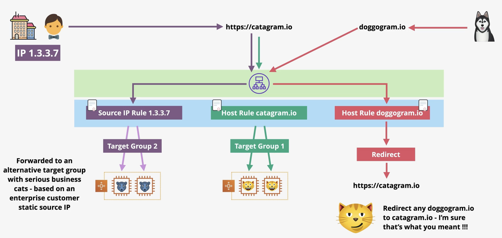

### Network Load Balancers (NLB

- **Layer 4** load balancer
  - Interprets
    - TCP
    - TLS
    - UDP
    - TCP_UDP
- **NO VISIBILITY OR UNDERSTANDING** of HTTP or HTTPS
  - Which means they can't interpret
    - Headers
    - Cookies
    - Session Stickiness
- Really Really Really Fast
  - millions of rps
  - 25% of ALB latency
- Ideal for 
  - SMTP
  - SSH
  - Game Servers
  - Financial Apps (not http or https)
- Health checks **JUST** check ICMP/TCP Handshake
  - Not app aware
- Can have **static ips**
  - useful for whitelisting
- **Forward TCP** to instances
  - **unbroken encryption**
- Used with private link to provide services to other `VPCs`

### ALB vs NLB

- Use NLBs for
  - Unbroken encryption
  - Static IP whitelisting
  - Fastest performance (millions of requests per second)
  - Protocols not HTTP or HTTPS
  - Privatelink
- Otherwise use ALB

## Launch Configurations (LC) and Launch Templates (LT)

- Allow you to define the configuration of an `EC2` instance **in advance**
  - Can configure things in advance like
    - AMI
    - Instance Type
    - Storage and Key Pair
    - Networking and Security Groups
    - Userdata and IAM Role
- Both are NOT editable
  - Defined once
  - Launch Template has versions
- Launch Template
  - Provides newer features like
    - Including T2/T3 unlimited
    - Placement Groups
    - Capacity Reservations
    - Elastic Graphics
  
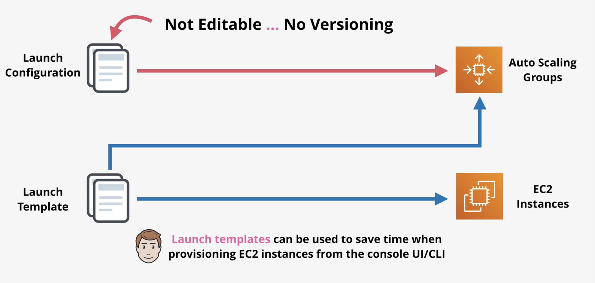

## Auto Scaling Groups (ASG)

- Automatic scaling and self-healing for `EC2`
- They make use of Launch Configurations and Launch Templates
- Autoscaling group uses one `LC` or a version of a `LT` which its linked with
- Three values to control
  - Minimum size
  - Desired capacity
  - Maximum size
- Provision or terminate instances to keep at the desired level 
  - Scaling Policies can trigger this based on metrics
- Autoscaling Groups will distribute `EC2` instances to try and keep the `AZs` equal

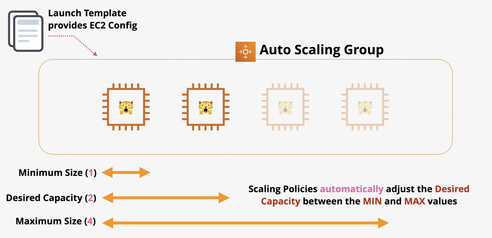

### ASG Architecture

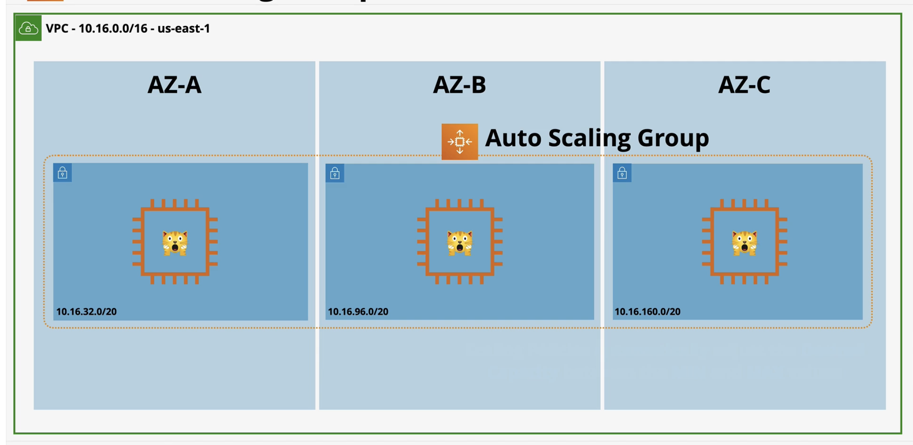

### Scaling Policies

- Scaling Policies are rules that you can use to define autoscaling of instances
- They are time based adjustments
  - Scale Periods
- **Cooldown Period**
  - Is how long to wait at the end of a scaling action before scaling again
  - There is a minimum billable duration for an `EC2` instance
  - Currently this is 300 seconds
- Self Healing occurs when an instance has failed and AWS provisions a new instance in its place
  - This will fix mose problems that are isolated to one instance
- ASGs can use the load balancer health checks rather than `EC2`
  - ALB status checks can be much richer than `EC2` checks because they can monitor the status of HTTP and HTTPS requests
  - This makes them more application aware
- **Launch** and **Terminate** - SUSPEND and RESUME
  - If **Launch** is set to SUSPEND then the `ASG` won't scale if any alarms or schedule actions take place
  - If **Terminate** is set to SUSPEND then the `ASG` will terminate any instances
- **AddToLoadBalancer** - add to LB on launch
  - This controls whether any instances provisioned are added to the Load Balancer
- **AlarmNotification** - accept notification from `CloudWatch`
  - This controls whether the `ASG` will react to any `CloudWatch` alarms
- **AZRebalance** - balances instances evenly across all of the `AZs`
  - This controls whether the `ASG` attempts to redistribute instances across `AZs`
- **HealthCheck** - instance health checks on/off
  - This controls whether instance health checks across the entire group are on or off
- **ReplaceUnhealthy** - terminate unhealthy and replace
  - This controls whether the `ASG` will replace any instances marked as unhealthy
- **ScheduledActions** - scheduled on/off
  - This controls whether the `ASG` will perform any schduled actions or not
- **Standby** - use this for instances *InService vs Standby*
  - This allows you to suspend any activities of the `ASG` of a specific instance

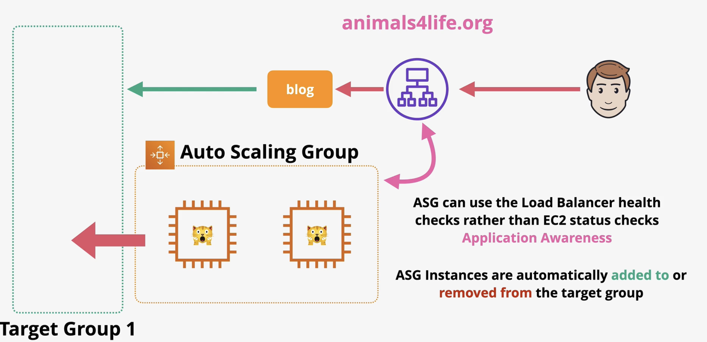

### ASG Summary

- `ASG` are free
  - Only billed for the resources deployed
- Always use cooldowns to avoid rapid scaling
- Think about implementing more and smaller instances to allow granularity
- Generally, for anything client facing you should always use `ASG` with `ALB` with autoscaling because thy allow you to provide elasticity by abstracting the user away from individual servers
  - Since customers will be connecting through an `ALB` they don't have any visiblity of individual servers
- `ASG` defines when and where
  - Launch Templates defines WHAT

## ASG Scaling Policies

- `ASGs` don't NEED scaling policies
  - They can have none
- **Manaual Scaling**
  - Refers to when you manually adjust these values
    - Min
    - Max
    - Desired
  - Useful in testing or urgent situations
- **Dynamic Scaling**
  - *Simple*
    - If CPU is above 50% add one to capacity
  - *Stepped*
    - If CPU usage is above 50% add one, if above 80% add three
  - *Target*
    - Desired aggregate CPU = 40%, ASG will achieve this
- Scaling based on `SQS`
  - **ApproximateNumberOfMessagesVisible**
    - Increase or decrease capacity based on approximate number of messages visible

### Simple Scaling

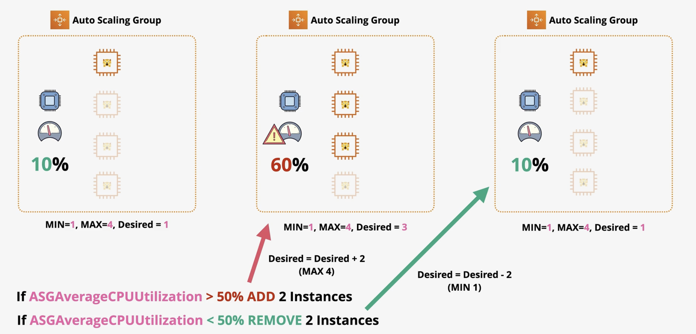

### Step Scaling

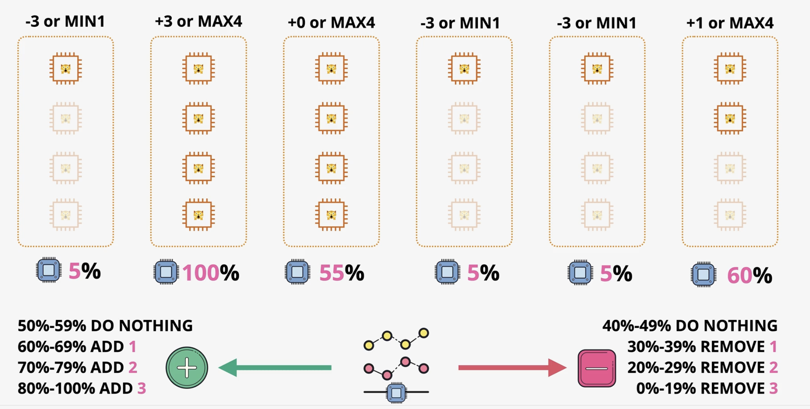

## ASG Lifecycle Hooks

- Lifecycle Hooks enable you to perform custom actions by pausing instances as an `ASG` launches or terminates them and when an instance is paused, it remains in a wait state either until you complete the lifecycle action using the **complete-lifecycle-action** command or the `CompleteLifecycleAction` operation or until the timeout period ends (one hour by default)
- **Custom Actions** on instances during **ASG actions**
  - Only during **instance launch** or **instance terminate** transitions

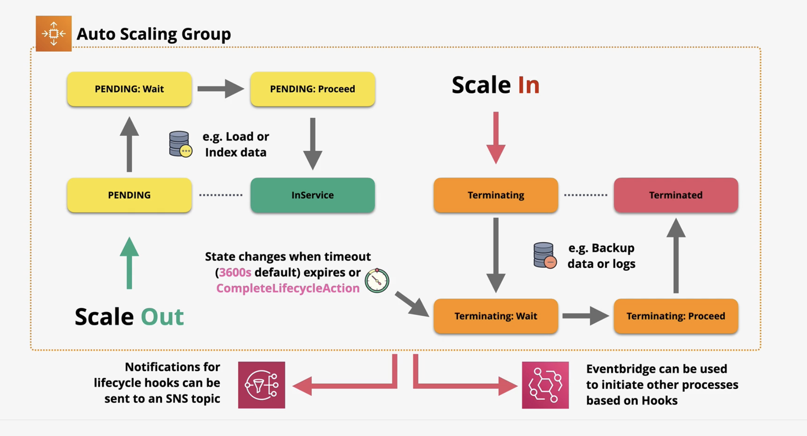

## ASH HealthCheck Comparison - EC2 vs ELB

- `EC2 ASG` can determine the health status of an instance using one or more of the following:
  - Status checks provided by `EC2` to identify hardware and software issues that may impair an instance
    - The default health checks for an `ASG` are `EC2` status checks only
  - Health checks provided by `ELB` are disabled by default but can be enabled
  - Custom health checks
- With `EC2` checks with any of the statuses can be **UNHEALTH**
  - Stopping
  - Stopped
  - Terminated
  - Shutting Down
  - Impaired (not 2/2 status)
- With `ELB` checks with any of the statuses can be **HEALTHY**
  - Runnning
  - Passing `ELB` health check
  - can be more aplication aware
- Health check grace period (Default 300s)
  - Delay before starting checks

## SSL Offload & Session Stickiness

- Bridging (Default for `ELB`)
  - One or more clients establish one or more connections to a load balancer, which is configured with an HTTPS listener, meaning SSL encryption occurs between the client and the load balancer.
  - The load balancer requires an SSL certificate matching the application's domain name, which is stored and accessed by AWS — this may be a concern if strict certificate storage requirements apply.
  - The load balancer decrypts the incoming client traffic, interprets the unencrypted HTTP content, and then initiates new encrypted SSL sessions to the backend EC2 instances.
  - The backend EC2 instances must each have matching SSL certificates and perform their own cryptographic operations, which can introduce significant compute overhead.
  - The key benefit of this architecture is that the load balancer has full visibility into the unencrypted HTTP traffic, allowing it to take actions based on the plain text content before re-encrypting it to the backend.
- Pass-Through
  - The client connects to a Network Load Balancer configured for TCP, which passes the connection through without decrypting the data — the load balancer can see source and destination details but never touches the encrypted payload.
  - Because the load balancer does not decrypt traffic, it does not require an SSL certificate — only the backend EC2 instances do, and the certificate never needs to be exposed to AWS.
  - The tradeoff is that since the HTTP content is never decrypted at the load balancer level, no HTTP-based load balancing decisions can be made, and each EC2 instance still bears the full cryptographic compute overhead.
- Offload
  - Clients connect to the load balancer via HTTPS, where the connection is terminated and decrypted — requiring an SSL certificate on the load balancer but not on the backend EC2 instances.
  - Traffic between the load balancer and backend instances is sent over HTTP in plain text across AWS's network, removing the need for cryptographic operations on the EC2 instances.
  - The tradeoff is that data travels unencrypted within AWS's internal network, which is acceptable for most use cases but may be a concern for stricter security requirements.

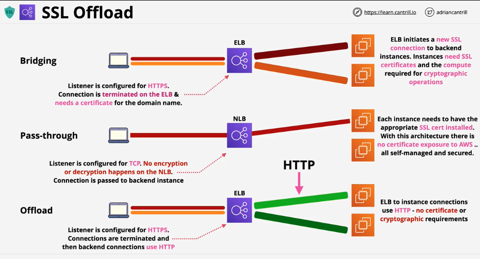

## Connecton Stickiness

- Without stickiness, each client request is stateless — if session data is stored on a specific server, it cannot be effectively load balanced across multiple servers.
- Elastic Load Balancers offer a feature called Session Stickiness to address this limitation.

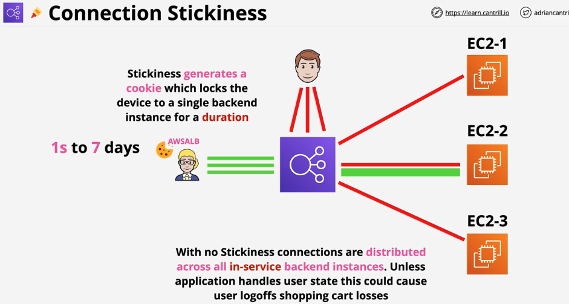

- In an Application Load Balancer, session stickiness is enabled at the target group level — when a user makes their first request, the load balancer generates a cookie called **AWSALB** with a duration between one second and seven days.
- During this time, all sessions from that user are routed to the same backend instance until one of the following occurs:
  - A server failure, causing the user to be moved to a different instance
  - The cookie expires, restarting the process and issuing a new cookie
- A downside of stickiness is that it can cause uneven load distribution, as users are always pinned to the same server regardless of overall traffic.
- The recommended approach is to design applications so session state is stored externally — such as in DynamoDB — keeping EC2 instances completely stateless and allowing true load balancing flexibility.

## Gateway Load Balancers (GWLB)

-`Gateway Load Balancers` enable you to deploy, scale, and manage virtual applicances, such as firewals, intrusion detection and prevention systems, and deep packet inspection systems
- Combines a transparent network gateway (that is, a single entry and exit point for all traffic) and distributes traffic while scaling your virtual appliances with the demand

### Why do we need a GWLB?

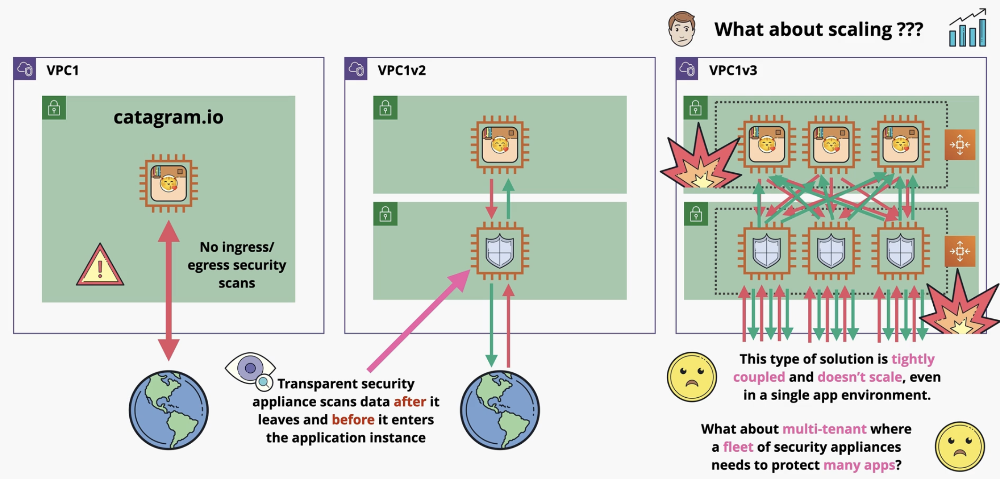

### What is GWLB?

- Help you run and scale 3rd part appliances
- Inbound and Outbound traffic transparent inspection and protection
  - GWLB endpoints traffic enters/leaves via these endpoints
  - GWLB balances packets across multiple backend appliances
- Traffic and metadata is tunnelled using GENEVE protocol

### How it Works

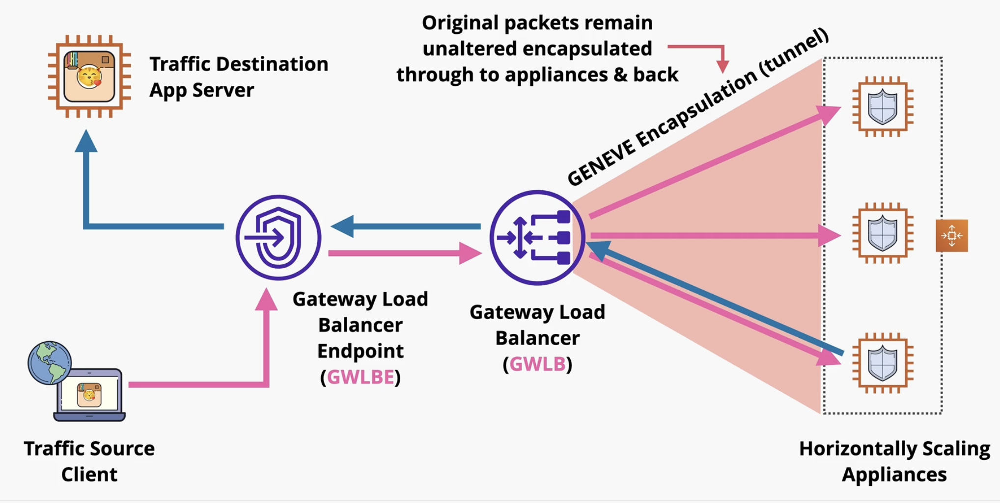

### GWLB Architecture

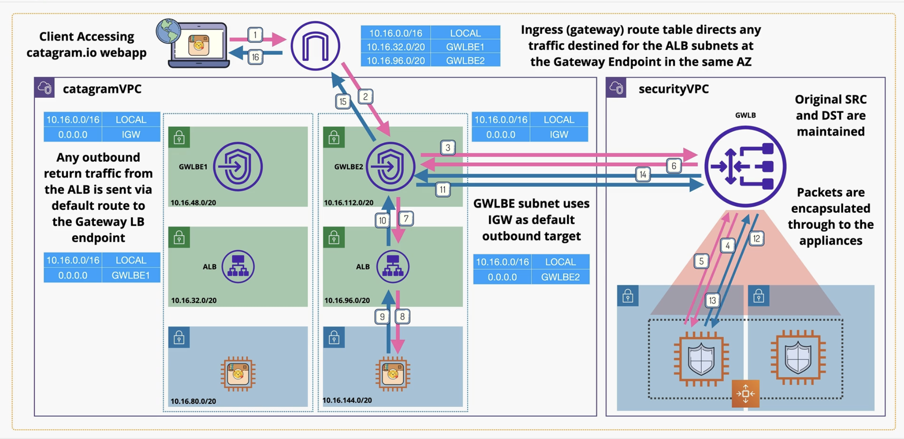
