# Serverless and Application Services

## Architecture Deep Dive

### Monolithic

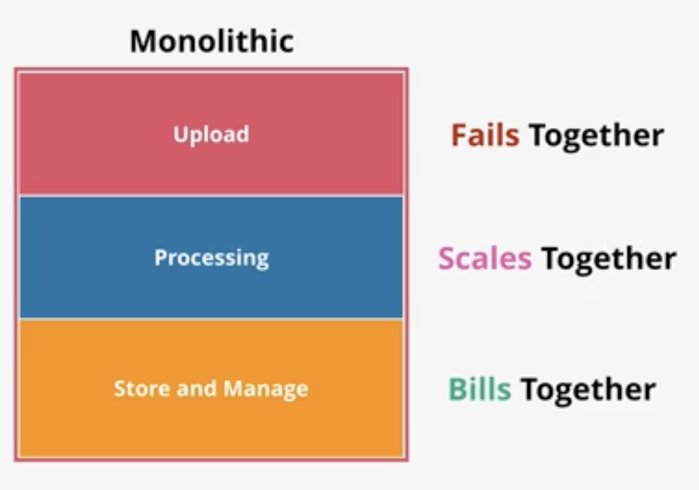

- Fails together as an entity.
  - One error will bring the whole system down.
- Scales together. Systems are highly coupled.
    - Everything expects to be running on the same compute hardware
- Bills together.
    - All components are always running and always incurring charges.
- **This is the least cost effective way to architect systems.**

### Tiered Architecture

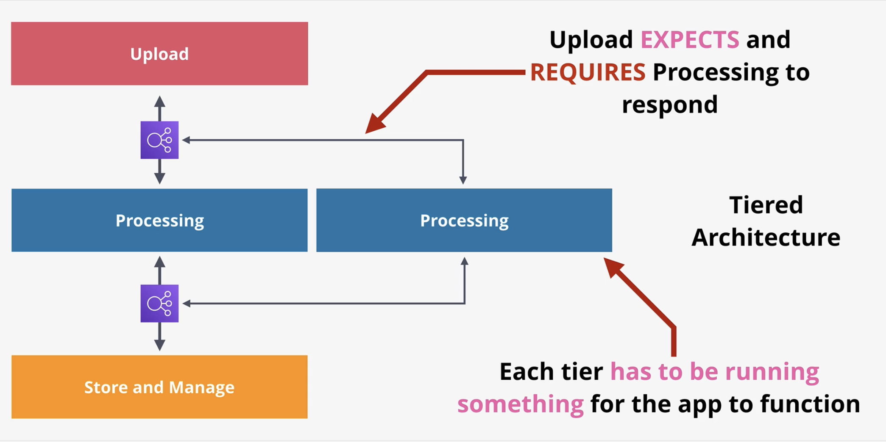

- Different components can be on the same server or different servers.
- Components are coupled together because the endpoints connect together.
- Can adjust the size of the server that is running each application tier.
- Utilizes load balancers in between tiers to add capacity.
- Tiers are still tightly coupled.
    - Tiers expect a response from each other. If one tier fails, subsequent tiers will also fail because they will not receive the proper response.
    - Back loads in one tier will impact the other tiers and customer experience.
- Tiers must be operational and send responses even if they are not processing anything of value otherwise the system fails.

### Queue Architecture

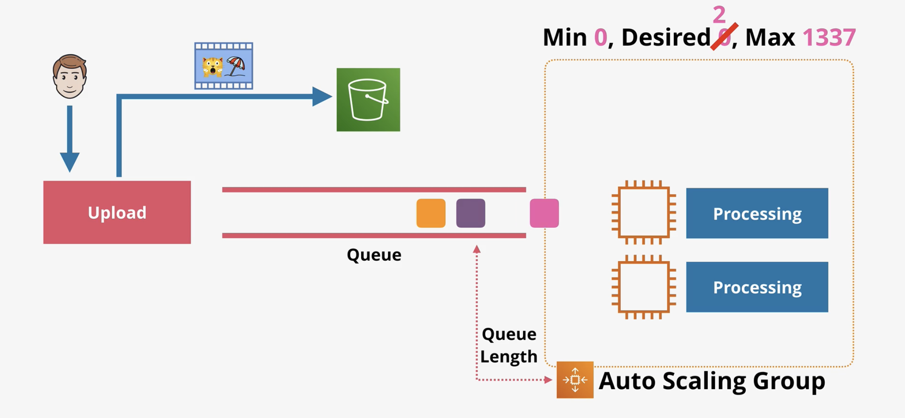

- Data no longer moves between tiers to be processed and instead uses a queue.
  - Often are FIFO (first in, first out)
- Data moves into a S3 bucket.
- Detailed information is put into the next slot in the queue.
  - Tiers no longer expect an answer.
- Upload tier sends an async message.
  - The upload tier can add more messages to the queue.
- The queue will have an autoscaling group to increase processing capacity.
- The autoscaling group will only bring up servers as they are needed.
- The queue has the location of the S3 bucket and passes this onto the processing tier.

### Micro-Service Architecture

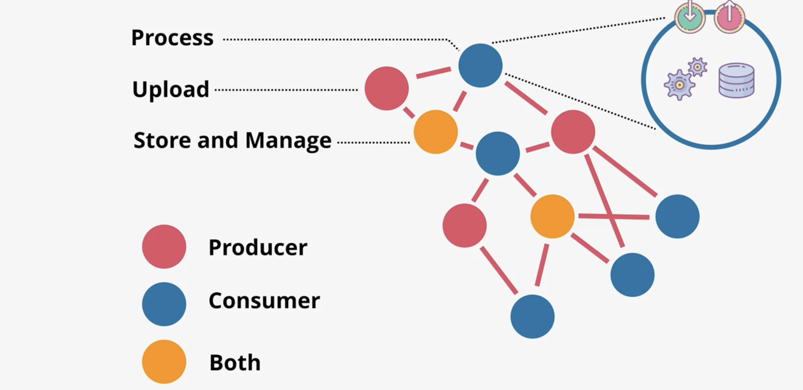

- **Microservices architecture**: A collection of tiny, self-sufficient applications, each with its own logic, data store, and input/output components
- **Core principle**: Microservices do individual things very well
- **Example microservices**:
  - Upload microservice
  - Process microservice
  - Store and manage microservice
- **Microservice roles**:
  - **Producers**: Produce data or messages (e.g., upload service)
  - **Consumers**: Consume data or messages (e.g., process service)
  - **Both**: Some microservices can produce and consume (e.g., store and manage service)
- **Events**: What services produce or consume architecturally
- **Queues**: Used to communicate events between microservices

### Event Driven Architecture

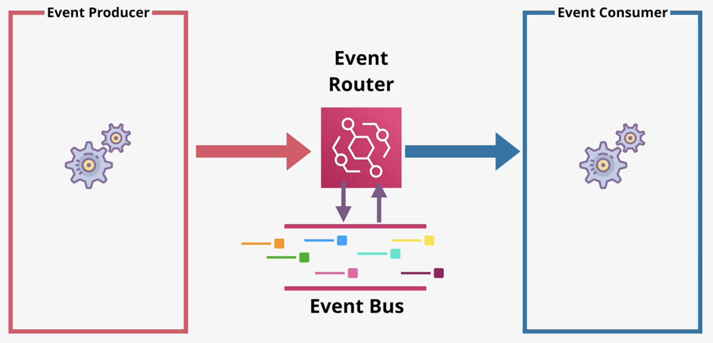

- No constant running/waiting for things
- Producers generate events when something happens (clicks, errors, uploads, etc)
- Events are delivered to Consumers and actions are taken and system returns to waiting
- Mature event-driven architecture only consumes resources while handling events

## Lambda In-Depth

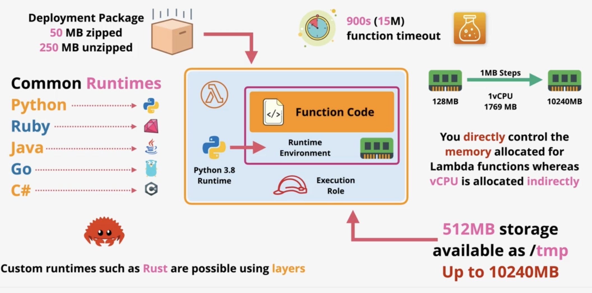

- **Function-as-a-Service (FaaS)**
	- Short running and focused
- Lambda Function: a piece of code lambda runs
- Functions use a runtime (Python 3.10)
- Functions are loaded and run in runtime environments
- The environment has a direct memory (indirect CPU) allocation
- You are billed for the duration that a function runs
- Now you can also use container images with Lambda. 
  - That means you are using your **existing** container build processes, the same one you use to create Docker images
  - Instead you're creating specific images designed to run inside the Lambda environment.

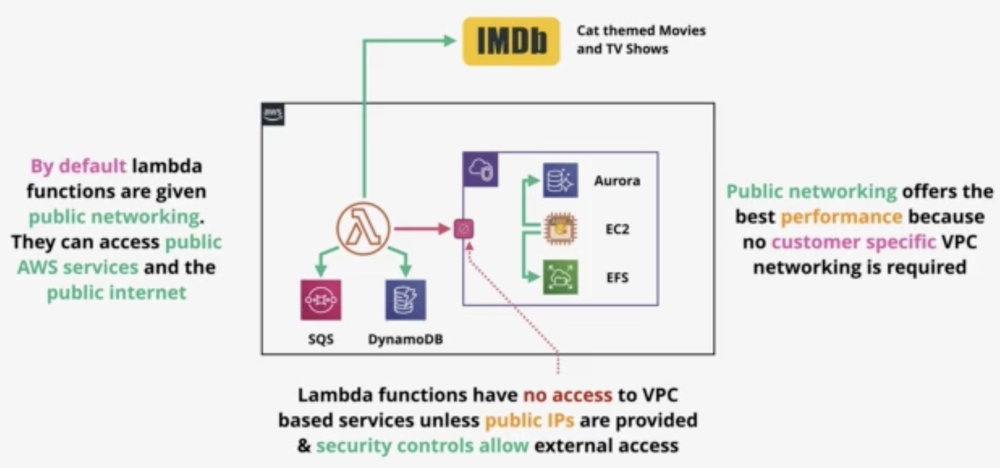

- **Default Lambda behavior**: Lambda functions are public services by default and can access any websites
- **Private VPC access**: 
  - By default, Lambda functions cannot access private VPC resources
  - Can be configured to access VPC resources if needed
- **Trade-off when configured for VPC**: Once configured for VPC access, Lambda functions can *only* access resources within that VPC
- **Losing public access**: A VPC-configured Lambda loses internet access unless the VPC is set up with:
  - Public internet access, or
  - Access to AWS public space endpoints

### Lambda Networking

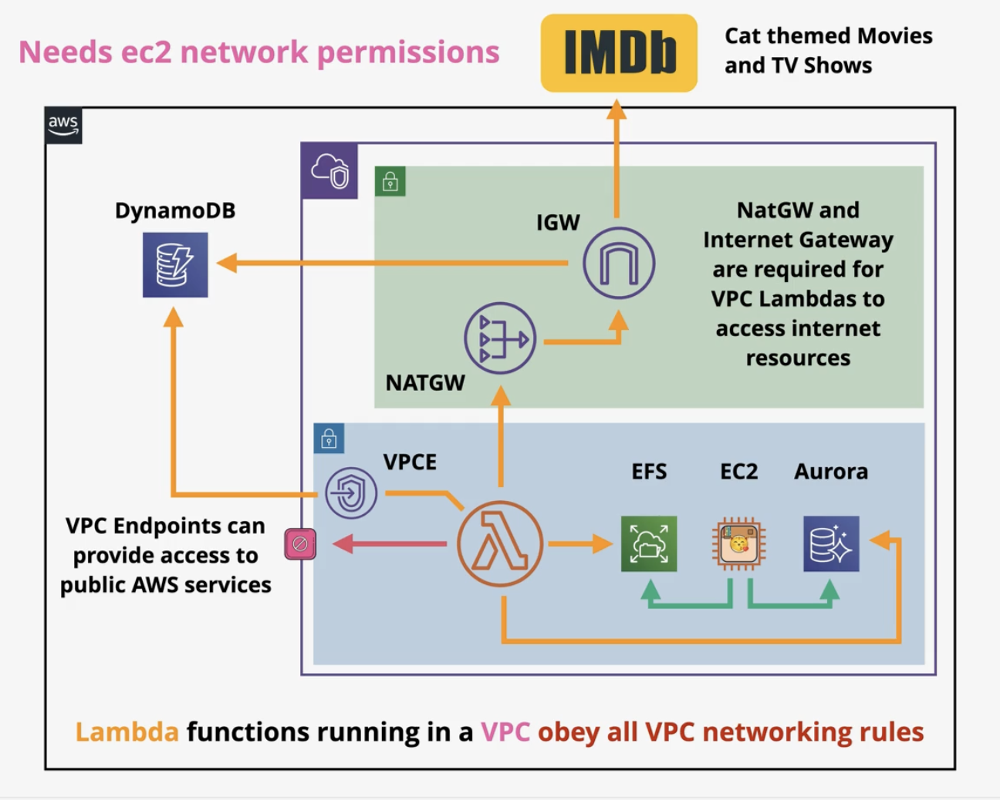

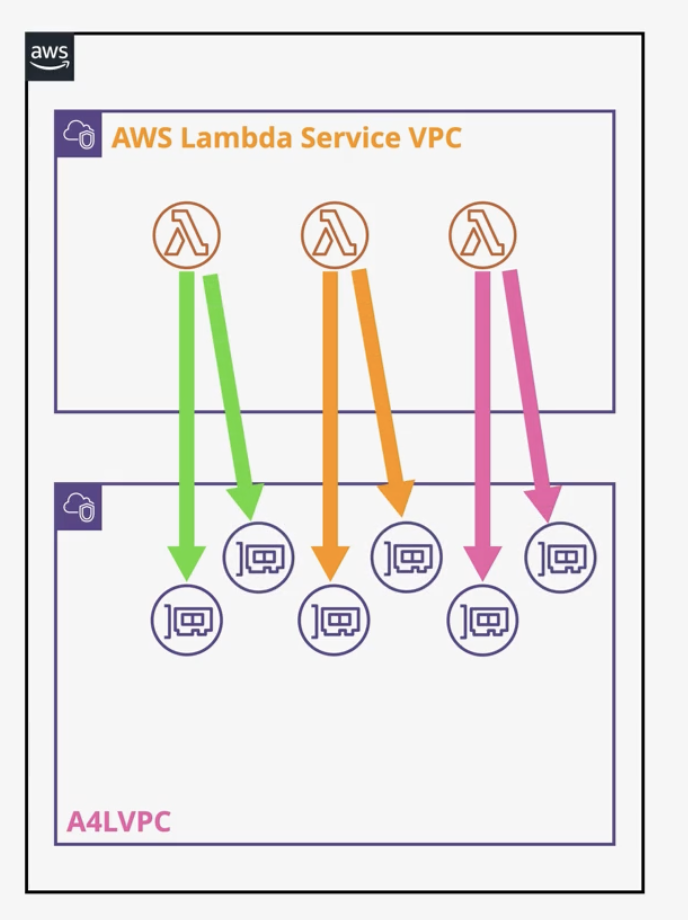

- **VPC-based Lambda functions don't actually run in your VPC**: Their architecture is similar to Fargate
- **How it works**:
  - When invoked, each Lambda function creates an elastic network interface (ENI) within the customer VPC
  - Traffic flows between the service VPC and the customer VPC
- **The problem with this approach**:
  - Configuring ENIs on a per-function, per-invocation basis took time
  - This added delay to Lambda function execution
- **Scaling issue** : Concurrency required additional elastic network interfaces — the more popular a system became, the worse it performed
- **Note**: This describes the **OLD ARCHITECTURE**

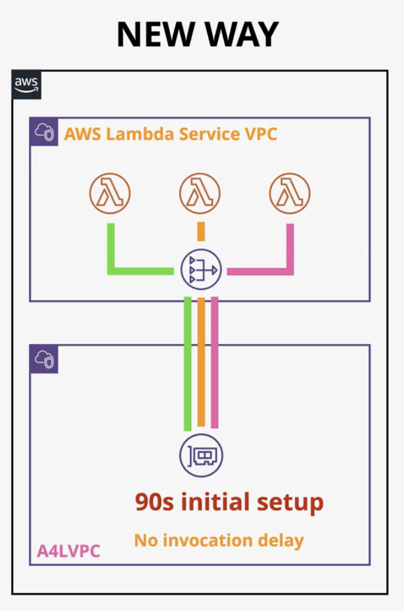

- **AWS analysis**: AWS analyzes all Lambda functions running in a region within an account and identifies unique combinations of security groups and subnets
- **ENI allocation rule**: For every unique combination of security group and subnet, one ENI is required in the VPC
- **Best-case scenario**: If all Lambda functions use the same subnet *and* the same security group, they can all share a single ENI
- **Result**: A single connection between the Lambda Service VPC and your VPC is created for each unique combination

### Lambda Security

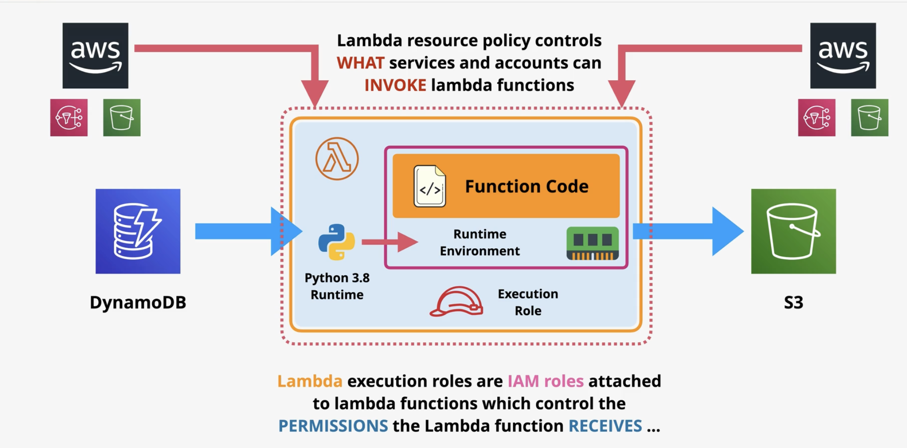

### Lambda Logging

* Lambda uses CloudWatch, CloudWatch Logs, and X-Ray
* **Logs from Lambda executions use CloudWatch Logs**
* Metrics: invocation success/failure, retires, latency, are stored in CloudWatch
* Lambda can be integrated with X-Ray for distributed tracing
* **CloudWatch Logs requires permission via Execution Role**

### Lambda Synchronous Invocation

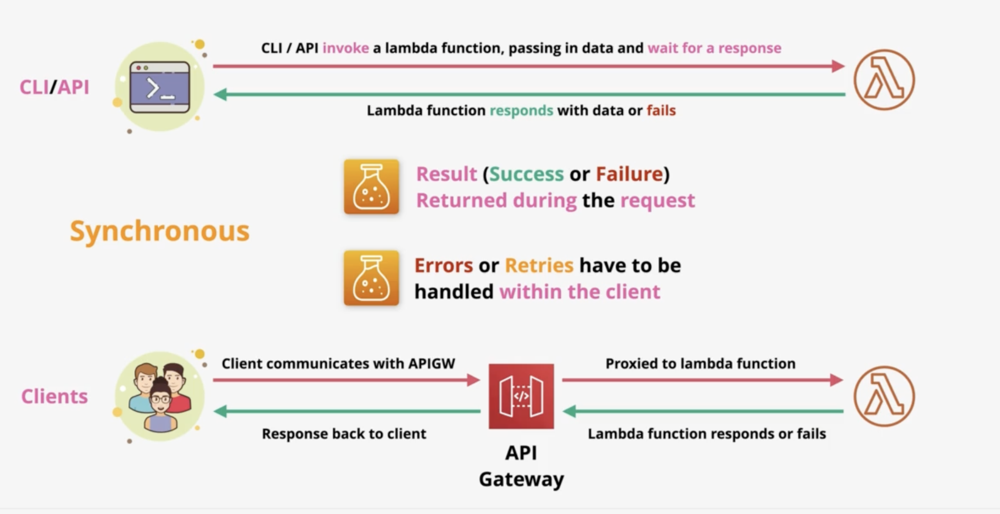

### Lambda Asynchronous Invocation

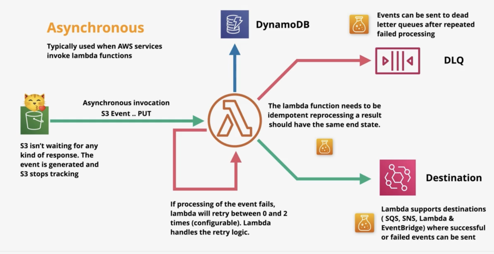

### Lambda Event Source Mapping

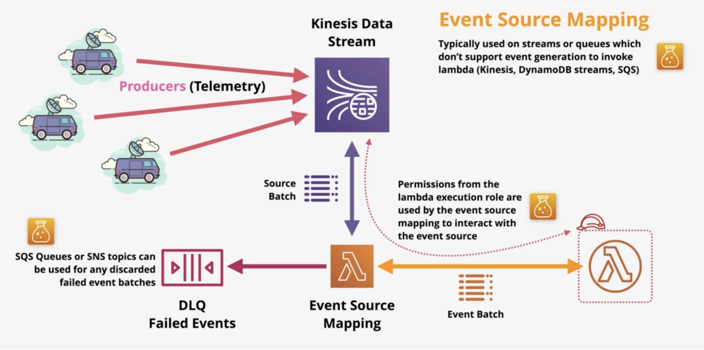

### Lambda Versions

* Lambda functions have versions
	* A version is the code and the configuration of the lambda function
* Versions are immutable, it never changes once published and has its own Amazon Resource name
* `$Latest` points at the latest version of lambda function
* Aliases (DEV, Stage, PROD) point at a version (can be changed)

## CloudWatch Events and Event Bridge

- CloudWatch Events and EventBridge have visibility over events generated by supported AWS services within an account.
- They can monitor the default account event bus - and pattern match events flowing through and deliver these events to multiple targets.
- They are also the source of scheduled events which can perform certain actions at certain times of day, days of the week, or multiple combinations of both - using the Unix CRON time expression format.
- Both services are one way how event driven architectures can be implemented within AWS.

### Key Concepts

* If X happens or at Y times then do Z
* EventBridge is CloudWatch Events Version 2
* A default Event Bus account
	* In CloudWatch Events this the only bus (implicitly defined)
* EventBridge can have additional event buses
* Rules match incoming **events** and/or **schedules** 
* Route events to 1+ targets

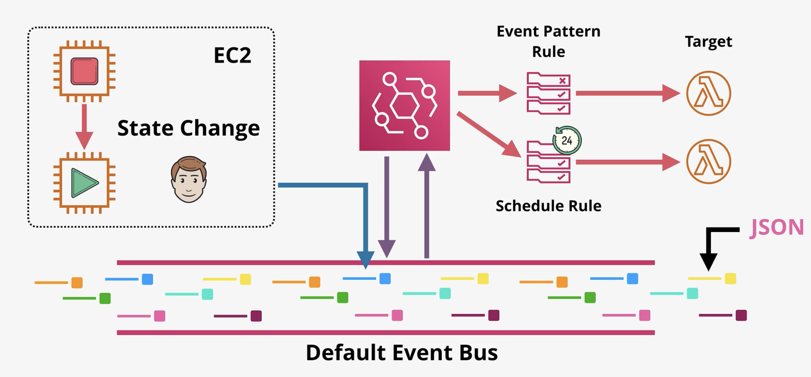

## Serverless Architecture

- The Serverless architecture is a evolution/combination of other popular architectures such as event-driven and microservices.
- It aims to use 3rd party services where possible and FAAS products for any on-demand computing needs.
- Using a serverless architecture means little to no base costs for an environment - and any cost incurred during operations scale in a way with matches the incoming load.
- Serverless starts to feature more and more on the AWS exams - so its a critical architecture to understand.

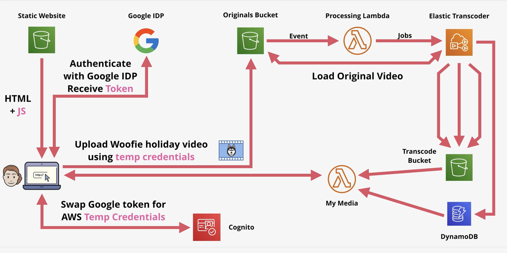

- Serverless isn't just one thing
	- You manage few, of any servers (low overhead)
- Applications are a collection of small and specialized functions
	- Stateless and ephemeral environments (duration billing)
- Event Driven
	- Consumption only when being used
- FaaS is used where possible for compute functionality
- Managed Services are used where possible 
- Serverless architecture means little to no base costs for an environment and any cost incurred during operations scale in a way with matches the incoming load.

## Simple Service Notification (SNS)

- **Simple Notification Service (SNS)**: A publish-subscribe (pub/sub) style notification system
- **Where it's used**:
  - Within AWS products and services
  - In serverless and event-driven architectures
  - In traditional application architectures
- **Core model**:
  - **Publishers** send messages to **topics**
  - **Subscribers** receive messages sent to those topics
- **Subscriber support**: SNS supports a wide variety of subscriber types, including other AWS services such as Lambda and SQS
- **Public AWS Service**
- Coordinates the sending and delivery messages
- Message are <= 256KB payloads
- SNS Topics are the base entity of SNS (permission configurations)

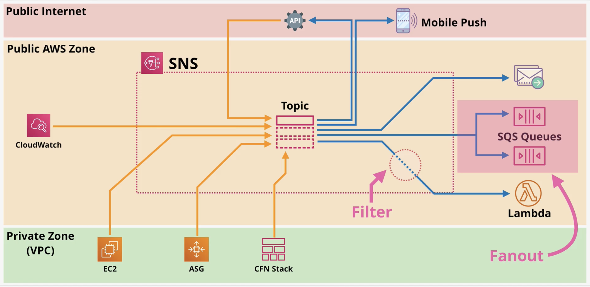

* Delivery Status (including HTTP, Lambda, SQS)
* Delivery Retries (Reliable Delivery)
* Highly Available and Scalable (Region)
* Server Side Encryption (SSE)
* Cross Account via Topic Policy

## State Machine - Step Functions

Step functions is a product which lets you build long running serverless workflow based applications within AWS which integrate with many AWS services.

- Problems With Lambda
	- Lamda is a FaaS
	- **15-minute max** execution time
	- Can be chained together
	- Gets messy at scale
	- Runtime Environments are stateless
- Step Functions
	- Serverless Workflow (START -> STATES -> END)
	- States are THINGS which occur
	- Maximum Duration 1 year
	- Two Types of Workflow
		- Standard Workflow
			- Default Workflow
			- 1 year Execution Limit
		- Express Workflow
			- High Volume event processing workloads such as IoT, Streaming Data, Mobile Applications backends
			- 5 minute execution limit
	- Started via API Gateway, IoT Rules, EventBridge, Lambdas
	- Amazon State Language (ASL) JSON Template
	- IAM Roles used for permission
- Available States
	- Succeed/Fail
	- Wait
	- Choice
	- Parallel
	- Map
		- Accepts a list of things
		- For each item in the list a map state performs a certain of things 
	- Task
		- Single Unit of work performed by a state machine
		- Can work or integrate with Lambda, Batch, DynamoDB, ECS, SNS, SQS

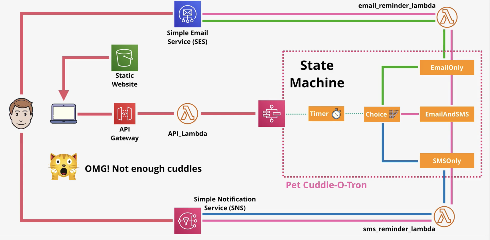

## API Gateway

- **API Gateway overview**: A managed AWS service that allows the creation of API endpoints, resources, and methods
- **AWS integration**: Integrates with other AWS services, and can even access some without the need for dedicated compute
- **Role in serverless architectures**: Serves as a core component of many serverless architectures, using Lambda as event-driven, on-demand backing for methods
- **Legacy application support**: Can connect to legacy monolithic applications, acting as a stable API endpoint during evolution from:
  - Monolith → microservices → potentially serverless
- **Further reading**: [Common Errors with API Gateway](https://docs.aws.amazon.com/apigateway/latest/api/CommonErrors.html)

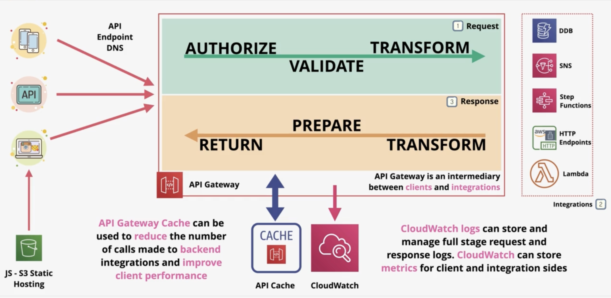

### Authentication

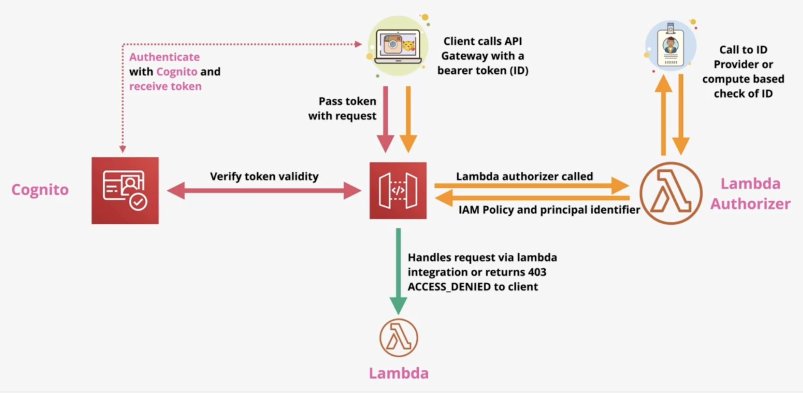

- API Gateway Authentication
	- Cognito Authorization
	- Lambda Based Authorization (Bearer Token)
	- IAM passing credentials within Headed

### End Point Types

- Edge Optimized
	- Any incoming requests are routed to the nearest CloudFront Point of Presence (POP)
- Regional
	- Clients in the same region
	- Does not use CloudFront network
	- Regional Endpoints
- Private
	- Endpoint accessible only within a VPC via interface endpoint

### Stages

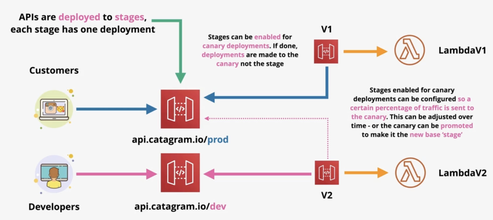

### Errors

- 4xx: Client error, invalid request
	- 400: Bad request, generic
	- 403: Access denied
	- 429: API Gateway can throttle, exceed amount
- 5xx: Server error, backend issue
	- 502: Bad gateway exception, bad output returned by lambda
	- 503: Service unavailable, major service issues
	- 504: Integration failure/timeout, 29s limit

### Caching

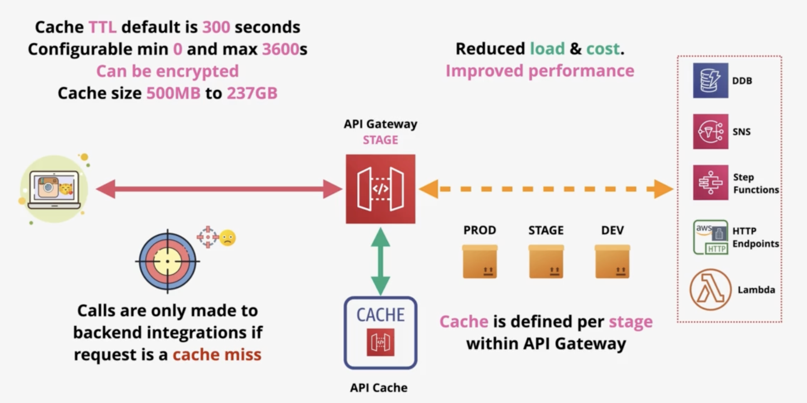

## Simple Queue Service (SQS)

SQS queues are a managed message queue service in AWS which help to decouple application components, allow Asynchronous messaging or the implementation of worker pools.

- Public, Fully Managed, Highly Available Queues (Standard/FIFO)
- Messages up to 256KB in size 
	- If data is above 256Kb link large data to messages
- Received messages are hidden (VisibilityTimeout) then either reappear (retry) or are explicitly deleted
- DeadLetter queues can be used for problem messages
- Auto Scaling Groups (ASG) can scale and lambdas invoke based on queue length

### SQS Architecture

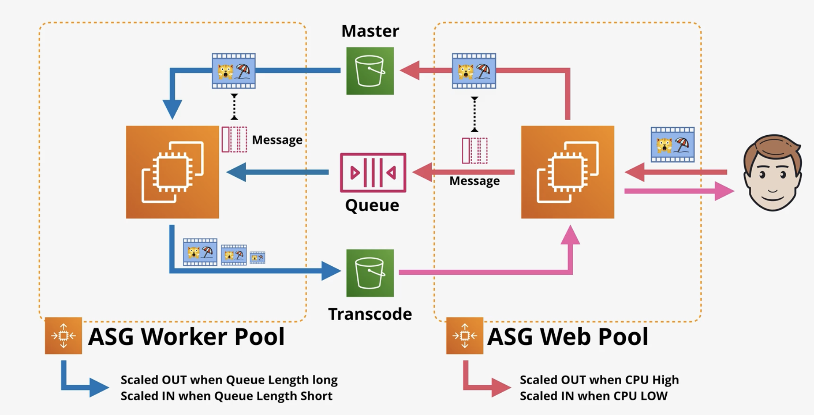

### SQS Advanced Architecture

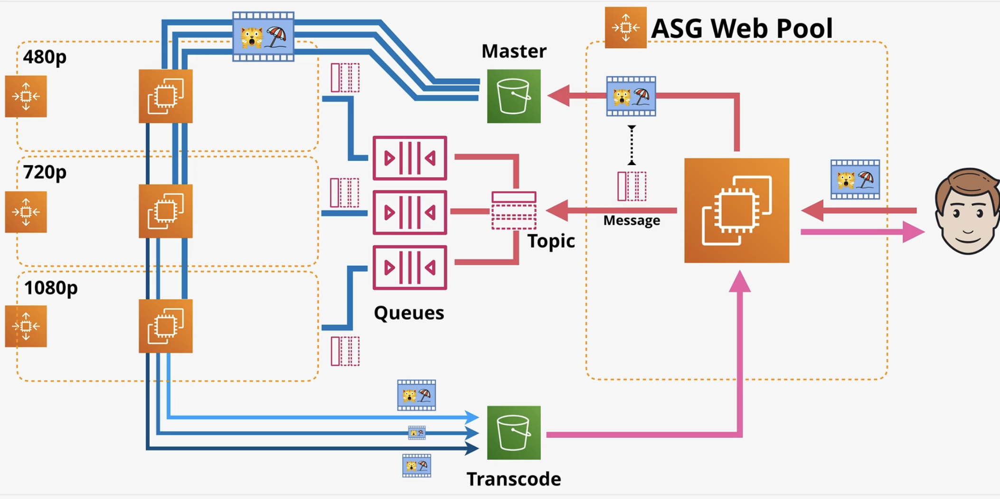

### Key Concepts

- Standard Queues
	- Guaranteed at least once delivery and do not guaranteed order
	- Can contain duplicate messages
- FIFO Queues
	- Guaranteed the order and guaranteed exactly once 
	- No duplicates
	- 3000 messages per second with batching
	- 300 messages per second without batching
- Billed on requests
	- Single request can receive 0 - 10 messages and up to 64KB total
- Different Types of Polling
	- Short (Immediate) Polling
		- can receive zero or more messages
	- Long (waitTimeSeconds) Polling
		- Up to 10 messages/64KB will be in a single request
		- Will wait up to 20 seconds until messages do arrive on queue
- Encryption at rest (using KMS) and in transit
- Queue Policy 
	- Can allow external accounts
- Identity/Queue Policy 
	- Can control access to a queue

### Standard vs FIFO

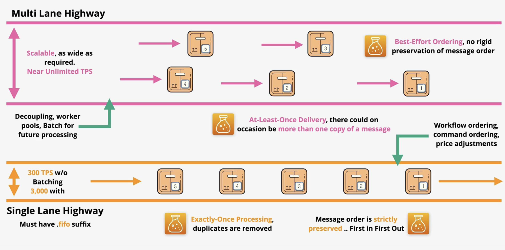

### Delay Queues

Delay queues provide an initial period of invisibility for messages. Predefine periods can ensure that processing of messages doesn't begin until this period has expired. Read more about [SQS Timeouts](https://docs.aws.amazon.com/AWSSimpleQueueService/latest/SQSDeveloperGuide/sqs-message-timers.html), [Delay Queues](https://docs.aws.amazon.com/AWSSimpleQueueService/latest/SQSDeveloperGuide/sqs-delay-queues.html), [Visibility Timeouts](https://docs.aws.amazon.com/AWSSimpleQueueService/latest/SQSDeveloperGuide/sqs-visibility-timeout.html).

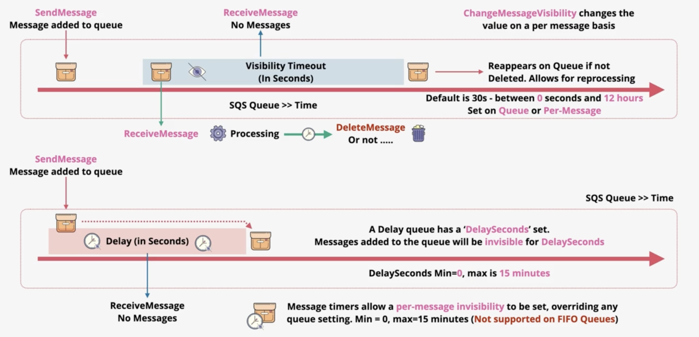

### Dead Letter Queues

Dead letter queues allow for messages which are causing repeated processing errors to be moved into a dead letter queue. In this queue, different processing methods, diagnostic methods or logging methods can be used to identity message faults.

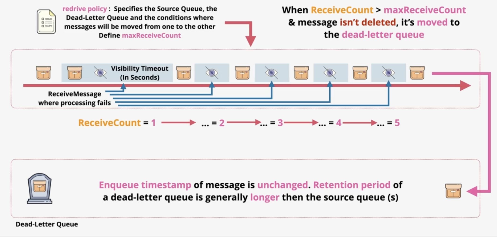

## Amazon Kinesis Data Streams

Kinesis data streams are a streaming service within AWS designed to ingest large quantities of data and allow access to that data for consumers. Kinesis is ideal for dashboards and large scale real time analytics needs. Kinesis data firehose allows the long term persistent storage of kinesis data onto services like S3.

- Kinesis is a scalable streaming service
- Producers send data into a kinesis stream
- Streams can scale from low to near infinite data rates
- Public service and highly available by design 
- Streams store a 24-hour moving window of data which can be increased to a maximum of 365 days at an additional cost
- Multiple consumers access data from that moving window
  -  Looking at data every second, hour, or day etc

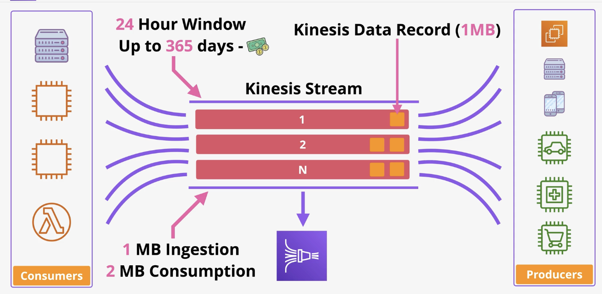

### SQS vs Kinesis

- SQS
  - 1 production and 1 consumption group
  - Decoupling and Asynchronous communications
  - No persistence of messages, no window
- Kinesis
  - Designed for huge scale ingestion
  - Multiple consumers
  - Rolling window for persistence of messages
  - Data ingestion, Analytics, Monitoring, App Clicks

### Amazon Kinesis Data Firehouse

Kinesis Data Firehose is a stream based delivery service capable of delivering high throughput streaming data to supported destinations in near realtime.

- Fully managed service to load data for data lakes, data stores, and analytics services
- Automatic scaling fully serverless and resilient
- **Near Real Time** delivery (~60 seconds)
  - Unlike Kinesis
- Supports transformation of data on the fly using Lambda but can increase latency depending on complexity of Lambda
- Billing
  - Volume through firehose (pay as you go)

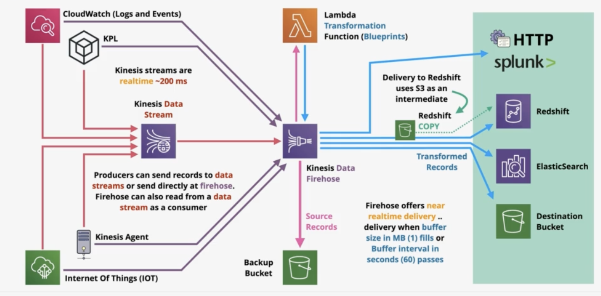

### Amazon Kinesis Data Analytics

Amazon Kinesis Data Analytics is the easiest way to analyze streaming data, gain actionable insights, and respond to your business and customer needs in real time. It is part of the kinesis family of products and is capable of operating in realtime on high throughput streaming data.

- **Real time processing** of data
  - Using SQL
- Ingests from Kinesis Data Streams or Firehose
- Destinations
  - Firehose (data becomes near real time)
    - S3
    - Redshift
    - Elastic Search and Splunk
  - Kinesis Data Streams (real time)
  - AWS Lambda (real time)

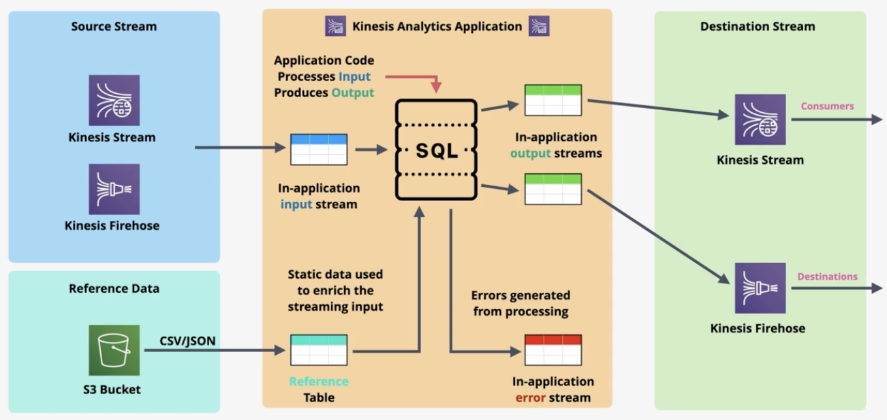

- When and Where
  - Streaming data needing **real time SQL processing**
  - Time Series analytics 
    - Elections
    - E-Sports
  - Real Time Dashboards
    - Leaderboards for games
  - Real Time Metrics
    - Security and Response Teams

### Kinesis Video Streams

Amazon Kinesis Video Streams makes it easy to securely stream video from connected devices to AWS for analytics, machine learning (ML), playback, and other processing. Kinesis Video Streams automatically provisions and elastically scales all the infrastructure needed to ingest streaming video data from millions of devices.

- Ingest live video data from producers
- Security Cameras, Smartphones, Cars, Drones, Time Serialized Audio, Thermal , Depth and RADAR data
- Consumers can access data frame-by-frame or as needed
- Can persist and encrypt (in transit and at rest) data
  - Can't access directly via storage only through via APIs
- Integrates with other AWS services (Rekognition and Connect)

## Amazon Cognito

- **User Pool**: A user directory in Amazon Cognito
  - Allows users to sign in to your web or mobile app through Cognito
  - Supports sign-in via social identity providers (Google, Facebook, Amazon, Apple)
  - Supports SAML identity providers
  - All members have a directory profile accessible through an SDK — whether they sign in directly or through a third party
- **Identity Pool (Federated Identities)**:
  - Creates unique identities for users and federates them with identity providers
  - Provides temporary, limited-privilege AWS credentials to access other AWS services
- **Key distinction**:
  - **User Pool** → authentication (*who are you?*) — manages sign-in and user profiles
  - **Identity Pool** → authorization to AWS resources (*what can you access?*) — provides AWS credentials
- Authentication, Authorization, and User Management for web/mobile apps
- USER POOLS
  - Sign in purposes and obtaining a JSON Web Token (JWT)
  - Do not grant access to AWS services
    - User directory management and profiles
	- MFA
	- Other security features
  	- Allow social sign ins (Facebook or Google)
- IDENTITY POOLS
  - Allow you to offer access to **Temporary AWS Credentials**
  - Unauthenticated Identities (Guest Users)
  - Federated Identities
    - Swap Social Signs and USER POOLs for short term AWS Credentials to access AWS Resources

### User Pools

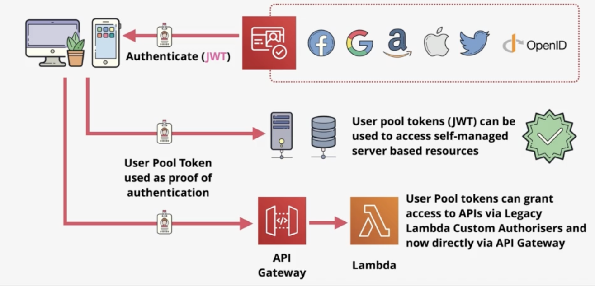

### Identity Pools

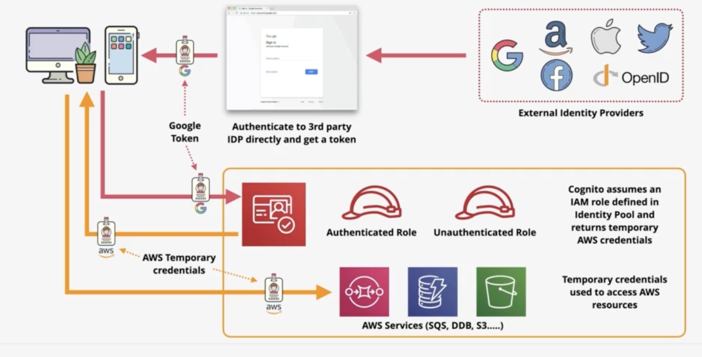

### Web Identity Federation

Uses both User and Identity Pools.

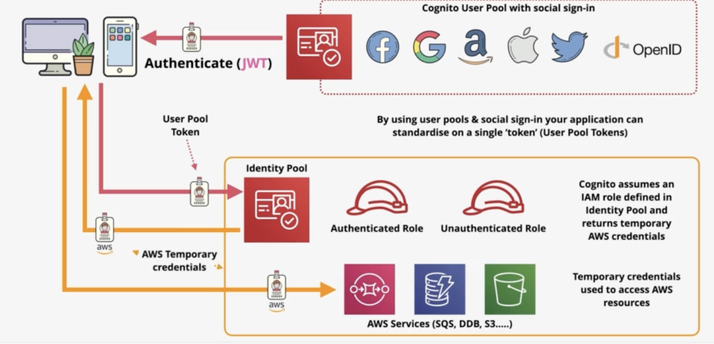

### AWS Glue 101

- **AWS Glue overview**: A fully managed extract, transform, and load (ETL) service that makes it easy to prepare and load data for analytics
- **Ease of use**: You can create and run an ETL job with a few clicks in the AWS Management Console
- **How it works**:
  - Point AWS Glue to your data stored on AWS
  - Glue discovers your data automatically
  - Associated metadata (table definitions, schemas) is stored in the **AWS Glue Data Catalog**
- **Post-cataloging benefits**: Once cataloged, your data is immediately:
  - Searchable
  - Queryable
  - Available for ETL
- Serverless ETL
  - Vs Datapipelines
    - Which do ETL
    - But this uses compute within your account and uses servers (EMR flusters)
- Moves and transforms data between source and destination
- Crawls data sources and generates the AWS Glue Data Catalog
- Data Source
  - Stores
    - S3, RDS, JDBC Compatible and DynamoDB
  - Streams
    - Kinesis Data Stream and Apache Kafka
- Data Targets
  - S3, RDS, JDBC Databases

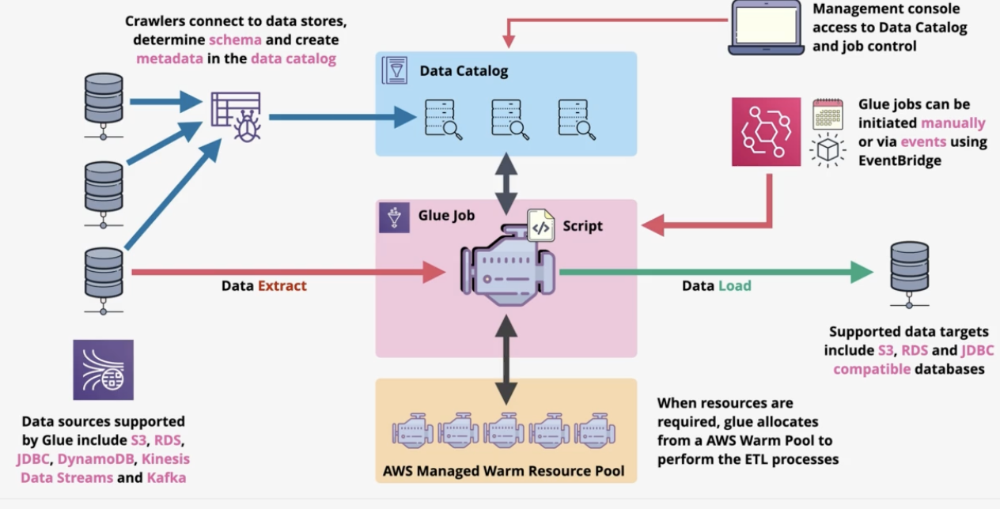

### AWS Glue Data Catalog

- Persistent metadata about data sources in region
- One catalog per region per account
- Avoids data silos
- Amazon Athena, Redshift Spectrum, EMR and AWS Lake Formation all use Data Catalog
- Data is discovered by configuring crawlers for data sources

## Amazon MQ

AmazonMQ is an AWS implementation of Apache ActiveMQ. It supports open standards such as JMS, AMQP, MQTT, OpenWire and STOMP. If you need to support any of these, and use queues and topics - AmazonMQ is the tool to use.

- SNS and SQS are AWS Services using AWS APIs
- SNS provides TOPICS and SQS provides QUEUES
- SNS and SQS
  - public services
  - highly scalable
  - AWS Integrated
- Many ORGS already use topics and queues and may want to migrate to AWS but SNS and SQS won't work out of the box
- We need a standards compliant solution for migration ....
- Amazon MQ
  - Open source message broker
  - Based on Managed Apache ActiveMQ
  - Provides both QUEUES and TOPICS
  - One to one or one to many