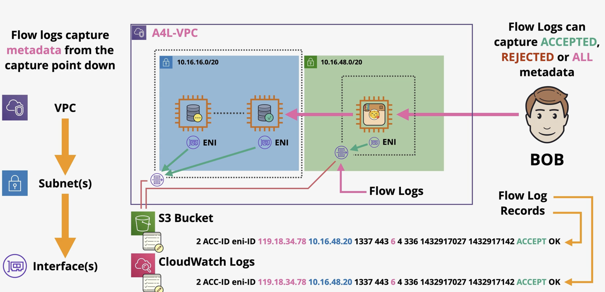
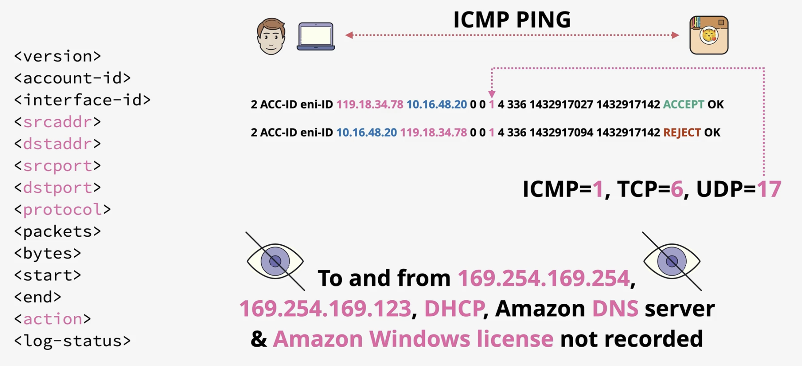
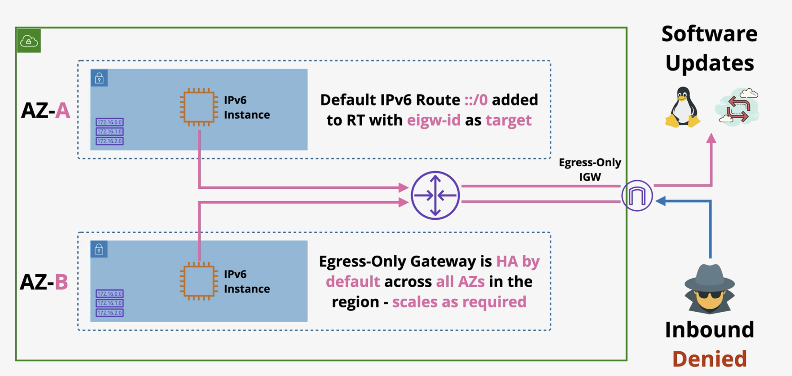
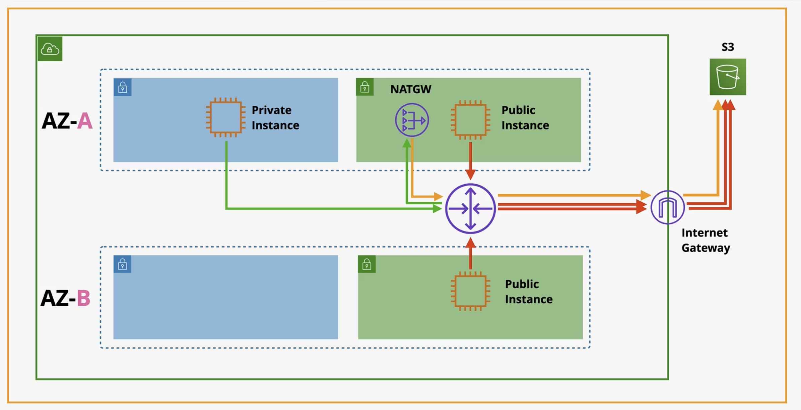
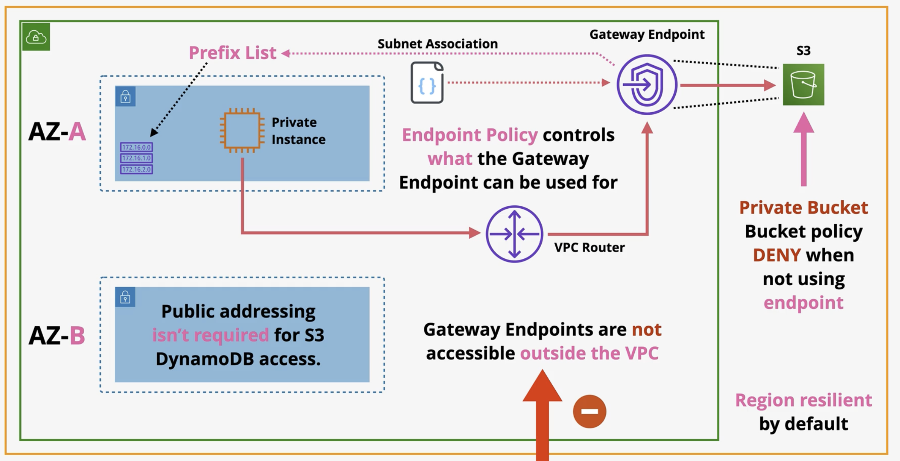
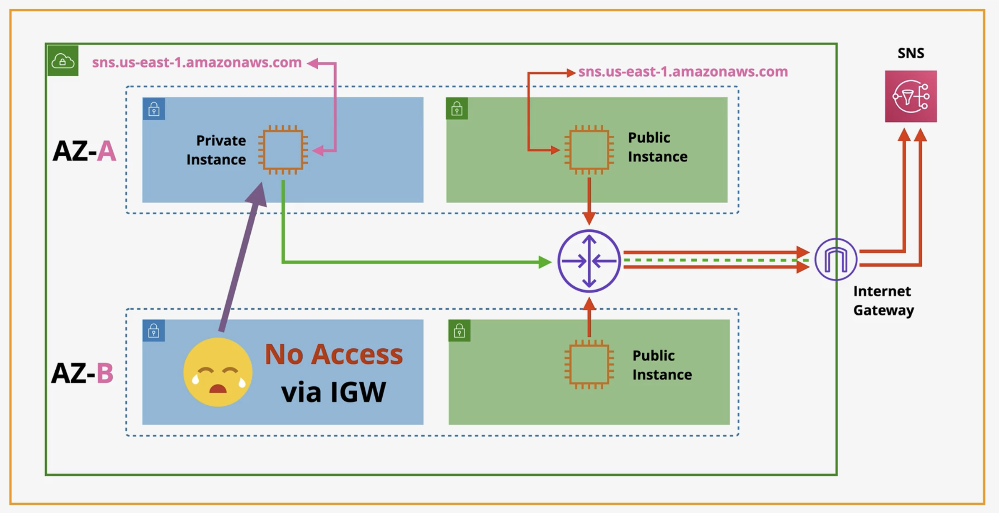
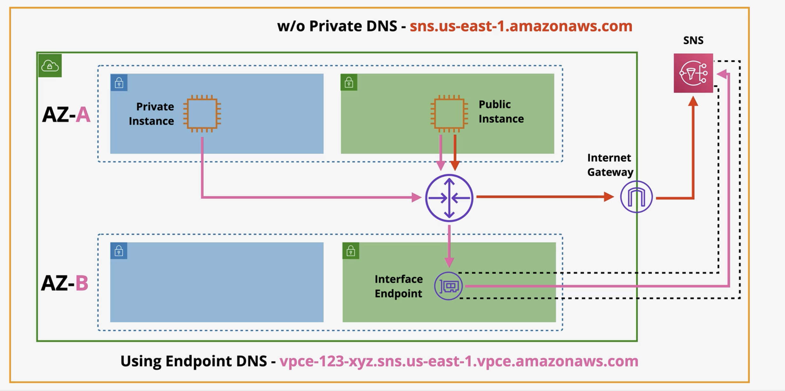
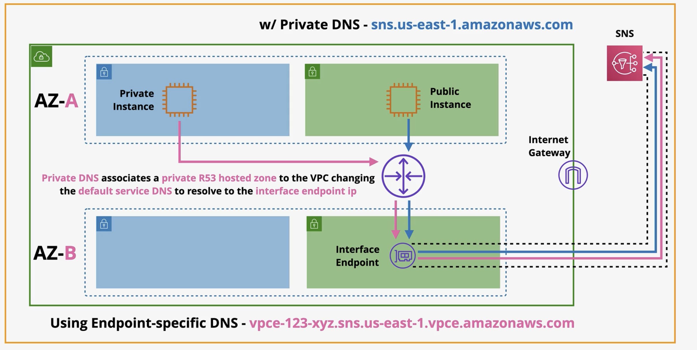
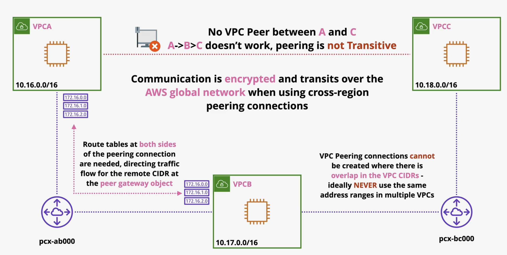

# Advanced VPC Networking

## VPC Flow Logs

- `VPC Flow Logs` is a feature allowing the monitoring of traffic flow to and from interfaces within a `VPC`
- `VPC Flow Logs` can be added at a `VPC`, Subnet, or `ENI` level
- Flow Logs don't monitor packet contents
  - That requires a packet sniffer
- Flow Logs can be stored on `S3` or `CloudWatch Logs`
- Flow Logs are NOT realtime

## Egress-Only Internet Gateway

- Egress-Only internet gateways allow outbound (and response) only access to the public AWS services and Public Internet for IPv6 enabled instances or other VPC based services
- With IPv4 addresses are **private** or **public**
  - NAT allows private IPs to access public networks
    - Without allowing externally initiated connections (IN)
- With **IPv6** all IPs are **public**
- Internet Gateway (IPv6) allows all IPs **IN** and **OUT**
- Egress-Only is **outbound-only** for **IPv6**

## VPC Gateway Endpoints

- Gateway endpoints are a type of VPC endpoint which allow access to S3 and DynamoDB without using public addressing
- Gateway endpoints add 'prefix lists' to route table, allowing the VPC router to direct traffic flow to the public services via the gateway endpoint
- Provide **private access** to `S3` and `DynamoDB`
- Highly Available (HA) across all `AZs` in a region by default
- **Does not go into a particular subnet**
- Endpolicy policy is used to control what it can access
  - Subset of `S3` buckets
- **Regional**
  - Can't access cross-region services
- **Prevent Leaky Buckets**
  - `S3 Buckets` can be set to private only by allowing access ONLY from a gateway endpoint

### Without VPC Gateway Endpoints

- Problem with this architecture (without VPC Gateway Endpoints) is that the private instances still have public IP addresses
  - Have public resources via the NAT Gateway

### With VPC Gateway Endpoints

## VPC Interface Endpoints

- Interface endpoints are used to allow private IP addressing to access public AWS services
- S3 and DynamoDB are handled by gateway endpoints 
  - Other supported services are handled by interface endpoints
  - `S3` is now supported
- Unlike gateway endpoints - interface endpoints are not highly available by default - they are normal VPC network interfaces and should be placed 1 per AZ to ensure full HA
- Added to specific subnets
  - An ENI
  - Not Highly Available
- Network access controlled via `Security Groups`
- **Endpoint Policies**
  - Restrict what can be done with the endpoint
  - Only support **TCP** and **IPv4**
- Uses **privateLink**
  - Allows external services (AWS or third party) to be injected into `VPC` and be given network interfaces inside the `VPC`
- Provides a **NEW** service endpoint DNS
- DNS Names
  - Regional DNS
  - Zonal DNS
    - Resolves to that one specific interface in that one specific `AZ`
- **PrivateDNS** overrides the default DNS for services
  - Associate a `Route53` private hosted with your `VPC`

### Without VPC Interface Endpoints

### With VPC Interface Endpoints

### With VPC Interface Endpoints and PrivateDNS

## VPC Peering

- `VPC` peering is a software define and logical networking connection between two `VPC`'s
- They can be created between `VPCs` in the same or different accounts and the same or different regions
- Direct encrypted network link between two `VPCs`
- Optional Configuration
  - **Public Hostnames** resolve to **private IPs**
    - Use the same DNS names to locate services
- If `VPCs` are in the same **region** then they can reference with **peer SGs**
- Can connect **TWO VPCs** and ONLY two
- `VPC Peering` does NOT support **transitive peering**
  - If you have VPC A peered VPC B and VPC B peered to VPC C
    - A cannot connect to C
- Routing Configuration is needed, `SGs` and `NACLs` can filter

