# Route53

## Public Hosted Zones

- A DNS database for a specific domain
- **Public** = hosted on Route 53 (R53) provided public DNS servers
- AWS provides a minimum of 4 hosted name servers per zone
- Globally resilient
  - Achieved through multiple DNS servers across regions
- Can be created automatically via domain registration through R53, or created separately/independently
- A monthly fee applies for non-R53 registered hosted zones
- Used to host DNS records for a domain
- Hosted Zones are referenced by the DNS system, making them **authoritative** for their domain and **visible to the public internet**

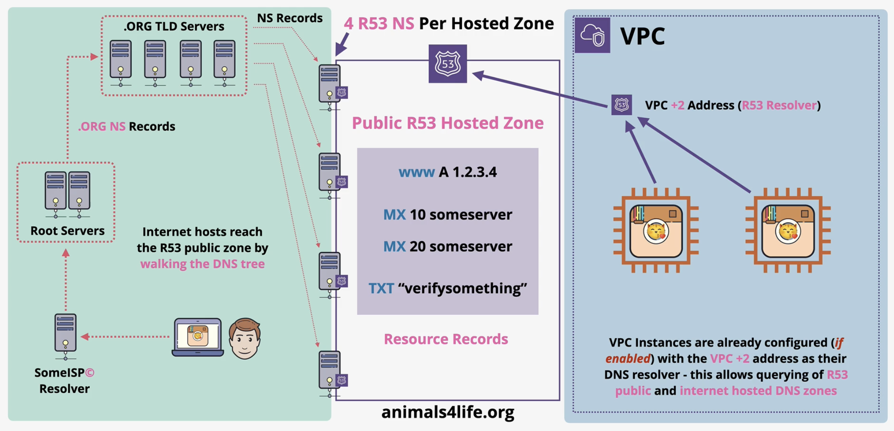

## Private Hosted Zones

- Assocated with `VPCs`
  - Accessible through `VPCs` that are associated with them

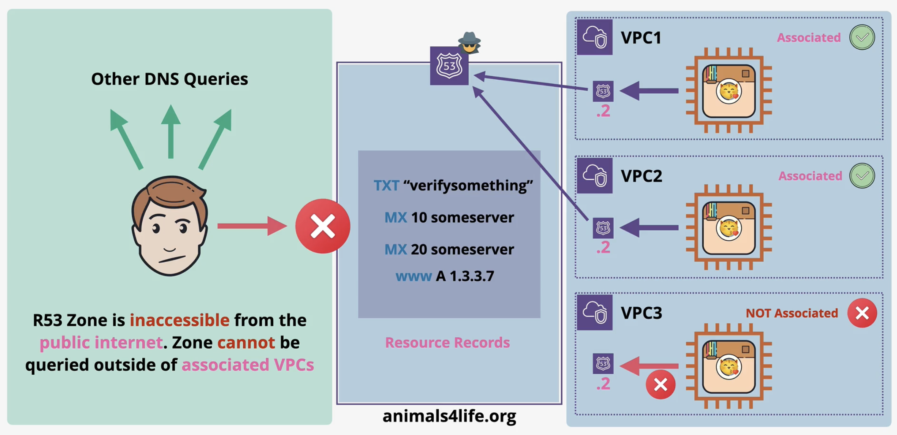

### Split View

- Allows you to create **two hosted zones with the same domain name**
  - One public and the other private
- The **public hosted zone** is accessible from the internet and returns public facing records
- The **private hosted zone** is associated with one or more `VPCs` and returns internal/private records for the same domain
- `AWS Route53` resolves the correct zone **based on where the query originates**:
  - Queries from **inside the `VPC`** ➡️ resovled using the **private hosted zone**
  - Queries from **outside/interent** ➡️ resolved using the **public hosted zone**
- This means the same domain can resolve to **different IPs** depending on the requester's location
- Useful for scenarios where internal services should resolve to private infrastructure, while external users reach public-facing endpoints
- Keeps internal network architecture hidden from public internet

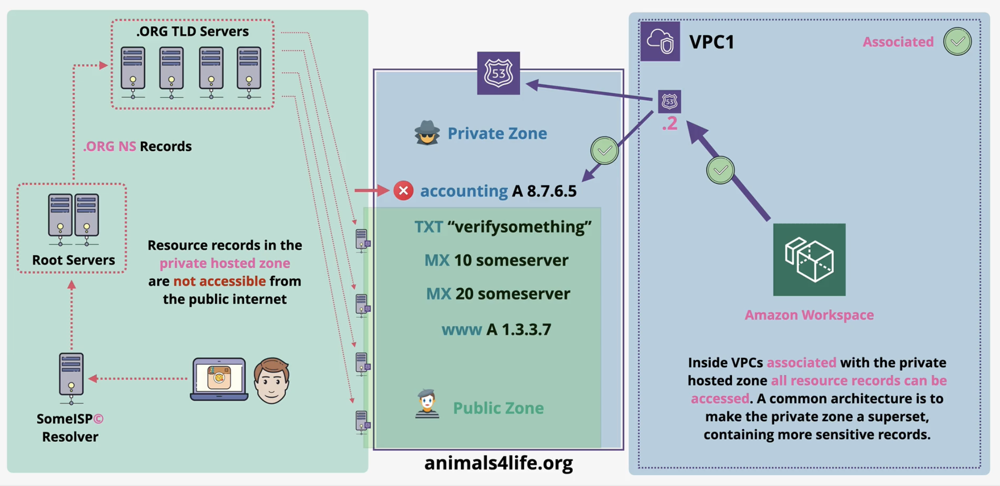

## CNAME vs ALIAS

- `CNAME`
  - Maps a hostname to another hostname (`app.example.com` ➡️ `example.com`)
  - **Cannot be used at the zone apex** 
    - The root domain (the root domain `example.com`)
      - This is a key limitation
  - Works with any DNS provider, it is standard DNS record type
  - You are charged for each query in `Route53`
- `A` 
  - Maps a hostname to an IPv4 address (`app.example.com` ➡️ `1.2.3.4`)
  - `AAAA` record is the equivalent to IPV6 address
- `ALIAS`
  - Maps a hostname to an AWS resource
  - **Can be used at the zone apex**
  - AWS proprietary
  - The resolution happens **internally within Route53**, no extra lookups
  - Can point to resources **in the same or different hosted zone**
  - AWS recommoneds **ALIAS over CNAME** whereever possible
  - **Should be the same *type* as what the record is pointing at**
    - `ELB` given an `A` record so you have to create an `A` record `ALIAS` if you want to point at the DNS name provided by `ELB`

## Simple Routing

- `Simple Routing` lets you configure standard DNS records, with no special `Route53` routing such as weighted or latency
  - With this routing you typically route traffic to a single resource, for example, to a web server for your website
- **No health checks**

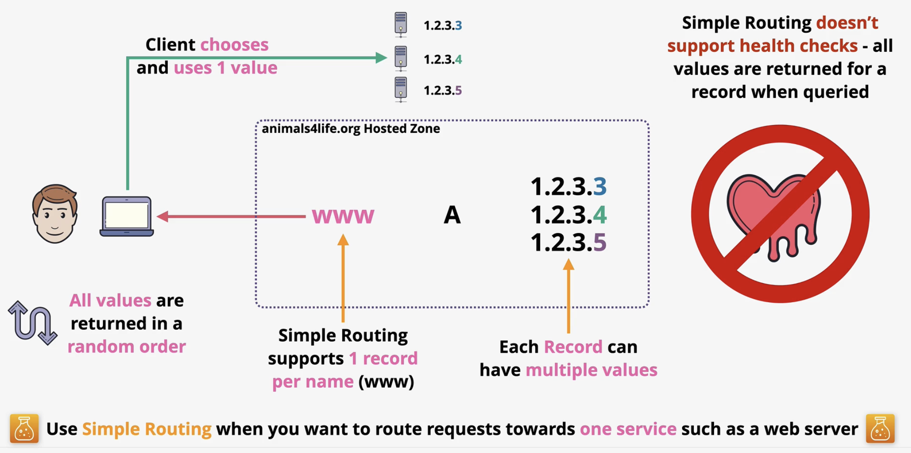

## Health Checks

- `AWS Route53` health checks monitor the health and performance of your web application, web servers, and other resources, and each health check that you create can monitor one of the following:
  - The health of a specified resource, such as a web server
  - The status of other health checks
  - The status of an Amazon CloudWatch alarm
- `Health Checks`
  - Perform periodic health checks on servers or resources
  - If a resource becomes unhealthy, it is **removed** from the available pool
  - Once the issue is resolved and checks pass, the resource is **added back** as healthy
  - Health checks are **separate from Route53** but are used by them

### Health Checker Fleet

- Performed by a **global fleet of health checkers**
- Do **not block** these checkers
- If treated as bots and blocked, it will trigger false alarms and flag your resourfce as unhealthy
- Default check interval is **every 30seconds**
- Can be increased to **every 10 seconds** for an additional cost
- Checks are **per health checker**
- Since there are many globally, checks effectively occur every few seconds automatically
- At the 10 second option, **multiple checks per second** will occur across the fleet

### Check Types

- **TCP**
  - `R53` attempts to establish a TCP connection with the endpoint within **10 seconds**
  - **HTTP/HTTPS**
    - Same as TCP but must connect within 4 seconds and the endpoint must return a **200** or **300** status code within 3 seconds
  - **String Matching**
    - Same as HTTP/HTTPS but the **response body** must contain a user-defined string within the first **5120 bytes**

### Result of Health Checks

- A resource is marked as either **Healthy** or **Unhealthy** based on the routing

### Three Types of Health Checks

- **Endpoint Checks**
  - Directly checks a resource endpoint
- **CloudWatch Alarms**
  - Health status based on a `CloudWatch` alarm state
- **Checks of Checks (also called Calculated)**
  - Aggregates the results of multiple health checks into one

## Failover Routing

- `Failover Routing` lets you route traffic to a resource when the resource is healthy or to a different resource when the first resource is unhealthy

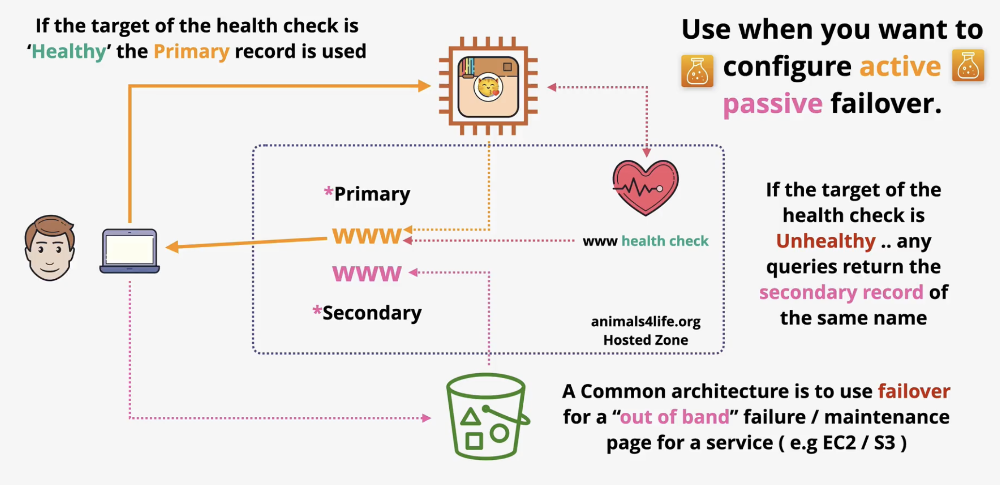

## Multi-Value Routing

- `Multi-Value Routing` lets you configure `Amazon Route53` to return multiple values, such as IP addresses for your web servers, in response to DNS queries. Yu can specify multiple values for almost any record, but multivalue answer routing also lets you check the health of each resource, so `Route53` returns only values for healthy resources

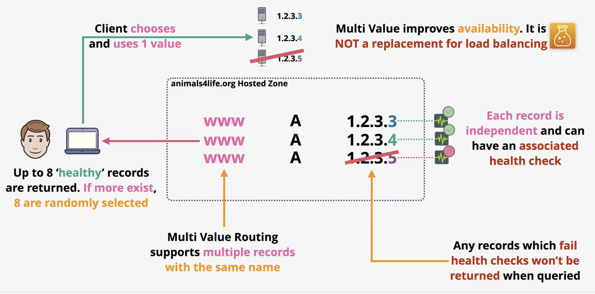

## Weighted Routing

- `Weighted Routing` lets you associate multiple resources with a single domain (`catagram.io`) and choose how much traffic is routed to each resource. This can be very useful for a variety of purposes, including load balancing and testing new versions of software

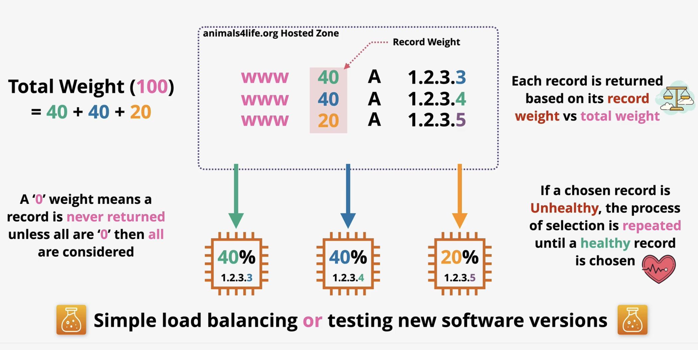

## Latency Routing

- If your application is hosted in multiple `AWS Regions`, you can improve performance for your users by serving their requests from `AWS Region` that provides the lowest latency

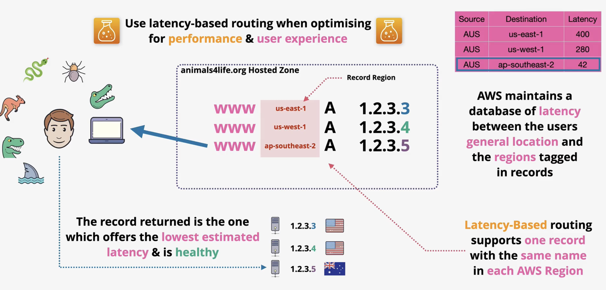

## Geolocation Routing

- `Geolocation Routing` lets you choose the resources that serve your traffice based on geographic location of your users, meaning the location that DNS queries originate from

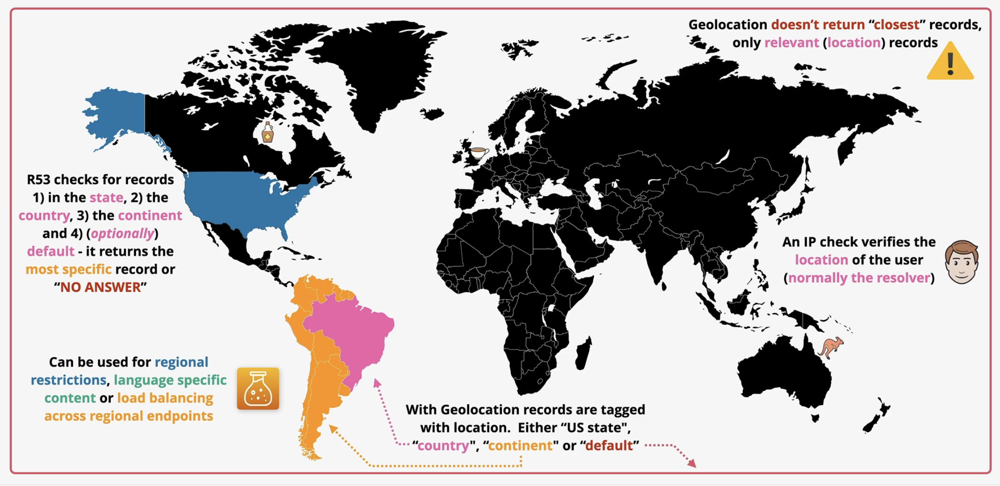

## Geoproximity Routing

- `Geoproximity Routing` lets `Amazon Route53` route traffic to your resources based on the geographic location of your users and your resources. You can optionally choose to route more traffic or less to a given resource by specifying a value known as *bias*.
  - A *bias* expands or shrinks the size of the geographic region from which traffic is routed to a resource

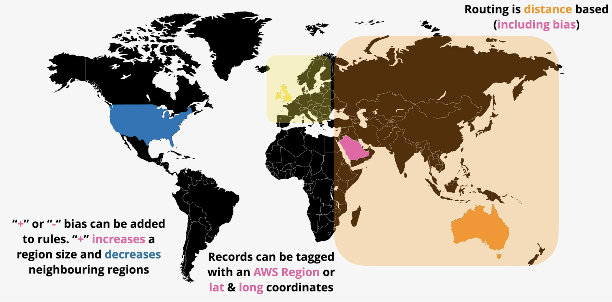

## Route53 Interoperability

- `R53` normally has two jobs
  - **Domain Registrar**
  - **Domain Hosting**
- `R53` can do BOTH or either **Domain Registrar** or **Domain Hosting**
- `R53` accepts your money when doing **Domain Registrar** (annual fee for domain)
- `R53` allocates 4 Name Servers (NS) when doing **Domain Hosting**
- `R53` creates a zone file when doing **Domain Hosting** on the above NS
- `R53` communciates with the registry of the TLD (Top Level Domain) (**Domain Registrart**)

### Both Roles

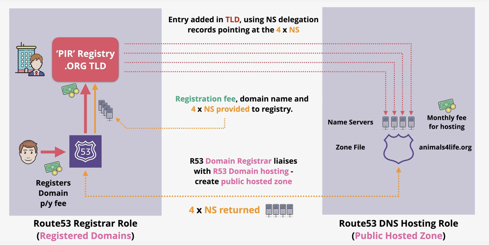

### Registrar Only

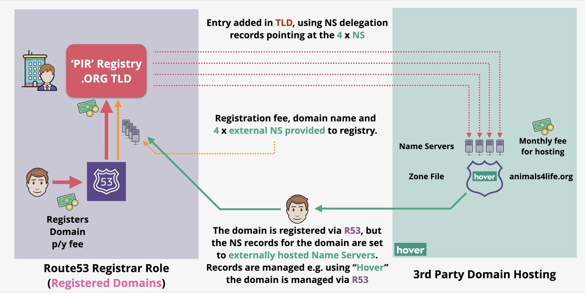

### Hosting Only

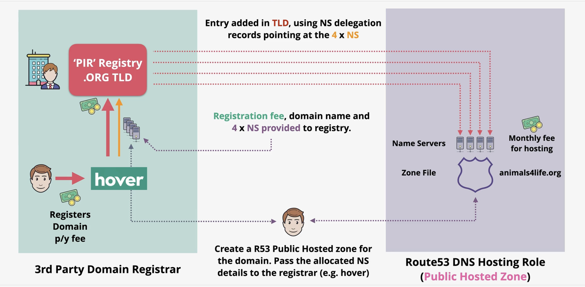

## Implenting DNSSEC

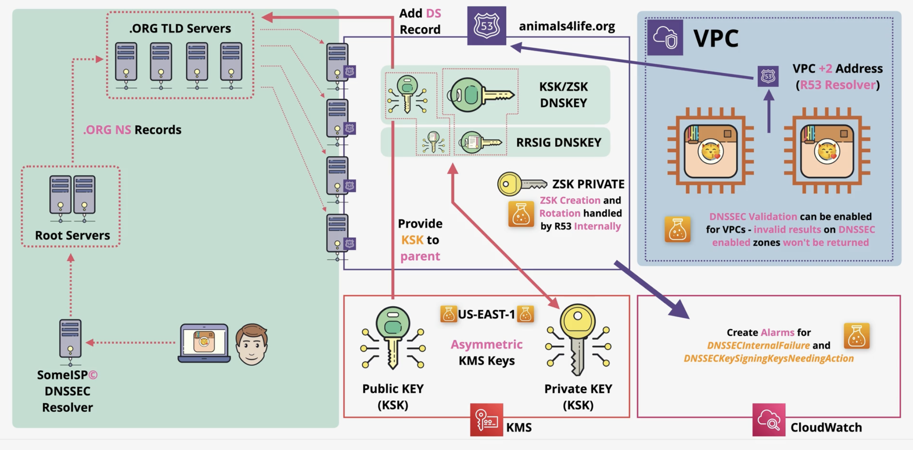