# CloudFront

CloudFront is a Content Delivery network (CDN) within AWS.

## CloudFront Architecture

- **Origin**
  - The source of location for your content
  - Can be `S3` or **Custom Origin**
- **Distribution**
  - The **configuration unit** of `CloudFront`
- **Edge Locations**
  - Local cache of your data
- **Regional Edge Cache**
  - Larger version of an edge location 
  - Provides another layer of caching

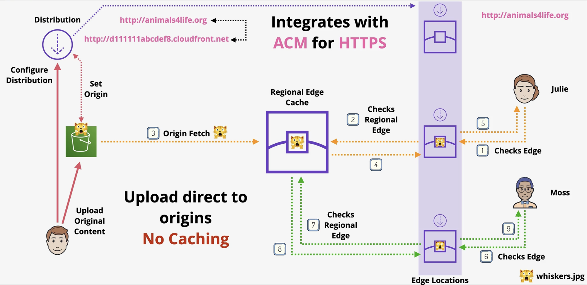

## CloudFront Behaviors

- CloudFront Behaviors control much of the TTL, protocol and privacy settings within CloudFront

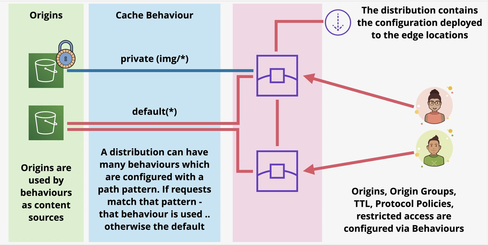

## TTL and Invalidations

- The problem with the diagram below is that the cache is different from the origin in Step 4 

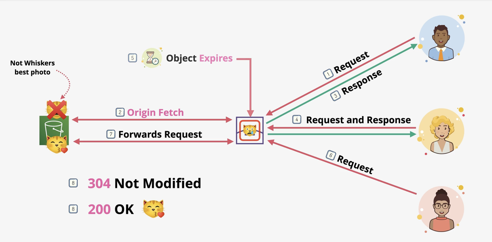

- More frequent cache HITS = lower origin load
- Objects cache by `CloudFront` have a default Time To Live period of 24 hours (validity period)
  - You can set **minimum TTL** and **maximum TTL** values
- Origin Headers to remember 
  - `Origin Header: Cache-Control max-age (seconds)`
    - sets TTL
  - `Origin Header: Cache-Control s-maxage (seconds)`
    - sets TTL
  - `Origin Header: Expires (Date and Time)`
    - sets date time where an object should be expired from cache
- Cache **invalidations** are performed on a distribution and applies to edge locations but that takes time
- `/images/p.jpeg`
  - invalidates just `p.jpeg`
- `/images/*`
  - invalidates everything in image folder
- `/*`
  - invalidates everything
- **Versioned Filenames** are better than invalidating
  - Different from `S3 Object Versioning`

## AWS Certificate Manager (ACM)

- The AWS certificate Manage is a service which allows the creation, management and renewal of certificates. 
  - It allows deployment of certificates onto supported AWS services such as CloudFront and ALB
- `ACM` lets you run a public or private Certificate of Authority (CA)
- **Private CA**
  - Applications need to trust your private CA
- **Public CA**
  - Browsers trust a list of providers, which can trust other providers 
- `ACM` can generate or import Certificates
  - If generated it can automatically renew
  - If imports then you have to update it
- Certificates can be deployed out to supported services
  - Supported AWS services only
    - `CloudFront`
    - `ALB`
    - `API Gateway`
    - NOT `EC2`
- `ACM` is a **regional service**
- Certs cannot leave the region they are generated or imported in
  - Meaning to use a cert with an `ALB` in `us-east-1` you need a **cert in ACM** in `us-east-2`
- Global services such as `CloudFront` operate as though within `us-east-1`
  - Basically always use `us-east-1`

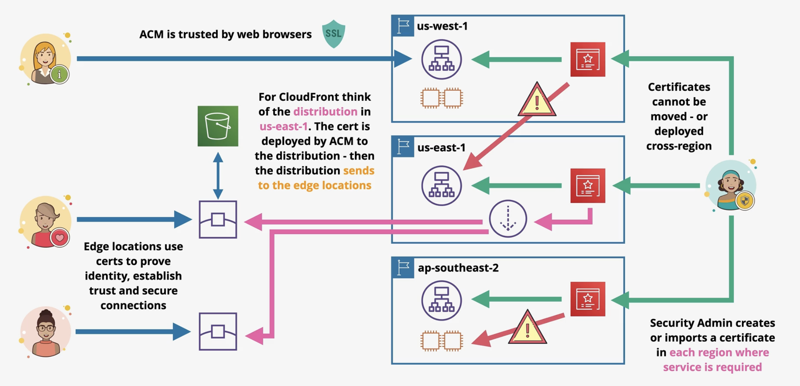

## CloudFront and SSL

- `CloudFront` **Default Domain Name** is a **CNAME** record type
- SSL supported by default ssl cert `*.cloudfront.net`
  - Most of the time you want to use your own domain name like `cdn.catagram`
    - **Alternative Domain Name**
  - Two SSL connections when using `CloudFront`
    - Viewer to `CloudFront`
    - `CloudFront` to origin
    - Both connections need valid public certificates (intermediate certs)
- Old browsers don't support SNI
  - `CloudFront` charges extra for dedicated IP

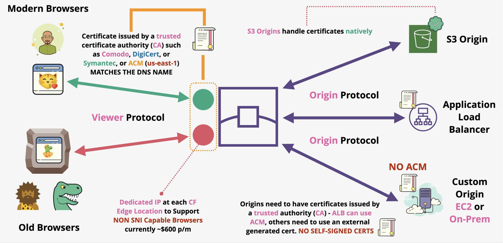

## Securing CloudFront Network

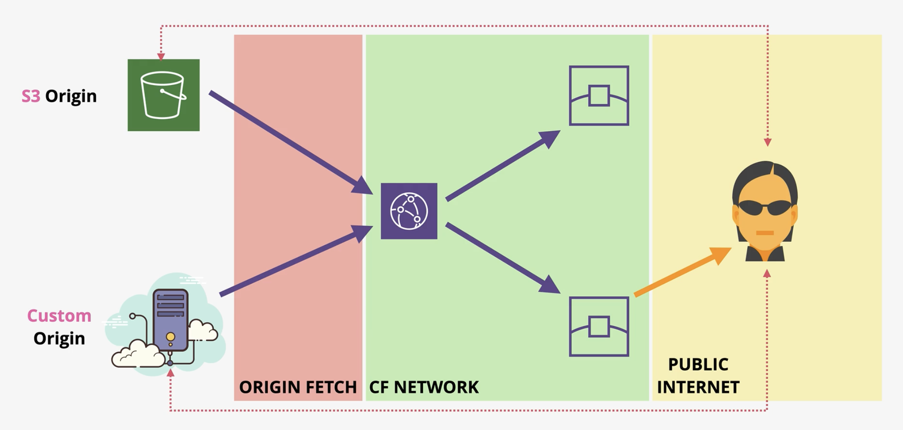

### Origin Access Identity (OAI)

- Origin Access Identities are a feature where virtual identities can be created, associated with a CloudFront Distribution and deployed to edge locations
- Access to an `S3` bucket can be controlled by using these OAI's - allowing access from an OAI, and using an implicit DENY for everything else
- They are generally used to ensure no direct access to S3 objects is allowed when using private CF Distributions.
- **OAI** is an identity type
- It can be associated with `CloudFront Distributions`
- `CloudFront` becomes the **OAI**
- That **OAI** can be used in `S3 Bucket Policies`
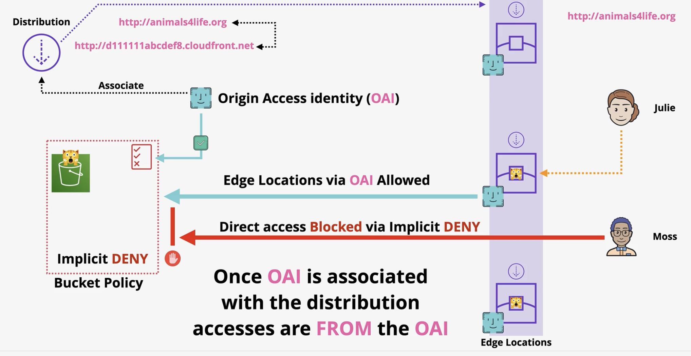

### Securing Custom Origins

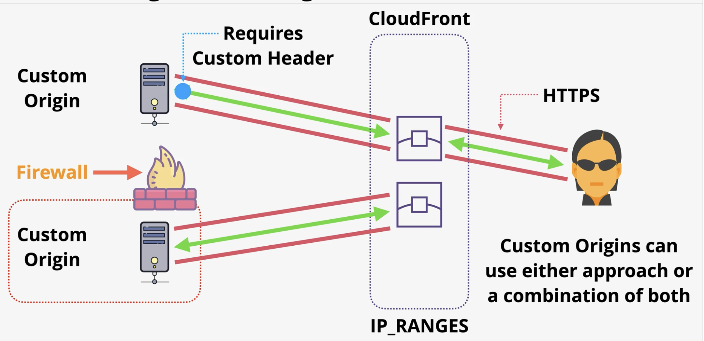

## CloudFront Private Distributions and Behaviors

- Private distributions requests require Signed Cookie or URL
- Old way of signing
  - A `CloudFront Key` is created by `Account Root User`
  - Once a `CloudFront Key` exists in the account, that account is added as a `Trusted Signer`
- New way
  - `Trusted Key Groups` and assign users to that key group
- When to use **Signed URLs**
  - Provide access to one object 
  - **Historically** RTMP distributions **couldn't use cookies**
  - Client does not support cookies
  - Use **groups** of files/**all files of a type** 
  - Or if maintaining application URL's is important

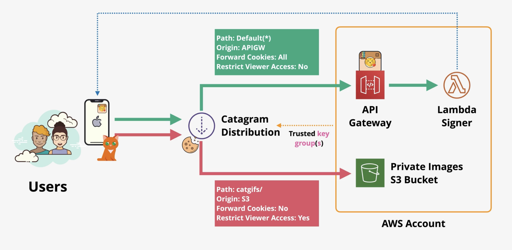

## Lambda Edge

- `Lambda@Edge` allows cloudfront to run lambda function at CloudFront edge locations to modify traffic between the viewer and edge location and edge locations and origins
- Adjust data between Viewer and Origin
- Layers are not supported
- Different Limits vs Normal Lambda Functions
- Supports NodeJs and Python
- [Lambda Edge Use Cases](https://docs.aws.amazon.com/AmazonCloudFront/latest/DeveloperGuide/lambda-examples.html#lambda-examples-redirecting-examples)
  - A/B Testing - Viewer Request
  - Migration between `S3` Origins - Origin Request
  - Different Objects based on device - Origin Request

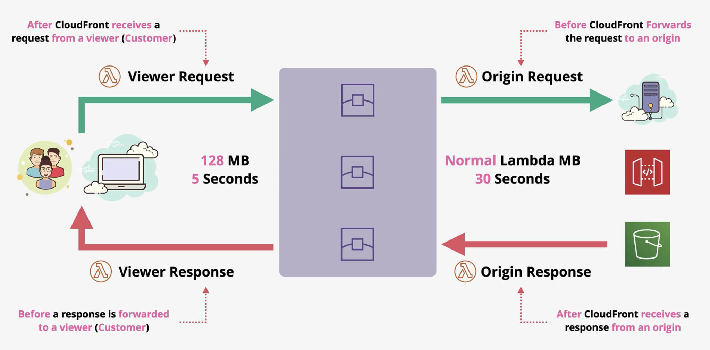

## Global Accelerator

- AWS Global Accelerator is designed to improve global network performance by offering entry point onto the global AWS transit network as close to customers as possible using ANycast IP addresses
- Moves the `AWS Network` closer to customers NOT the content
- Connections enter at edge using anycast IP addresses
- Transit over AWS backbone to 1+ locations
- Can be used for **NON HTTP/S (TCP/UDP)**
  - Different from `CloudFront`
- `Global Accelerator` does not cache anything or understand HTTP/HTTPS its a networking sevice

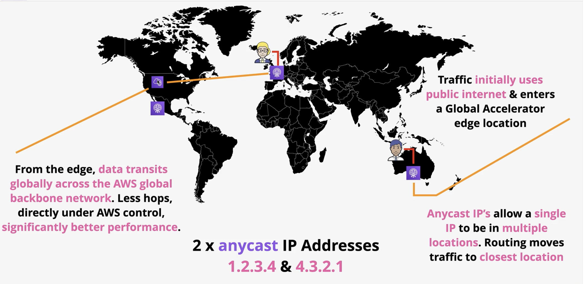